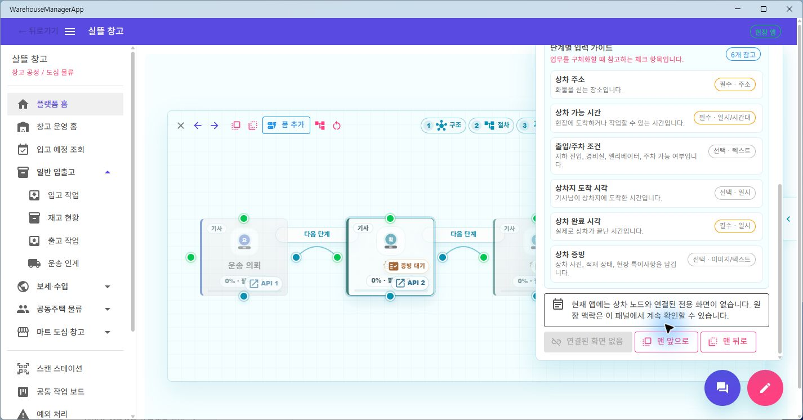

# 다이어그램 노드 앱별 Navigation Adapter

## 결과

공용 `PlatformCommunityHome`의 노드 상세가 Web·메인 앱·전문 앱 URL을 직접 결정하던 책임을 제거했다. 이제 공용 UI는 원장 template, node 제목·종류와 form 종류를 `IPlatformCommunityNodeNavigationResolver`에 전달하고, 각 host가 자신이 실제 제공하는 화면만 목적지로 반환한다.

기존 임시 화주 요청 ID `HD-WEB-001`과 업무 URL literal은 공용 노드 상세에서 제거했다. 목적지가 있는 경우에도 새 ID를 만들지 않고 현재 원장의 `ledgerId`, node 문맥과 안전한 다이어그램 복귀 주소를 query로 전달한다. 목적지가 없는 전문 앱은 다른 앱의 URL을 열지 않고 상세 패널 안에서 원장 문맥을 계속 보여 준다.

## host별 책임 경계

| host | 반환 가능한 목적지 | 미지원 처리 |
| --- | --- | --- |
| Web | 커뮤니티·화주·기사·창고 화면 | 알려지지 않은 일반 node는 커뮤니티 원장으로 안전하게 복귀 |
| `SsalddelApp` | 커뮤니티·화주·창고 화면 | 메인 앱이 조립하는 공용 화면으로만 이동 |
| `WarehouseManagerApp` | 운송 의뢰 초안·입고·출고·마트 등 창고 화면 | 기사·주문자 전용 node는 `null` |
| `FDriverApp` | 배차·배달 이행·경로·정산 등 기사 화면 | 창고·주문자 전용 node는 `null` |
| `OrdererApp` | 음식·마트·화물·공동구매 주문 화면 | 창고·기사 전용 node는 `null` |
| adapter 미등록 host | 없음 | 공용 safe default가 항상 `null` |

공용 UI는 `null`을 받으면 `현재 앱에는 … 전용 화면이 없습니다` 안내와 비활성 `연결된 화면 없음` 버튼을 표시한다. 이 상태에서 node 상세, 준비도, 입력 가이드와 원장 맥락은 닫히거나 다른 화면으로 바뀌지 않는다.

목적지가 있으면 `source=diagram-node`, `ledgerTemplateKey`, `ledgerId`, `nodeTitle`, `nodeKind`, `formKind`, `from`을 공용 query builder로 구성한다. 목적지 화면의 로그인·기능 플래그·서버 권한 검증은 그대로 유지하며 이번 adapter는 Command, 자동 배차, 결제·정산 또는 통관 운영 효과를 실행하지 않는다.

## 실제 화면 확인

`WarehouseManagerApp` Windows 빌드의 화물 운송 원장에서 `상차` node 상세를 열었다. 창고 앱에는 상차·하차 증빙 전용 기사 화면이 없으므로 안내 문구와 비활성 버튼이 표시되고, 원장 입력 가이드는 같은 패널에 유지되는 것을 확인했다.

메인 `SsalddelApp`에서는 같은 `상차` node가 실제 제공되는 `/shipper/request`의 운송 의뢰 목록으로 해석되어 `상세 정보 확인` 버튼이 활성화되는 것도 함께 확인했다. 실제 개인정보·주소·연락처·결제 식별자는 사용하지 않았고 sample 원장만 렌더링했다.

## 검증

- node resolver·host 조립·공용 DI·route 계약 선택 테스트 69개 통과
- clean snapshot 전체 `Ssalddel.Tests` 2,635개 통과, 실패·건너뜀 0개
- clean snapshot `Ssalddel.WebApp` build 경고 0개·오류 0개
- clean snapshot `SsalddelApp`, `WarehouseManagerApp`, `FDriverApp`, `OrdererApp` Windows build 각각 경고 0개·오류 0개
- 실제 `SsalddelApp` 지원 node와 `WarehouseManagerApp` 미지원 node 상태 확인
- 변경 파일 `git diff --check` 통과

## 다음 작업

`PlatformHomeWorkspaceProfile`에는 `/shipper/request`, `/food`, `/driver/recommendations`, 입·출고 작업과 커뮤니티 진입 URL이 아직 공용 profile 데이터에 남아 있다. 다음 `P0-0` 수직 단위에서는 workspace entry를 host capability로 해석해 전문 앱이 제공하지 않는 교차 앱 진입을 노출하지 않도록 분리한다.
