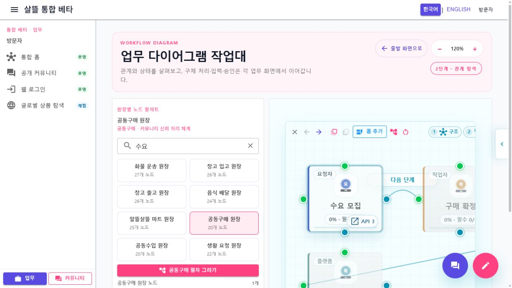

# 다이어그램 Route·공용 Screen 단일책임 분리

날짜: 2026-07-22

## 변경 결과

- WebApp과 `SsalddelApp`에 같은 `/diagram` route를 두고, 두 Route Page가 `Ssalddel.Ui.Common`의 `CommunityDiagramWorkbenchScreen` 하나를 조립하도록 통합했다.
- Web 전용 route가 직접 소유하던 원장 palette·preset·catalog·canvas 상태를 공용 Screen으로 옮겼다.
- desktop은 왼쪽 palette sidebar와 canvas를 함께 보여 주고, mobile은 44px 이상 조작 영역을 가진 bottom sheet palette와 세로 흐름을 사용한다.
- `ledgerTemplate`, 선택 node, zoom, filter와 `from` 출발 page를 공용 `CommunityDiagramNavigationContext`와 query로 보존한다. 선택·필터·확대 변경은 같은 URL 문맥에 즉시 반영되어 새로고침 뒤 복원된다.
- 과거 `/community/workspace?diagram=true&ledgerTemplate=...` 링크는 `/diagram`으로 호환 이동한다.
- canvas pointer 계산 JavaScript를 `Ssalddel.Ui.Common` 정적 자산으로 옮겨 Web과 mobile app이 같은 확대 좌표 규칙을 사용한다.
- 다이어그램은 관계 탐색과 목적지 선택만 담당한다. 상세·입력·승인 같은 Command는 기존 3단계 업무 route로 이동하며 추천·자동 배차·결제·계약 등 운영 효과를 새로 실행하지 않는다.

## 대표 화면

## 검증

- 다이어그램 route·공용 Screen·navigation context·capability·canvas 상태 관련 테스트 76개 통과
- `Ssalddel.WebApp` 빌드: 경고 0, 오류 0
- `SsalddelApp` Windows 빌드: 경고 0, 오류 0
- `SsalddelAdminApp` Windows 빌드: 경고 0, 오류 0
- 실제 Web desktop 기본 1270px와 mobile 390×844에서 같은 deep link를 열어 원장 `group-purchase`, 선택 node `수요 모집`, zoom `120`, filter `수요`, 출발 page `/community/workspace` 복원을 확인했다.
- desktop canvas에 120% 확대가 적용되고 mobile palette가 다른 fixed action보다 위에 표시됨을 확인했다.
- 두 폭에서 가로 overflow가 없고, mobile 본문과 열린 palette의 보이는 버튼·링크·입력 조작 영역이 모두 44px 이상임을 확인했다.
- mobile에서 `구매 확정` node를 선택하면 URL이 갱신되고 새로고침 뒤 같은 node가 복원됨을 확인했다.
- desktop 확대 버튼이 URL과 canvas를 130%로 함께 갱신하고, 과거 workspace diagram query가 공용 `/diagram`으로 이동함을 확인했다.
