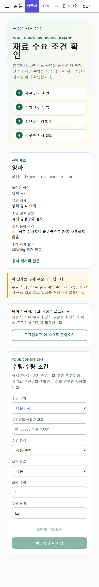

# 음식·재료 탐색에서 비구속 수요 등록까지

## 변경 요약

- 음식·재료 탐색의 재료·레시피 동작을 공동구매 제안서가 아니라 `/community/group-purchase/demand` 독립 Route로 연결했다.
- WebApp과 통합 MAUI 앱의 Route Page는 `OfficialFoodIngredientDemandScreen` 하나를 조립하며, 입력·미리보기·저장·철회 상태는 전용 ViewModel이 맡는다.
- 선택 재료 stable key, 둘러본 음식, 공식 레시피, 공개 가격, 조달 검토 방향을 query 문맥으로 보존한다. 음식 문화 국가는 원산지나 배송국으로 자동 사용하지 않는다.
- 사용자는 수령 국가, 우편번호·생활권 코드, 수령 방식, 보관 온도, 희망 수량·단위를 명시적으로 입력한다. 상세 주소, 연락처, 결제 정보, 창고와 HS 분류는 수요 payload에 포함하지 않는다.
- 집단화 미리보기 뒤에만 비구속 수요를 저장·변경할 수 있고, 같은 수요는 안정적인 source key와 작업별 멱등 key를 사용한다. 철회도 별도 멱등 key로 처리한다.
- 공개 탐색과 입력 확인은 익명으로 가능하지만 미리보기·저장·철회는 로그인 사용자에게만 허용한다.
- 수요 저장은 주문·결제·계약·수입 신고·공급자 선정·운송 의뢰·창고 입고를 실행하지 않는다.

## 실제 화면

### Desktop

### 390px mobile

실제 Chromium 렌더링에서 재료·문화권 경고·로그인 경계·6개 조건 입력을 확인했다. 익명 상태의 미리보기와 저장 동작은 비활성이고, 기존 공동구매 제안서 폼은 이 페이지에 포함되지 않았다. 390px에서 문서 너비와 viewport 너비가 모두 390px로 일치해 가로 넘침이 없었다.

## 검증

- `dotnet build Ssalddel/Ssalddel.csproj --no-restore`
- `dotnet build Ssalddel.WebApp/Ssalddel.WebApp.csproj --no-restore`
- `dotnet build SsalddelApp/SsalddelApp.csproj -f net10.0-windows10.0.19041.0 --no-restore`
- 수요 ViewModel·공용 Route 조립·탐색 연결·UI client·Controller·UseCase·집단화 계획·페이지 capability 관련 테스트 157개 통과
- desktop 1440px와 mobile 390px 실제 렌더링 확인
