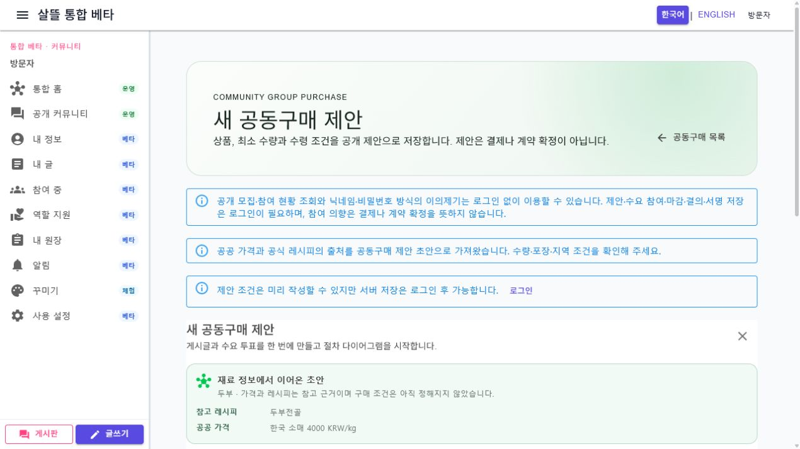
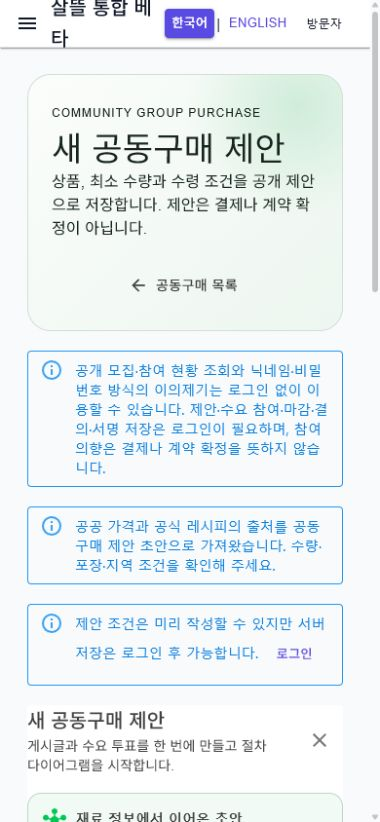

# 공동구매 Route·공용 Screen 단일책임 분리

날짜: 2026-07-22

## 변경 결과

- `/community/group-purchase`는 공개 모집 목록만 표시하며 상세를 자동 선택하지 않는다.
- `/community/group-purchase/new`는 새 제안과 공공 재료 근거 초안만 담당한다.
- 선택한 모집은 `/community/group-purchase/{CampaignId:guid}`로 직접 열고 참여, 공급자 찾기, 공개 협의, 이의제기, 결의, 서명, 배송 가능 정보와 이행 초안을 각각 하위 route로 분리했다.
- WebApp과 `SsalddelApp` route shell은 같은 `Ssalddel.Ui.Common` Screen을 조립한다.
- 과거 `/community/group-purchase?campaignId=...` 링크는 stable-ID 상세 route로 호환 이동한다.
- Command는 기존 `I공동구매업무Service`를 사용하며 성공 뒤 같은 campaign ID의 서버 원본을 다시 조회한다.
- 공급자·기사 정보를 자동 선택하지 않고 실제 결제·계약·자동 배차를 실행하지 않는다. 이행 route는 Simulation 발주·원장 초안 경계를 유지한다.

## 대표 화면

## 검증

- 공동구매 route·Screen·route catalog·capability·공공 재료 연결·route inventory 관련 테스트 154개 통과
- `Ssalddel.WebApp` 빌드: 경고 0, 오류 0
- `SsalddelApp` Windows 빌드: 경고 0, 오류 0
- `SsalddelAdminApp` Windows 빌드: 경고 0, 오류 0
- 실제 Web desktop 기본 1270px와 mobile 390×844에서 개설 화면을 확인했다.
- 두 폭에서 가로 overflow가 없고, 390px 공동구매 Screen 내부의 표시된 링크·버튼이 모두 44px 이상임을 확인했다.
- 목록 loading/error/retry, stable-ID 참여 route loading/error, 과거 campaign query redirect를 확인했다.
- 로컬 검증 시 API 서버가 실행되지 않아 실제 campaign 데이터가 있는 단계 화면과 Command 저장은 브라우저에서 재현하지 못했다. 해당 경계는 구성 테스트와 소비 앱 빌드, 저장 후 exact-ID 재조회 테스트로 대체 검증했다.
