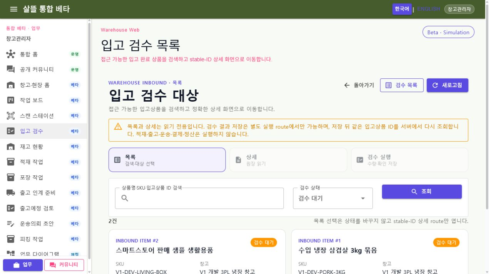
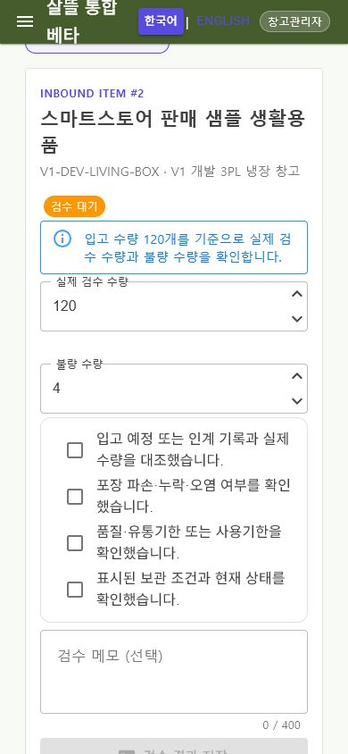

# 입고 검수 Route·공용 Screen 단일책임 분리

날짜: 2026-07-22

## 변경 결과

- 목록 선택, 상세 조회와 검수 저장을 함께 수행하던 376줄 `SsalddelInboundInspectionWorkspace`를 제거하고 `List`, stable-ID `Detail`, `Record` Screen으로 분리했다.
- `InboundInspectionPageRoutes`와 `InboundInspectionNavigationContext`가 Web·창고 앱의 canonical route, 기존 Web 호환 route와 검색·상태·페이지 복귀 문맥을 공통으로 관리한다. 외부 URL은 `from`으로 수용하지 않는다.
- 목록과 상세는 읽기 전용이고 검수 `Command`는 실행 route에서만 호출한다. 저장 성공 뒤에는 목록의 첫 항목을 추정하지 않고 같은 inbound item ID를 서버에서 다시 조회한다.
- 모바일은 넓은 master-detail 화면 대신 목록·상세·실행을 독립 화면으로 이동하며, 화면 전환 navigation을 2열·58px 터치 높이로 구성했다. 실행 화면에서는 입력 폼을 요약보다 먼저 표시한다.
- 입고 검수는 `WarehouseFulfillmentWorkflow`와 `Simulation` 경계를 그대로 사용한다. 추적 설정의 기본 비활성 값은 바꾸지 않았고 실제 렌더링 때만 로컬 프로세스에 기능 플래그를 주입했다.

## Route 책임

| Route | 책임 |
| --- | --- |
| `/work/inbound/inspection` | 접근 가능한 검수 대상 검색·필터와 stable-ID 대상 선택 |
| `/work/inbound/inspection/{InboundItemId:long}` | 한 입고상품의 입고·재고·검수 상태 읽기 |
| `/work/inbound/inspection/{InboundItemId:long}/record` | 실제 수량·불량 수량과 네 가지 현장 확인 뒤 명시적 저장 |

기존 `/warehouse/work/inbound/inspection` 경로도 같은 공용 Screen으로 연결하되 새 navigation은 canonical route를 사용한다.

## 대표 화면

캡처는 개발 seeder의 비식별 sample 상품·창고 데이터로 생성했다. 실제 주소, 연락처, 계좌, 결제 식별자와 증빙 원본은 포함하지 않았다.

## 실제 흐름 확인

1. `/work/inbound/inspection`에서 검수 대기 상품 2건을 조회하고 목록 선택이 상태를 바꾸지 않은 채 `/work/inbound/inspection/2`로 이동함을 확인했다.
2. stable-ID 상세에서 같은 상품의 입고 수량, 현재 가용·불량 수량, 창고와 보관 위치를 읽기 전용으로 확인했다.
3. `/work/inbound/inspection/2/record`에서 실제 수량과 불량 수량이 같은 ID 원장에서 채워지는 것을 확인했다.
4. 저장 버튼은 네 확인 항목 중 하나라도 빠지면 비활성이고 네 번째 확인 뒤에만 활성화됐다. 시각 검증 중 실제 저장 `Command`는 실행하지 않았다.
5. desktop 1270×714에서 navigation·검색·2열 카드가 가로 overflow 없이 표시됐다.
6. mobile 390×844에서 navigation이 2열, 각 항목 58px로 배치되고 가로 overflow 없이 실행 폼이 요약보다 먼저 표시됐다.
7. 목록·상세·실행 route를 이동하는 동안 브라우저 warning·error는 없었다.

## 검증

- 전체 `Ssalddel.Tests` 2,502개 통과
- 입고 검수 route·조립·ViewModel·capability 대상 테스트 96개 통과
- `Ssalddel.WebApp` 빌드: 경고 0, 오류 0
- `WarehouseManagerApp` Windows 빌드: 경고 0, 오류 0
- `SsalddelApp` Windows 빌드: 경고 0, 오류 0
- `SsalddelAdminApp` Windows 빌드: 경고 0, 오류 0
- 실제 Web desktop·390px mobile에서 목록·상세·실행 route 확인
- mobile horizontal overflow 없음, route 항목 높이 58px, 실행 폼이 요약보다 먼저 배치됨
- 브라우저 console warning·error 0개

## 다음 단계

`P1-4`의 다음 수직 단위로 query 기반 master-detail-action을 가진 피킹 작업을 감사하고, 목록·stable task detail·실행 `Command` route와 desktop adaptive composition의 분리 순서를 확정한다.
