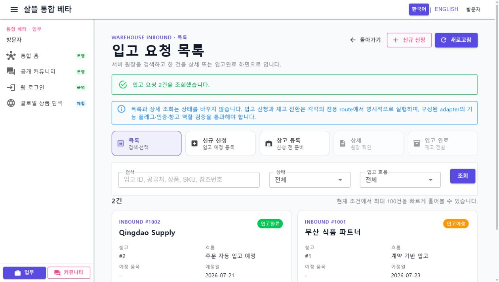
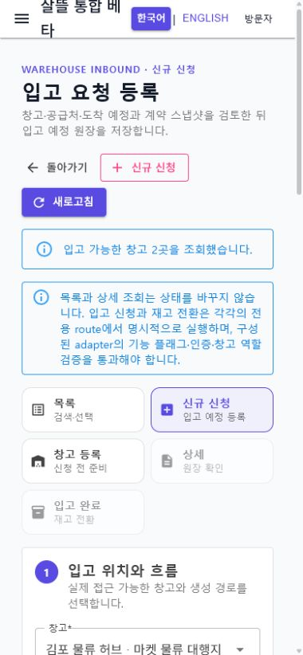

# 입고 요청 Route·공용 Screen 단일책임 분리

날짜: 2026-07-22

## 변경 결과

- 창고 등록·입고 신청·목록·상세·완료를 함께 수행하던 697줄 `SsalddelInboundRequestManager`를 제거하고 다섯 개 사용자 목표를 독립 Route Page와 공용 Screen으로 분리했다.
- `InboundRequestPageRoutes`가 stable inbound ID route, 안전한 local `from`, 다이어그램 후보·초안 문맥을 Web·모바일에 동일하게 제공한다. 생성 초안은 신규 신청·창고 등록 route에만 전달되고 `created` 표시는 상세 route에만 남는다.
- `InboundRequestPageViewModel`이 목록 조회, 창고 조회, 생성, 정확한 ID 상세 재조회, 입고 완료와 창고 등록 상태를 조율한다. 생성·완료 Command 응답 뒤에는 응답 목록의 첫 항목을 추정하지 않고 같은 inbound ID를 adapter에서 다시 조회한다.
- 일반 신규 신청은 계약 기반 입고만 생성한다. 현장 임시 입고는 안내 동의와 멱등 요청 ID가 있는 입고상품 수령 workflow, 주문 자동 입고 예정은 주문 workflow에 남겨 우회 생성을 막았다.
- 다이어그램 창고 후보는 신규 신청서에 검토할 초안만 전달하며 API Command를 직접 실행하지 않는다. 실제 warehouse ID가 없는 후보를 첫 번째 창고에 자동 연결하지 않는다.
- 모바일 목록은 넓은 표 대신 compact card로 표시하고 route navigation을 2열·58px 높이로 구성했다. 실제 렌더링에서 초안 요약이 입력 폼보다 먼저 나오던 순서를 바로잡아 1단계 입력을 우선 노출했다.

## Route 책임

| Route | 책임 |
| --- | --- |
| `/shipper/inbound/requests` | 입고 원장 검색·필터와 대상 선택 |
| `/shipper/inbound/requests/new` | 계약 기반 입고 예정 한 건 검토·등록 |
| `/shipper/inbound/requests/{InboundId:long}` | stable inbound ID의 원장·계약 스냅샷 재조회 |
| `/shipper/inbound/requests/{InboundId:long}/complete` | 실제 수량·불량·보관 위치 확인 후 명시적 재고 전환 |
| `/shipper/warehouses/new` | 입고 신청과 분리된 창고 기본정보 한 건 등록 |

## 대표 화면

캡처는 Web의 로컬 sample adapter와 비식별 창고·공급처 데이터로 생성했다. 실제 주소, 연락처, 계좌, 결제 식별자와 증빙 원본은 포함하지 않았다.

## 실제 흐름 확인

1. `/shipper/inbound/requests`에서 sample 입고 원장 2건을 조회하고 상태·흐름 필터와 compact card 목록이 조회 Command 없이 표시됨을 확인했다.
2. `/shipper/inbound/requests/1001`을 직접 열어 같은 ID의 입고 기준, 계약 스냅샷과 연결 원장을 조회했다.
3. `/shipper/inbound/requests/1001/complete`에서 sample 수량을 확인한 뒤 입고완료를 명시적으로 실행했다. 완료 뒤 같은 ID 재조회 문구와 생성 재고 항목이 표시되고, 현재 상태에서는 같은 Command 버튼이 비활성화됨을 확인했다.
4. desktop 1270×720에서 목록 navigation·검색·카드가 가로 overflow 없이 표시됐다.
5. mobile 390×844에서 신규 신청 navigation이 2열, 각 항목 58px로 배치되고 가로 overflow 없이 1단계 입력이 초안 요약보다 먼저 표시됐다.
6. 목록·신규 신청·상세·완료를 이동하는 동안 브라우저 warning·error는 없었다.

## 검증

- 전체 `Ssalddel.Tests` 2,481개 통과(입고 요청 대상 테스트 29개 포함)
- `Ssalddel.WebApp` 빌드: 경고 0, 오류 0
- `SsalddelApp` Windows 빌드: 경고 0, 오류 0
- `SsalddelAdminApp` Windows 빌드: 경고 0, 오류 0
- 실제 Web desktop 1270×720과 mobile 390×844에서 목록·신규 신청·상세·완료 route 확인
- desktop·mobile horizontal overflow 없음, mobile route 항목 높이 58px
- 브라우저 console warning·error 0개

## 다음 단계

`P1-4` 창고·판매 master-detail-action의 현재 route·공용 Screen 조립 상태를 감사하고, 모바일 독립 List·Detail·Action route와 desktop 선택형 split pane 분리 순서를 확정한다.
