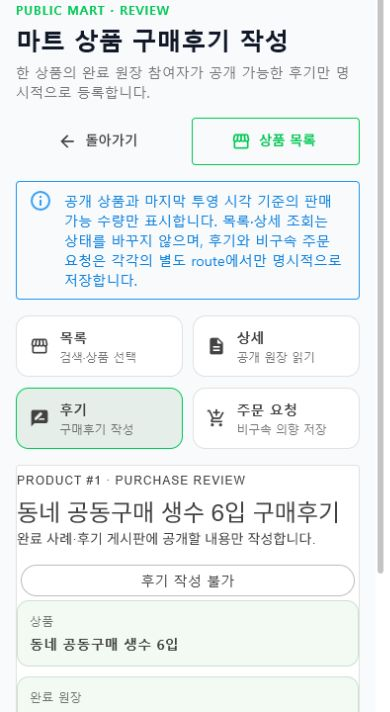

# 마트 공개 상품 Route·공용 Screen 단일책임 분리

## 결과

기존 `/food/mart?productId=...` 한 화면이 함께 소유하던 목록, 상세와 후기 작성을 사용자 목표별 Route Page로 분리했다. Web과 `OrdererApp`은 같은 canonical route 계약과 `Ssalddel.Ui.Common` Screen을 사용한다.

| 화면 | canonical route | 주 책임 | 저장 경계 |
| --- | --- | --- | --- |
| 목록 | `/food/mart` | 공개 상품 검색·판매 가능 조건·서버 페이징 | ReadOnly |
| 상세 | `/food/mart/products/{ProductId}` | stable product ID의 공개 설명·재고 투영·구매 근거 읽기 | ReadOnly |
| 후기 | `/food/mart/reviews/{ProductId}` | 완료 원장 참여자의 공개 후기 작성 | PlatformPersistence |
| 주문 요청 | `/food/mart/order/{ProductId}` | 한 상품의 비구속 주문 의향과 같은 요청 ID 영수증 | PlatformPersistence |

409줄 markup과 148줄 code-behind의 `OrdererMartCatalogWorkspace`를 제거했다. 목록은 `마트공개상품목록ViewModel`, 상세는 `마트공개상품상세ViewModel`만 사용한다. 후기 Screen만 저장을 호출하고 성공 뒤 목록 전체가 아니라 같은 product ID 한 건을 다시 조회한다. 주문 요청 Workspace는 공용 접근 frame 아래에서 상품·인증·작성·같은 request ID 영수증만 조립한다.

## 모바일 우선 확인

- 390px에서 마트 navigation은 2열이며 네 항목이 각각 63px 높이였다.
- 390px 내부 viewport의 `clientWidth`와 `scrollWidth`는 모두 380px로 가로 넘침이 없었다.
- 목록·상세·후기·주문 요청은 넓은 표 대신 단일 열 card와 stable-ID 이동을 사용한다.
- 주문 로그인 입력과 버튼은 모바일에서 최소 48px 터치 영역을 갖도록 보완했다. 실제 재빌드 렌더링에서 입력 69px, 버튼 48px를 확인했다.
- 전역 Web 언어 전환은 아직 31px이다. 마트 Screen 책임과 섞지 않고 다음 공통 셸 모바일 터치 기준 감사 대상으로 남겼다.

## 호환성과 안전 경계

- `/orderer/mart?productId=1&q=생수&available=1&page=1`은 `/food/mart/products/1?q=생수&available=true`로 이동해 유효한 검색 문맥을 보존했다.
- `/food/mart/order?productId=1`은 `/food/mart/order/1`로 이동했다.
- 공개 목록·상세 조회는 장바구니, 재고 예약·차감, 결제, 피킹·포장과 배송을 생성하지 않는다.
- 후기와 주문 요청은 별도 인증·PlatformPersistence route에서만 저장한다.
- 로컬 검증 프로세스에서만 `VersionFeatureFlags__SsalddelMartWorkflow=true`를 사용했다.
- 비식별 상품 두 건을 로컬 검증 DB에 잠시 넣었고 캡처 뒤 같은 검증 표식의 두 행을 삭제했다.
- 후기 작성, 주문 요청, 결제, 재고와 물류 Command는 실행하지 않았다.

## 실제 렌더링

### Desktop · 공개 상품 목록

1280px browser viewport에서 목록 card, 판매 가능·품절 구분, stable-ID 상세 진입과 가로 넘침 없음을 확인했다.

### Mobile 390px · 구매후기

후기 route의 독립 제목, 2열 navigation, 익명·완료 원장 미확인 disabled 상태와 세로 card 흐름을 확인했다.

## 검증

- 목록 → `/food/mart/products/1` 상세 → `/food/mart/reviews/1` 후기 → `/food/mart/order/1` 주문 요청 route 실제 확인
- desktop 1280px·mobile 390px에서 horizontal overflow 없음
- final browser console warning·error 0
- route 계약, capability, Web·Orderer 공용 Screen 조립과 같은 ID 재조회 자동 테스트
- clean commit 기준 `Ssalddel.Tests` 전체 2,528개 통과
- `Ssalddel.WebApp`, `OrdererApp`, `SsalddelApp`, `SsalddelAdminApp` 경고 0개·오류 0개 빌드
