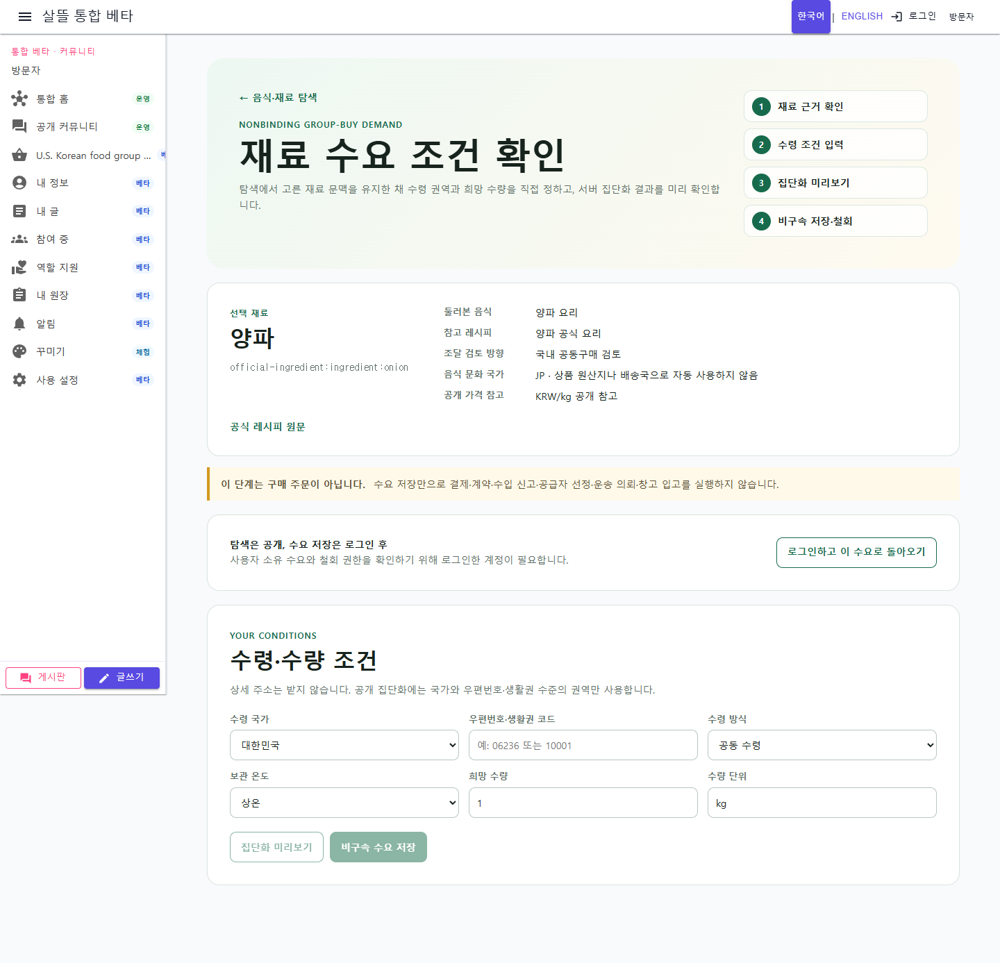

# 세계 음식·공식 재료에서 공동구매·공동수입 검토까지

## 변경 요약

- 공개 경로 `/information/food-ingredients`를 WebApp과 통합 MAUI 앱에 연결했다.
- 한국·일본·영국·미국·캐나다·프랑스 필터로 공식 원천에 수집된 음식을 먼저 둘러보고, 선택 음식의 대표 레시피와 구조화 재료를 같은 페이지에서 확인한다.
- 공개 음식 API는 음식 메타데이터와 구조화 재료·공공 가격·원문 출처만 반환하며 조리 지시문과 이미지 파일은 공개하지 않는다.
- 공식 재료 카드를 검색·가격·관련 레시피·비구속 수요 이동 책임으로 분리했다.
- 실제 재료당 관련 공식 레시피를 최대 3개 표시하고, 농수산·축산으로 확인되는 경우에만 국가·통화·단위·시장 단계·기준일과 함께 가격을 표시한다.
- 선택한 재료 또는 레시피의 비식별 출처만 독립 수요 등록 화면에 전달한다. 수량·지역·수령 조건은 사용자가 직접 확인하며 포장·공급 조건은 자동 확정하지 않는다.
- 음식에서 고른 재료는 `국내 공동구매 검토` 또는 `공동수입 검토`로 명시적으로 분기한다. 음식 문화 국가는 실제 상품 원산지나 출발국으로 자동 사용하지 않으며, 공동수입 여부는 후속 거래경로 단계에서 출발국·배송국·통관 상태·HS 코드로 다시 판정한다.
- 농수산 가격 비교 화면의 섹션 이동을 업무와 무관한 사방괘 탐색에서 명시적인 가격 자료 탭으로 단순화했다.

## 실제 화면

### 공식 재료 공개 조회

### 재료에서 이어온 비구속 수요 등록

실제 로컬 데이터에서 양파의 KAMIS 소매·도매 가격과 식약처 관련 레시피 3건을 확인했다. 이어지는 화면에서는 재료 문맥과 실행 경계를 desktop·390px에서 확인했으며 익명 상태라 수요 저장은 수행하지 않았다.

## 검증

- `OfficialFoodRecipeArchiveServiceTests`
- `OfficialFoodIngredientDiscoveryControllerTests`
- `PageCapabilityCatalogTests`
- `OfficialFoodIngredientJourneyTests`
- `AgriculturalFisheriesPriceComparisonViewModelTests`
- `dotnet build Ssalddel.WebApp/Ssalddel.WebApp.csproj --no-restore`
- `dotnet build SsalddelApp/SsalddelApp.csproj -f net10.0-windows10.0.19041.0 --no-restore`
