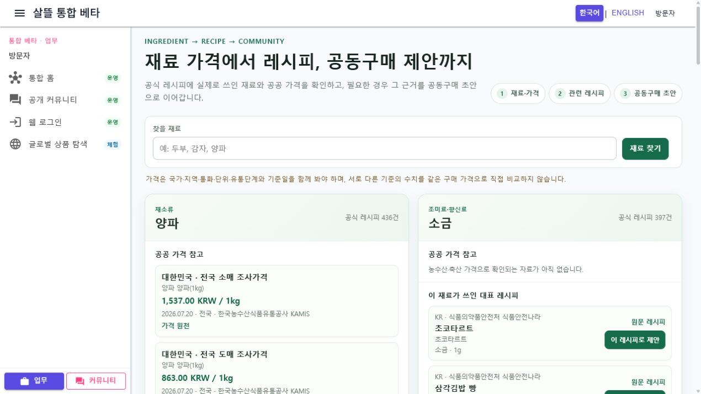
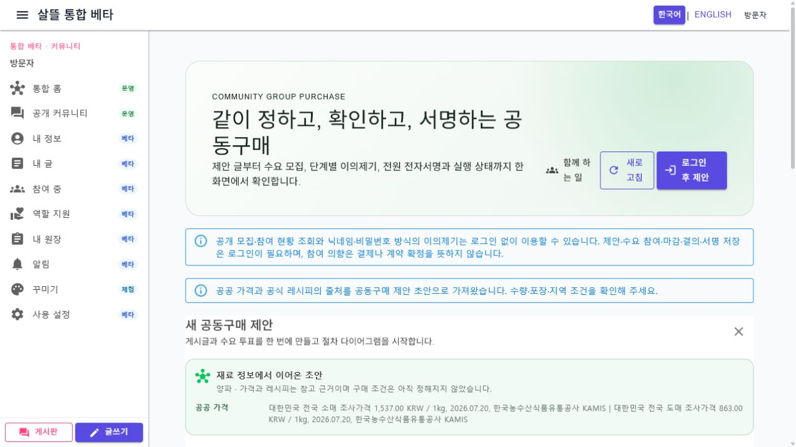

# 공식 재료·가격·레시피에서 공동구매 초안까지

## 변경 요약

- 공개 경로 `/information/food-ingredients`를 WebApp과 통합 MAUI 앱에 연결했다.
- 공식 재료 카드를 검색·가격·관련 레시피·공동구매 이동 책임으로 분리했다.
- 실제 재료당 관련 공식 레시피를 최대 3개 표시하고, 농수산·축산으로 확인되는 경우에만 국가·통화·단위·시장 단계·기준일과 함께 가격을 표시한다.
- 선택한 재료 또는 레시피의 비식별 출처만 공동구매 제안 초안에 전달한다. 수량·포장·지역·공급 조건은 자동 확정하지 않는다.
- 농수산 가격 비교 화면의 섹션 이동을 업무와 무관한 사방괘 탐색에서 명시적인 가격 자료 탭으로 단순화했다.

## 실제 화면

### 공식 재료 공개 조회

### 재료에서 이어온 공동구매 초안

실제 로컬 데이터에서 양파의 KAMIS 소매·도매 가격과 식약처 관련 레시피 3건을 확인했다. 공동구매 화면으로 이동했지만 제안 저장은 수행하지 않았다. 자동화 브라우저의 임시 viewport override가 적용되지 않아 이번 기록은 1280px desktop 캡처만 남겼으며, 900px·640px 재배치 규칙, 44px 입력·동작 영역과 소비 MAUI 빌드로 모바일 계약을 간접 확인했다.

## 검증

- `PageCapabilityCatalogTests`
- `OfficialFoodIngredientJourneyTests`
- `AgriculturalFisheriesPriceComparisonViewModelTests`
- `dotnet build Ssalddel.WebApp/Ssalddel.WebApp.csproj --no-restore`
- `dotnet build SsalddelApp/SsalddelApp.csproj -f net10.0-windows10.0.19041.0 --no-restore`
