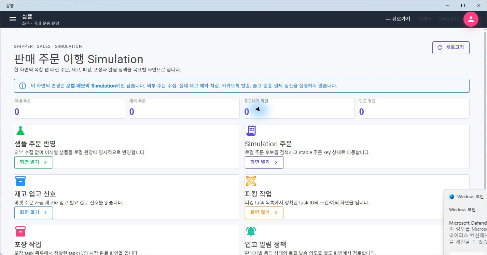
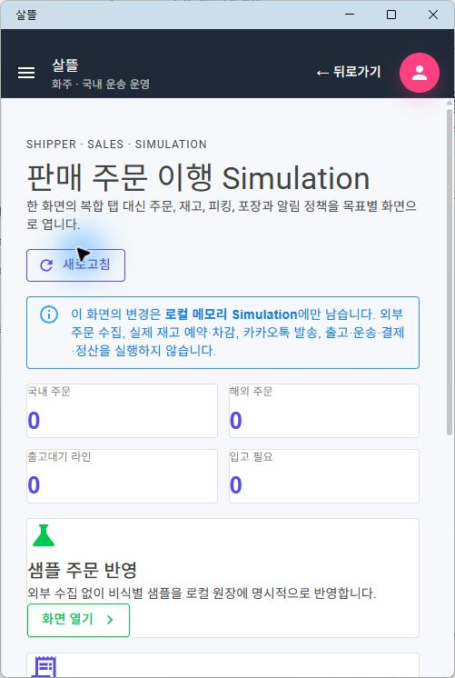
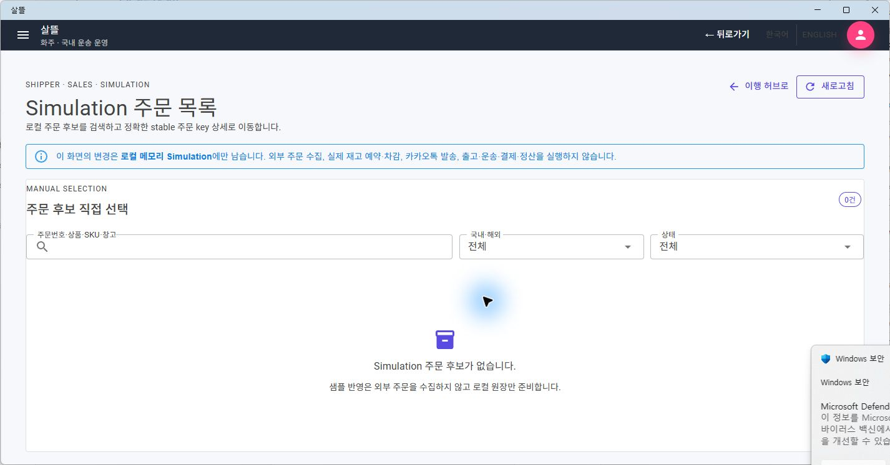

# 판매 주문 이행 목표별 Route 단일책임 분리

## 결과

`/shipper/sales/fulfillment`의 주문·재고·피킹·포장·알림 정책 복합 탭을 상태 변경 없는 허브와 사용자 목표별 Route Page로 분리했다. 모바일은 넓은 작업표 대신 목록 → stable key 상세/Action으로 이동하며, 피킹·포장 Command는 주소가 가리키는 정확한 task 한 건에서만 실행한다.

| 경계 | 변경 결과 |
| --- | --- |
| 영속 판매 주문 | Web·모바일 공통 `/shipper/sales/orders` 목록과 stable order ID 상세 유지 |
| 로컬 Simulation 허브 | 요약과 목표별 진입점만 읽고 Command를 실행하지 않음 |
| 주문·재고 | 목록·상세·snapshot 조회 전용 route로 분리 |
| 피킹·포장 | 읽기 목록과 stable task ID Action route를 분리 |
| 알림 정책·샘플 | 각각 독립 Simulation route에서만 로컬 상태 변경 |
| 운영 효과 | 외부 주문 수집, 실제 재고 예약·차감, 메시지 발송, 출고·운송·결제·정산 비활성 유지 |

## Route와 capability

| Route | 한 가지 책임 | 경계 |
| --- | --- | --- |
| `/shipper/sales/fulfillment` | 목표 허브와 요약 | ReadOnly |
| `/shipper/sales/fulfillment/samples` | 비식별 샘플을 로컬 원장에 명시적으로 반영 | Simulation |
| `/shipper/sales/fulfillment/orders` | 로컬 주문 후보 검색·필터 | ReadOnly |
| `/shipper/sales/fulfillment/orders/{OrderKey}` | opaque stable 주문 key 한 건 조회 | ReadOnly |
| `/shipper/sales/fulfillment/inventory` | 재고 snapshot·입고 검토 신호 조회 | ReadOnly |
| `/shipper/sales/fulfillment/picking` | 피킹 task 목록 | ReadOnly |
| `/shipper/sales/fulfillment/picking/{TaskId:long}` | 정확한 task의 스캔·보류·취소 | Simulation |
| `/shipper/sales/fulfillment/packing` | 포장 task 목록 | ReadOnly |
| `/shipper/sales/fulfillment/packing/{TaskId:long}` | 정확한 task의 시작·완료 | Simulation |
| `/shipper/sales/fulfillment/restock-policy` | 판매자별 로컬 알림 정책 편집 | Simulation |

주문 상세 key는 채널과 주문번호를 URL-safe opaque 값으로 왕복하며 slash·공백·한글을 경로 구분자로 오해하지 않는다. task route builder는 0 이하 ID를 거부하고, 존재하지 않는 주문·task는 다른 항목으로 자동 대체하지 않는다. 주문 목록의 검색·국내외·상태는 상세의 안전한 local `from`에 보존된다.

## 모바일 기준

- 허브와 task 목록은 720px 이하에서 단일 열로 줄어든다.
- 뒤로가기·새로고침·목록의 주 행동은 최소 48px 높이를 갖는다.
- 피킹·포장 목록에는 수령인과 주소를 표시하지 않는다.
- route를 이동할 때 이전 화면의 스크롤 위치를 이어받지 않고 새 화면의 `h1`과 상단 경계를 먼저 보여 준다.
- Windows 앱의 최소 축소 너비가 501px이어서 실제 501px 창으로 확인했다. Android·iOS 실기기 390px 확인은 해당 배포 대상이 정해질 때 별도로 수행한다.

## 실제 화면

상태를 바꾸지 않는 desktop 허브에서 각 목표가 독립 카드로 분리된 것을 확인했다.

501px 좁은 창에서는 허브 카드가 단일 열로 정리된다.

주문 목록은 검색·국내외·상태와 empty 안내만 소유한다.

허브의 아래쪽 카드에서 이동해도 501px 목록이 제목부터 시작하는 것을 실제 WebView2에서 확인했다.

비식별 empty 상태와 조회 이동만 사용했으며 샘플 반영, 피킹·포장, 알림 정책 Command는 시각 검증 중 실행하지 않았다.

## 검증

- route·stable key·capability·페이지 조립·개인정보·터치 영역 대상 테스트 130개와 저장소 전체 테스트 2,560개 통과
- `SsalddelApp` `net10.0-windows10.0.19041.0` build 경고 0개·오류 0개
- `Ssalddel.WebApp` build 경고 0개·오류 0개
- 실제 MAUI Windows WebView2에서 desktop 허브·주문 목록과 플랫폼 최소 501px 허브·목록 확인
- 501px에서 단일 열, 가로 넘침 없음, 48px 행동, route 전환 뒤 상단 복원 확인
