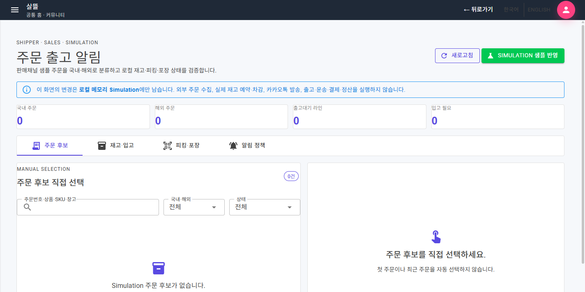
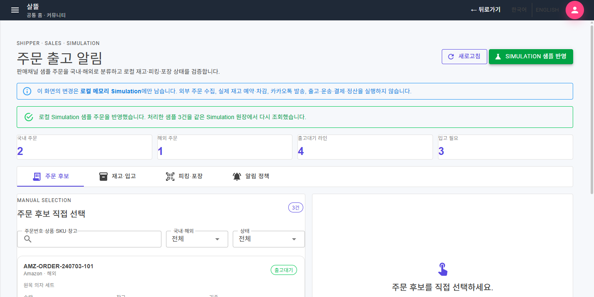
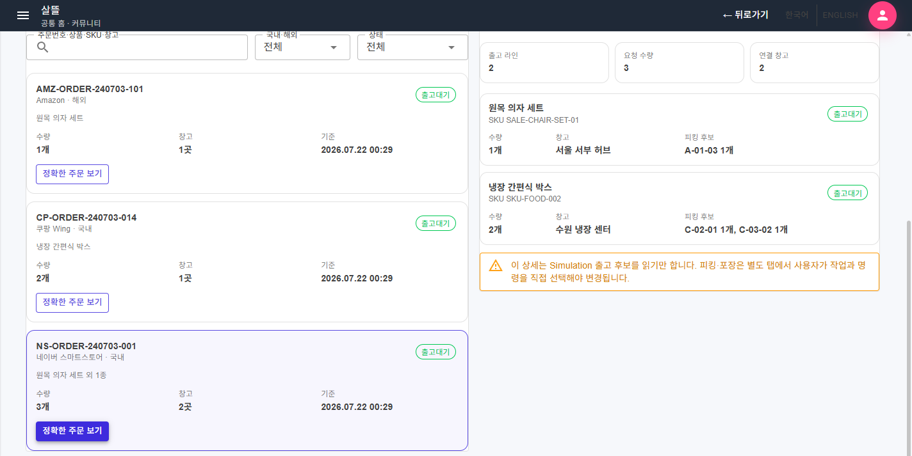
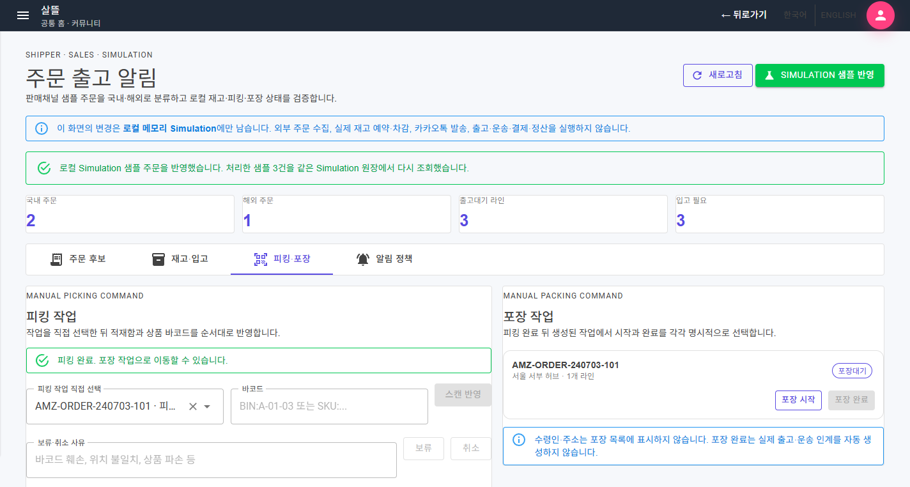
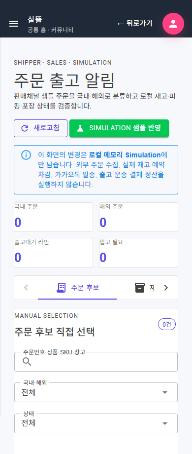
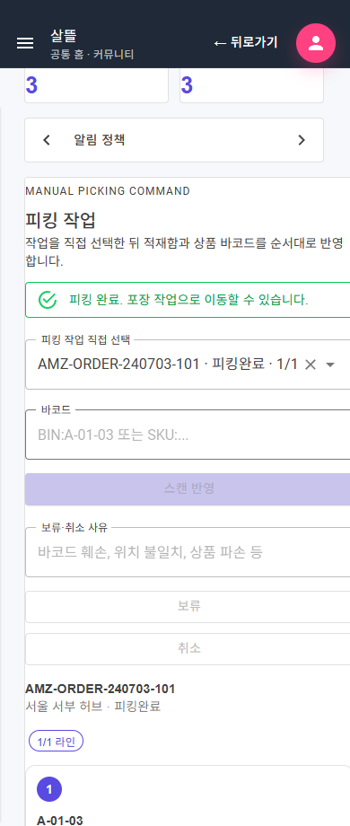

# 판매 주문 이행 페이지 단일책임 분리

> 후속 상태: 이 기록은 한 route 내부의 component·ViewModel 책임을 먼저 나눈 시점의 이력이다. 이후 [판매 주문 이행 목표별 Route 단일책임 분리](2026-07-22-order-fulfillment-route-srp.md)에서 복합 탭을 허브·목록·상세·stable task Action·정책 route로 다시 분리했으며, 아래 화면은 변경 전 구조를 설명하는 역사적 증거로 보존한다.

## 변경 기록

| 변경 축 | 화면 변경 여부 | 책임 경계 |
| --- | --- | --- |
| 주문 이행 route shell | 구조 정돈 | 631줄 화면을 61줄 shell과 40줄 code-behind로 줄이고 상태 영역과 업무 component만 조립 |
| 주문 조회 | 화면 보강 | 일곱 조회를 병렬로 모으고 국내·해외·상태·검색 필터, 정확한 주문 선택과 파생 요약만 담당 |
| Simulation 샘플 | 경계 보강 | 외부 판매채널 수집처럼 보이던 action을 로컬 메모리 샘플 반영으로 명시하고 독립 ViewModel로 분리 |
| 재고·입고 | 구조 정돈 | 현재 재고와 입고 필요 목록을 읽기 전용 panel로 분리 |
| 피킹 Command | 화면 보강 | 작업을 직접 선택하고 적재함·상품 바코드를 순서대로 반영하며 보류·취소 사유를 별도로 검증 |
| 포장 Command | 구조 정돈 | 피킹 완료 뒤 생성된 포장 작업의 시작과 완료를 각각 명시적으로 실행 |
| 알림 정책 | 구조 정돈 | 판매자별 입고 알림 기본값과 SKU override 편집을 독립 책임으로 분리 |
| 표현·개인정보 | 경계 보강 | 상태·채널·날짜·메시지 표현을 분리하고 피킹·포장 화면에서 수령인과 주소를 표시하지 않음 |
| 반응형 스타일 | 화면 보강 | 암시적 Grid 최소 폭을 제거하고 720px 이하 목록·입력·작업 영역을 단일 열로 전환 |

## 조립 구조

```text
OrderFulfillment (61줄 route shell)
├─ OrderFulfillmentPageViewModel
│  ├─ OrderFulfillmentReadViewModel
│  ├─ OrderFulfillmentSimulationViewModel
│  ├─ OrderFulfillmentRestockPolicyViewModel
│  ├─ OrderFulfillmentPickingViewModel
│  └─ OrderFulfillmentPackingViewModel
├─ OrderFulfillmentHeader / LoadState / Summary
├─ OrderFulfillmentOrderListPanel / OrderDetailPanel
├─ OrderFulfillmentInventoryPanel / RestockPolicyPanel
├─ OrderFulfillmentPickingPanel / PackingPanel
└─ OrderFulfillmentPresentation
```

route shell은 하위 상태와 event만 연결한다. 읽기 ViewModel은 여러 조회 결과를 한 snapshot으로 만들고, 각 Command ViewModel은 자기 입력과 실행 결과만 소유하며, 페이지 ViewModel은 성공 뒤 같은 Simulation 원장을 다시 읽는 순서만 조율한다.

## 유지·보강한 제품 경계

- 첫 주문이나 최근 주문을 자동 선택하지 않고 사용자가 고른 정확한 주문 key만 상세로 연다.
- 피킹 작업도 자동 선택하지 않으며, 선택한 작업과 일치하는 적재함·상품 바코드만 순서대로 반영한다.
- 보류와 취소는 사유가 있어야 실행되며 중복 실행 중에는 다른 Command를 비활성화한다.
- 모든 변경은 기존 `InMemoryShipperStore`의 로컬 메모리 Simulation에만 남는다.
- 외부 주문 수집, 실제 재고 예약·차감, 카카오톡 발송, 출고·운송 인계, 결제와 정산을 실행하지 않는다.
- 피킹·포장 작업 목록에서 수령인과 주소를 표시하지 않는다.

## 화면

초기 화면은 선택을 자동 보정하지 않고 빈 주문 후보와 Simulation 경계를 먼저 표시한다.



로컬 샘플 세 건을 반영하면 국내·해외·출고대기·입고 필요 요약과 필터 가능한 주문 후보를 보여 준다.



선택한 정확한 주문만 라인·창고·피킹 계획과 함께 표시한다.



적재함과 상품 바코드를 모두 확인하면 피킹 완료 상태와 새 포장대기 작업이 같은 화면에 나타난다.



390px 폭에서는 요약·입력·피킹·포장 영역이 단일 열로 줄어들고 탭은 좌우 이동 control을 제공한다.





캡처 당시에는 clean 격리 worktree의 실제 MAUI Blazor `/shipper/sales/orders` route를 WebView2로 렌더링했다. 이후 Web·모바일 route 의미를 맞추는 작업에서 이 동일한 Simulation 화면은 `/shipper/sales/fulfillment`로 이동했고, `/shipper/sales/orders`는 공용 영속 원장 목록·상세가 되었다. 비식별 샘플만 사용했으며 외부 주문·재고·메시지·운송·결제 효과는 실행하지 않았다.

## 검증

- clean 격리 worktree `SsalddelApp` Windows build 경고 0개·오류 0개
- route 조립, ViewModel 분리, Simulation 경계, 개인정보 비노출과 반응형 구조 테스트 24개 통과
- 실제 MAUI 화면에서 샘플 3건 반영, 정확한 주문 선택, AMZ 피킹 작업 직접 선택, 적재함·상품 바코드 반영, 피킹 완료와 포장대기 생성 확인
- 재고·입고, 피킹·포장, 알림 정책 탭과 loading·empty·error·retry 상태를 실제 DOM과 구조로 확인
- 390px mobile에서 `body.scrollWidth=390`, shell 폭 324px로 문서 가로 넘침 없음 확인
- 주 작업 트리의 전체 build는 이번 변경과 무관한 기존 미완료 UI 변경의 compile 오류가 있어, HEAD와 이번 작업만 합성한 clean worktree에서 검증
