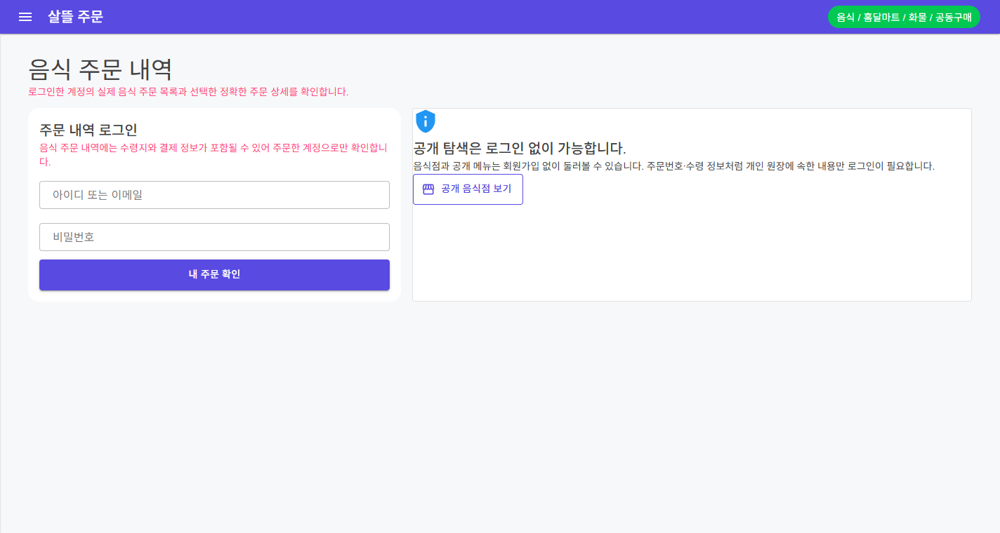
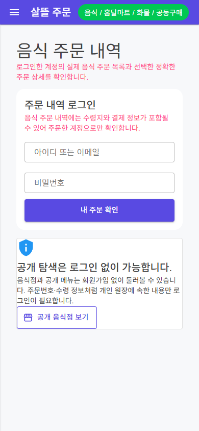

# 주문자 음식 주문 내역 단일책임 분리

## 변경 기록

| 변경 축 | 화면 변경 여부 | 책임 경계 |
| --- | --- | --- |
| 음식 주문 route shell | 구조 정돈 | 320줄 화면을 40줄 shell과 66줄 route/event code-behind로 줄이고 접근 상태와 업무 component만 조립 |
| 접근 상태 | 구조 정돈 | 기능 플래그 확인·오류·비활성·세션 복원 중 상태를 독립 component로 분리 |
| 로그인 경계 | 화면 유지 | 개인 주문 원장은 주문자 계정으로만 열고 공개 음식점 탐색은 익명으로 이동 가능하도록 분리 |
| 인증 후 머리글 | 경계 보강 | 현재 사용자와 로그아웃, 주문·결제·음식점 수락·배차 비실행 안내만 담당 |
| 검색·목록 | 구조 정돈 | 검색 조건·서버 paging과 loading·empty·error·retry 표시를 각각 독립 책임으로 분리 |
| 정확한 상세 | 경계 보강 | 사용자가 고른 `orderNo` 한 건만 조회하고 없는 번호를 다른 주문으로 대체하지 않음 |
| 개인정보 표시 | 경계 보강 | 주문 상품과 수령 정보·연락처·주소·상태 이력을 민감정보 disclosure 안에서 필요할 때만 펼침 |
| 모바일 조작성 | 화면 보강 | 1100px 이하에서 목록과 상세, 720px 이하에서 로그인·검색·카드를 단일 열로 전환하고 주요 action 높이를 44px로 보강 |

## 조립 구조

```text
OrdererFoodOrderWorkspace (40줄 shell)
├─ 주문자음식주문PageViewModel
│  ├─ 음식배달페이지접근ViewModel
│  ├─ 주문자앱인증ViewModel
│  ├─ 주문자음식주문목록ViewModel
│  └─ 주문자음식주문상세ViewModel
├─ OrdererFoodOrderAccessState / LoginPanel / Header
├─ OrdererFoodOrderSearchPanel / ListPanel / DetailPanel
└─ OrdererFoodOrderPresentation
```

shell은 상태 분기와 하위 event만 연결한다. 페이지 ViewModel은 기능 접근, 세션 복원, 목록 조회와 정확한 상세 조회 순서만 조율한다. 목록 ViewModel은 검색·paging, 상세 ViewModel은 선택한 주문번호 한 건, 인증 ViewModel은 주문자 세션만 소유한다.

## 유지·보강한 제품 경계

- `FoodDeliveryWorkflow`가 비활성이면 인증 복원과 개인 주문 API를 호출하지 않는다.
- 기능이 활성이어도 익명 세션에서는 개인 주문 목록·상세 API를 호출하지 않는다.
- 로그인 또는 복원된 사용자만 자신의 영속 음식 주문을 조회한다.
- 첫 주문이나 예시 주문을 자동 선택하지 않고 URL 또는 목록에서 선택한 정확한 `orderNo`만 조회한다.
- 같은 `orderNo`의 route 재적용은 중복 조회하지 않으며 빈 route로 돌아가면 상세 선택을 해제한다.
- 로그아웃 성공 뒤 목록·필터·상세의 개인 상태를 비운다.
- 이 화면은 주문 생성, 음식점 수락, 결제 승인과 배차 상태 전이를 실행하지 않는다.

## 화면

데스크톱에서는 로그인 카드와 익명 공개 탐색 안내를 분리해 개인 원장과 공개 정보의 경계를 먼저 보여 준다.



390px 폭에서는 로그인과 공개 탐색 안내를 한 열로 전환하며 주요 action의 터치 높이를 44px로 유지한다.



캡처는 검증 중에만 local API의 `FoodDeliveryWorkflow`를 활성화하고 실제 Windows `OrdererApp` `/orders` route를 WebView2로 렌더링한 결과다. 로그인을 실행하지 않아 사용자 정보, 주문번호, 수령지, 연락처와 결제 정보는 포함되지 않았다.

## 검증

- `Ssalddel.Ui.Common` build 경고 0개·오류 0개
- `OrdererApp` Windows build 경고 0개·오류 0개
- 접근·인증·목록·정확한 상세와 화면 조립·비실행 경계·반응형 구조 테스트 26개 통과
- 기능 비활성·익명 세션에서 개인 주문 API를 호출하지 않는 동작 테스트 통과
- 로그인 세션 복원, 명시적 로그인, 같은 route 중복 방지, route 선택 해제와 로그아웃 상태 초기화 테스트 통과
- 실제 OrdererApp 로그인 보호 화면에서 개인 주문번호 비노출과 Blazor 오류 UI 비노출 확인
- desktop `scrollWidth=1424`, 390px mobile `scrollWidth=390`, 닫힌 drawer 외 가로 넘침 0개 확인
- 390px mobile의 `내 주문 확인` action 높이 44px 확인
