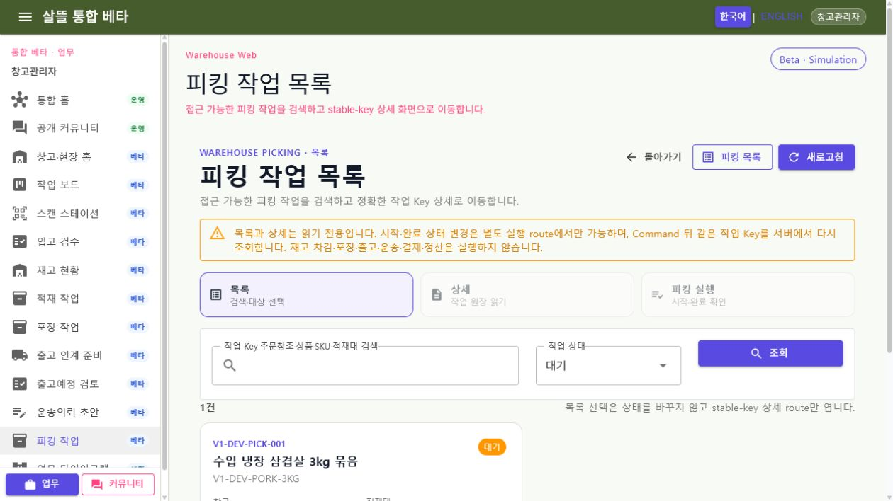
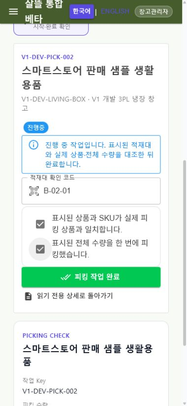

# 피킹 작업 Route·공용 Screen 단일책임 분리

날짜: 2026-07-22

## 변경 결과

- 목록 선택, 상세 조회와 시작·완료를 한 화면에서 수행하던 `SsalddelPickingTaskWorkspace`를 제거하고 `List`, stable-key `Detail`, `Execute` Screen으로 분리했다.
- `PickingTaskPageRoutes`와 `PickingTaskNavigationContext`가 Web·창고 앱의 canonical route, 기존 Web 호환 route와 검색·상태·페이지 복귀 문맥을 공통으로 관리한다. 외부 URL은 `from`으로 수용하지 않는다.
- 목록과 상세는 읽기 전용이고 시작·완료 `Command`는 실행 route에서만 호출한다. 성공 뒤에는 목록 전체나 첫 항목을 추정하지 않고 같은 task key 한 건을 서버에서 다시 조회한다.
- 모바일은 넓은 master-detail 화면 대신 목록·상세·실행을 독립 화면으로 이동하며, navigation을 2열·58px 터치 높이로 구성했다. 실행 화면에서는 확인 폼을 긴 작업 요약보다 먼저 표시한다.
- 피킹 작업은 `WarehouseFulfillmentWorkflow`와 `Simulation` 경계를 그대로 사용한다. 추적 설정의 기본 비활성 값은 바꾸지 않았고 실제 렌더링 때만 로컬 프로세스에 기능 플래그를 주입했다.

## Route 책임

| Route | 책임 |
| --- | --- |
| `/work/picking-batch` | 접근 가능한 피킹 작업 검색·필터와 stable-key 대상 선택 |
| `/work/picking-batch/{TaskKey}` | 한 피킹 작업의 상품·수량·적재대·담당·현재 상태 읽기 |
| `/work/picking-batch/{TaskKey}/execute` | 대기 작업 시작 또는 진행 중 작업의 적재대·상품·전체 수량 확인 뒤 완료 |

기존 `/warehouse/work/picking-batch[/...]` 경로도 같은 공용 Screen으로 연결하되 새 navigation은 canonical route를 사용한다. 기존 `?taskKey=...` 링크는 stable-key 상세 route로 호환 이동한다.

## 대표 화면

캡처는 개발 seeder의 비식별 sample 상품·창고 데이터로 생성했다. 실제 주소, 연락처, 계좌, 결제 식별자와 증빙 원본은 포함하지 않았다.

## 실제 흐름 확인

1. `/work/picking-batch`에서 대기 작업 `V1-DEV-PICK-001`을 조회하고 목록 선택이 상태를 바꾸지 않은 채 stable-key 상세로 이동함을 확인했다.
2. 상세 route에서 같은 Key의 상품, 수량, 적재대, 담당과 현재 상태를 읽기 전용으로 확인했다.
3. 대기 작업 실행 route에서 시작 버튼이 활성화되는 것을 확인했지만 시작 `Command`는 실행하지 않았다.
4. 진행 중 sample `V1-DEV-PICK-002`의 mobile 실행 화면에서 적재대 코드, 상품 확인, 전체 수량 확인 순으로 입력했으며 세 조건이 모두 충족된 뒤에만 완료 버튼이 활성화됐다. 완료 `Command`는 실행하지 않았다.
5. desktop 1270×714에서 navigation·검색·목록이 가로 overflow 없이 표시됐다.
6. mobile 390×844에서 navigation이 2열, 각 항목 58px로 배치되고 가로 overflow 없이 실행 폼이 요약보다 먼저 표시됐다.
7. `?taskKey=V1-DEV-PICK-001` legacy query와 `/warehouse/work/picking-batch/V1-DEV-PICK-001` Web alias가 같은 stable-key 상세로 연결됐다.
8. 목록·상세·실행 route를 이동하는 동안 브라우저 warning·error는 없었다.

## 검증

- 전체 `Ssalddel.Tests` 2,523개 통과
- 피킹 route·조립·ViewModel·capability 대상 테스트 107개 통과
- `Ssalddel.WebApp` 빌드: 경고 0, 오류 0
- `WarehouseManagerApp` Windows 빌드: 경고 0, 오류 0
- `SsalddelApp` Windows 빌드: 경고 0, 오류 0
- `SsalddelAdminApp` Windows 빌드: 경고 0, 오류 0
- 실제 Web desktop·390px mobile에서 목록·상세·실행 route 확인
- desktop·mobile horizontal overflow 없음, mobile route 항목 높이 58px, 실행 폼이 요약보다 먼저 배치됨
- 브라우저 console warning·error 0개
- 시각 검증 중 시작·완료 `Command`를 실행하지 않아 개발 DB의 피킹 상태를 변경하지 않음

## 다음 단계

`P1-4`의 다음 수직 단위로 마트 상품과 판매 주문의 master-detail-action 구조를 감사하고, stable-ID route·읽기 Screen·실행 Screen 분리 우선순위를 확정한다.
