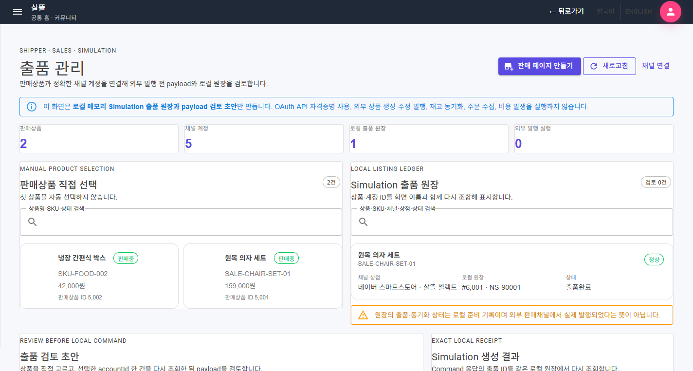
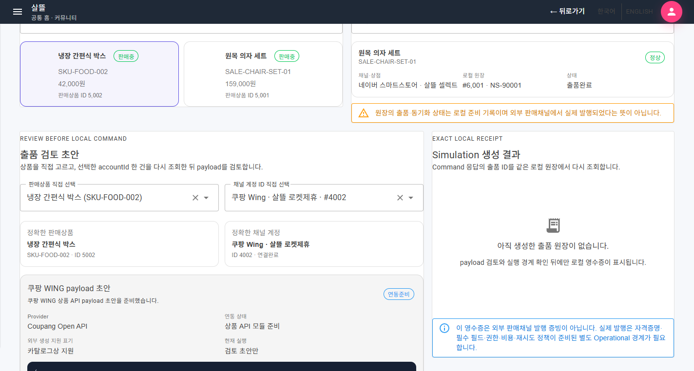
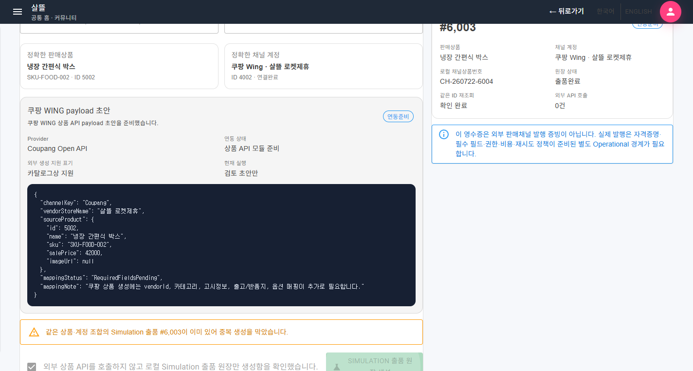
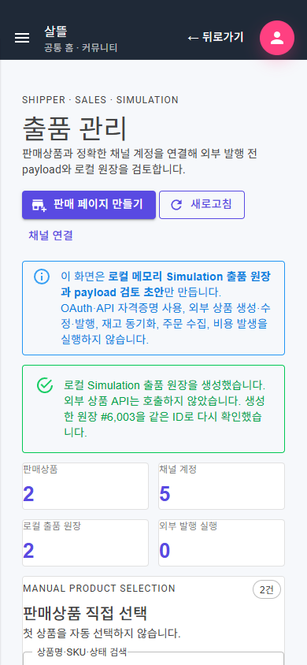

# 판매상품 출품 페이지 단일책임 분리

## 변경 기록

| 변경 축 | 화면 변경 여부 | 책임 경계 |
| --- | --- | --- |
| 출품 관리 route shell | 구조 정돈 | 209줄 화면을 47줄 shell과 36줄 navigation code-behind로 줄이고 상태 영역과 업무 component만 조립 |
| 현황 조회 | 화면 보강 | 판매상품·채널 계정·로컬 출품 원장을 병렬 조회하고 검색·요약·표시용 join만 담당 |
| 판매상품 선택 | 화면 보강 | 첫 항목 자동 선택을 없애고 사용자가 고른 정확한 판매상품 ID만 초안에 전달 |
| 채널 계정 확인 | 경계 보강 | 목록 값으로 실행하지 않고 선택한 `accountId` 한 건을 기존 상세조회 계약으로 다시 조회 |
| payload 검토 | 화면 보강 | 채널별 mapper가 만든 JSON 초안과 준비 상태를 외부 실행 전에 별도 panel에서 확인 |
| Simulation 원장 생성 | 경계 보강 | 외부 상품 API 비호출을 명시적으로 확인한 뒤 로컬 메모리 원장만 생성하고 같은 출품 ID를 재조회 |
| 중복·결과 처리 | 화면 보강 | 같은 상품·계정 조합의 중복 생성을 막고 생성 응답과 재조회 결과를 독립 영수증으로 표시 |
| 표현·반응형 스타일 | 구조 정돈 | 채널·상태·금액·JSON 표현을 분리하고 720px 이하에서 목록·검토·결과 영역을 단일 열로 전환 |

## 조립 구조

```text
ProductListings (47줄 route shell)
├─ ProductListingsPageViewModel
│  ├─ ProductListingReadViewModel
│  ├─ ProductListingDraftViewModel
│  └─ ProductListingCreateViewModel
├─ ProductListingsHeader / LoadState / Feedback / Summary
├─ ProductListingProductPanel / LedgerPanel
├─ ProductListingDraftPanel / ResultPanel
└─ ProductListingPresentation
```

route shell은 하위 상태와 event만 연결한다. 읽기 ViewModel은 세 조회 결과를 하나의 snapshot으로 만들고, 초안 ViewModel은 정확한 상품·계정과 payload 검토만, 생성 ViewModel은 로컬 Command와 같은 ID 재조회 결과만 소유한다. 페이지 ViewModel은 이 순서만 조율한다.

## 유지·보강한 제품 경계

- 첫 판매상품과 첫 채널 계정을 자동 선택하지 않는다.
- 채널 계정은 사용자가 선택한 ID 한 건을 기존 `계정상세조회Async` 계약으로 다시 조회한다.
- 동일 상품·계정 조합의 로컬 출품 원장이 있으면 중복 생성을 차단한다.
- 생성 전 외부 상품 API를 호출하지 않는다는 확인을 받아 로컬 `InMemoryShipperStore`의 Simulation 원장만 만든다.
- 생성 성공 뒤 Command 응답의 출품 ID와 같은 항목을 다시 조회해 영수증에 표시한다.
- OAuth/API 자격증명 사용, 외부 상품 생성·수정·발행, 재고 동기화, 주문 수집과 비용 발생은 실행하지 않는다.

## 화면

초기 화면은 선택을 자동 보정하지 않고 판매상품·채널 계정·로컬 원장 수와 외부 실행 0건을 먼저 표시한다.



직접 고른 판매상품과 정확히 다시 조회한 채널 계정으로 채널별 payload 초안을 검토한다.



명시적 확인 뒤 생성한 로컬 원장은 같은 ID 재조회 여부와 외부 API 호출 0건을 별도 영수증으로 표시한다.



390px 폭에서는 현황·목록·검토·영수증이 한 열로 줄어들며 닫힌 drawer 외 문서 가로 넘침이 없다.



캡처는 clean 격리 worktree의 실제 MAUI Blazor `/shipper/sales/listings` route를 WebView2로 렌더링한 결과다. 비식별 로컬 샘플만 사용했으며 외부 판매채널 효과는 실행하지 않았다.

## 검증

- clean 격리 worktree `SsalddelApp` Windows build 경고 0개·오류 0개
- route 조립, ViewModel 분리, 정확한 계정 조회, 같은 ID 재조회, Simulation 경계와 반응형 구조 테스트 21개 통과
- 실제 MAUI 화면에서 상품 ID 5002와 계정 ID 4002를 직접 선택하고 쿠팡 payload 초안 준비 확인
- 명시적 확인 전 생성 button 비활성, 확인 뒤 로컬 출품 #6003 생성, 같은 ID 재조회와 중복 생성 차단 확인
- 외부 API 호출 0건과 Blazor 오류 UI 비노출 확인
- 390px mobile에서 `body.scrollWidth=390`, shell 폭 334px로 문서 가로 넘침 없음 확인
- 주 작업 트리의 전체 build는 이번 변경과 무관한 기존 미완료 UI 변경의 compile 오류가 있어, HEAD와 이번 작업만 합성한 clean worktree에서 검증
