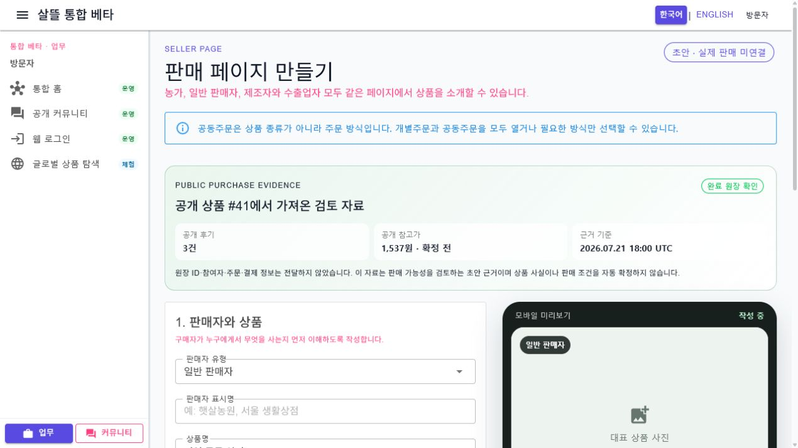

# 구매 근거를 잇는 상품 상세·판매 초안 UI

## 변경 요약

- 마트 공개 상품 상세에 완료 원장 확인 상태, 공개 후기 수, 최근 공개 후기와 기준 시각을 표시한다.
- 로그인한 원장 참여자만 명시적으로 후기를 작성할 수 있고, 익명 사용자는 로그인 경계만 본다.
- 완료 원장이 확인된 공개 상품만 판매 페이지 초안 이동을 제공한다.
- 판매 페이지는 공개 상품 ID·상품 표시 정보·공개 후기 수·참고 가격만 초안 근거로 받아 표시한다.
- 상세 설명, 원산지, 출고지와 최소 주문 수량 입력을 판매 조건과 분리했다.

## 개인정보·실행 경계

- 원장 ID, 참여자, 주소, 연락처, 주문·결제·계약과 내부 재고는 query seed와 공개 화면에 포함하지 않는다.
- 공개 참고가는 판매가로 자동 확정하지 않는다.
- 후기 등록과 판매 초안 저장은 사용자의 명시적 동작과 서버 권한·근거 재검증을 거친다.

## 실제 화면

1280px WebApp에서 공개 근거 callout과 모바일 미리보기를 확인했다. 로컬 공개 상품 목록이 비어 있어 마트 상품 상세의 후기 패널은 실제 데이터로 열지 못했고, 해당 부분은 ViewModel 테스트와 공용 UI·WebApp 빌드로 확인했다. 900px·680px 반응형 규칙은 유지되지만 이번 자동화 브라우저의 viewport override 제한으로 실제 390px 캡처는 남기지 못했다.

## 검증

- `마트공개상품페이지ViewModelTests`
- `판매페이지공개상품SeedTests`
- `dotnet build Ssalddel.WebApp/Ssalddel.WebApp.csproj --no-restore`
- `dotnet build SsalddelApp/SsalddelApp.csproj -f net10.0-windows10.0.19041.0 --no-restore`
