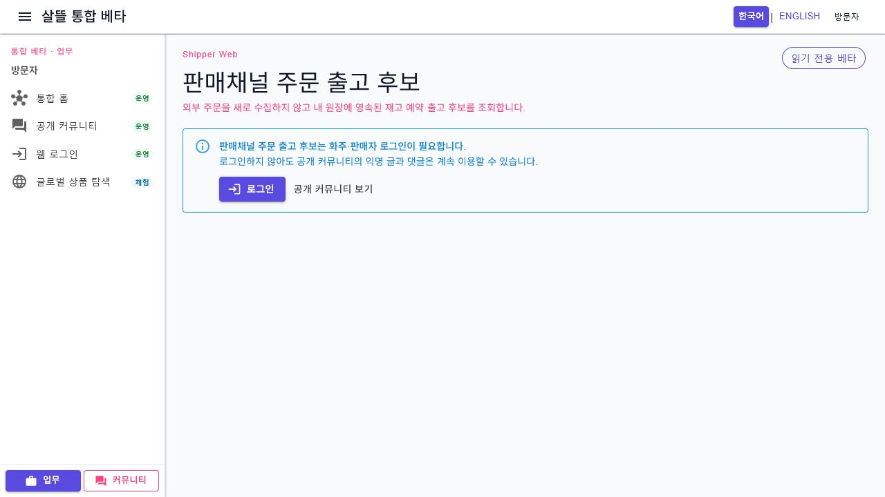
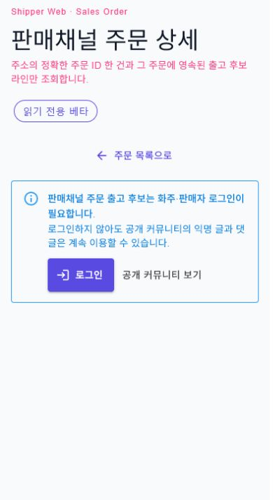

# 판매 주문 조회 Route 의미·단일책임 정렬

## 결과

Web과 모바일에서 같은 `/shipper/sales/orders`가 서로 다른 일을 하던 충돌을 제거했다. 이제 두 앱은 같은 영속 판매 주문 목록·stable-ID 상세 Screen을 사용하고, 모바일의 로컬 피킹·포장 Simulation은 `/shipper/sales/fulfillment`로 분리된다.

| 사용자 목표 | Route | 책임·효과 |
| --- | --- | --- |
| 판매 주문 원장 목록 | `/shipper/sales/orders` | 인증된 영속 주문 검색·동기화 범위·상태·페이지 조회, 읽기 전용 |
| 판매 주문 원장 상세 | `/shipper/sales/orders/{OrderId:long}` | stable order ID 한 건의 주문·출고 투영 조회, 읽기 전용 |
| 기존 query 호환 | `/shipper/sales/orders?orderId=...` | 목록 문맥을 보존해 stable-ID 상세로 replace redirect |
| 주문 이행 Simulation | `/shipper/sales/fulfillment` | `InMemoryShipperStore`의 샘플 주문·재고·피킹·포장·알림 정책 검증 |

## 책임 경계

- `SalesOrderPageRoutes`와 `SalesOrderNavigationContext`가 Web·모바일의 canonical route, stable ID, 안전한 local `from`, 검색·동기화 범위·상태·페이지 복귀를 정의한다.
- `ShipperSalesOrderWorkspace`는 `List`와 `Detail` mode를 독립적으로 조립한다. 목록 mode는 상세를 미리 로드하지 않고 상세 mode는 목록 전체를 미리 로드하지 않는다.
- Web의 `ShipperSalesOrdersPage`와 모바일의 `SalesOrders`는 같은 목록 mode를 사용한다.
- Web·모바일의 `ShipperSalesOrderDetailPage`·`SalesOrderDetail`은 같은 상세 mode와 order ID를 사용한다.
- 모바일의 기존 `OrderFulfillment` 내부 component와 ViewModel 분리는 보존하되 route만 `/shipper/sales/fulfillment`로 옮겨 영속 읽기 원장과 구별했다.
- Page capability는 영속 목록·상세를 `ReadOnly`, 로컬 이행 route를 `Simulation`으로 분리한다.
- Web·모바일 메뉴 문구도 실행을 암시하는 “주문 출고”에서 “판매 주문 원장”으로 맞췄다.

조회 route는 피킹·포장, 실제 재고 예약·차감, 메시지 발송, 운송 인계, 결제나 정산을 실행하지 않는다. Simulation route도 운영 효과 없이 로컬 메모리에서만 상태를 바꾼다.

## 모바일 우선 동작

- 목록에서 상세로 이동할 때 검색어, 동기화 범위, 상태와 페이지를 `from`에 보존한다.
- `orderId` query를 사용하는 기존 링크는 stable-ID 상세 route로 이동하며 뒤로가기로 원래 목록 상태를 복원한다.
- 390px 상세는 단일 열이고 문서 가로 넘침이 없다.
- 새 목록 복귀 동작과 공용 주문 Screen의 주요 버튼은 최소 48px 터치 영역을 갖는다.
- 공통 Web 셸의 언어 전환 버튼은 31px로 남아 있으며 업무 Screen과 분리된 후속 모바일 셸 감사 항목이다.

## 실제 화면

1280px Web 목록 route의 인증 경계다. 영속 데이터 접근 전에도 route 의미와 안내가 “판매 주문 원장”으로 일치한다.

390px stable-ID 상세 route와 목록 복귀 동작이다.

## 실제 검증

- `/shipper/sales/orders`를 1280px에서 실제 Web 렌더링했다.
- `/shipper/sales/orders/73?from=/shipper/sales/orders?page=2`를 390px에서 실제 렌더링해 `clientWidth=390`, `scrollWidth=390`을 확인했다.
- 새 목록 복귀 동작의 높이는 48px이며 실제 클릭 뒤 `/shipper/sales/orders?page=2`가 복원됐다.
- 기존 `/shipper/sales/orders?orderId=73&page=2`가 stable-ID 상세와 encoded `from`으로 호환 이동하는 것을 확인했다.
- 실제 검증은 인증 경계까지만 수행했다. 영속 주문 데이터, 개인정보와 POST·Command는 사용하지 않았다.
- clean index 스냅샷에서 route·capability·조립 관련 테스트 86개와 전체 테스트 2,540개가 통과했다.
- 같은 스냅샷의 `Ssalddel.WebApp`과 `SsalddelApp` Windows target 빌드가 각각 경고 0개·오류 0개로 통과했다.

## 남은 작업

`/shipper/sales/fulfillment`에는 주문 조회, 재고·입고, 피킹, 포장과 알림 정책이 한 route의 탭으로 남아 있다. 다음 수직 단위에서 stable task key를 가진 피킹·포장 Action route, 정책 route와 성공 뒤 같은 Simulation 원장 재조회를 분리한다.
