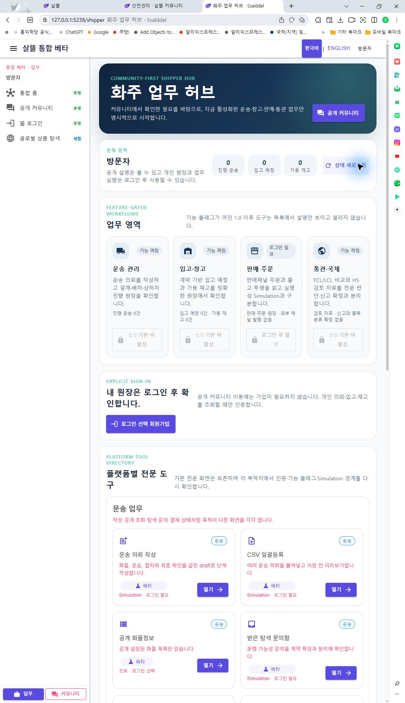
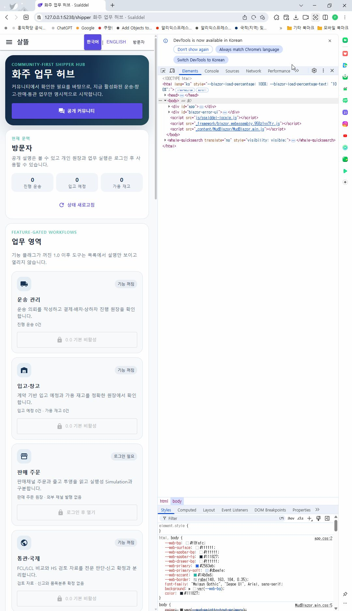

# 화주 홈 Route 의미·단일책임 정렬

## 결과

Web과 `SsalddelApp`의 `/shipper`가 같은 사용자 목표를 갖도록 정렬했다. 두 플랫폼의 얇은 Route Page는 이제 `Ssalddel.Ui.Common`의 `ShipperHomeScreen`을 조립하며, 이 Screen은 현재 문맥과 읽기 전용 업무 요약을 보여 주고 활성화된 업무 목적지만 선택하게 한다. 허브에서는 상태 변경 Command를 실행하지 않는다.

Web에 있던 전문 도구 링크는 제거하지 않고 별도 `ShipperHomeWebToolDirectory`로 보존했다. `SsalddelApp`의 인증 복원, 꾸미기 보유권, 화면 노출 설정, `PlatformCommunityHome`, 커뮤니티 콘텐츠와 기존 빠른 행동도 플랫폼 shell에 유지했다.

## 책임 경계

| 책임 | 소유자 | 경계 |
| --- | --- | --- |
| canonical route | `ShipperHomePageRoutes` | Web·모바일의 `/shipper`, 운송·창고·통관 기본 목적지를 한 계약으로 정의 |
| capability | `PageCapabilityCatalog` | 화주 홈은 공개·읽기 전용, 알 수 없는 화주 route는 인증·Simulation·외부 효과가 필요한 보수적 fallback |
| 조회 상태 | `ShipperHomeDashboardClient`, `ShipperHomePageViewModel` | 기능 플래그와 허용된 요약 조회, loading·warning·error·retry 관리 |
| 공용 표현 | `ShipperHomeScreen` | 현재 문맥, 업무 요약, 기능별 진입, 로그인·disabled 상태 |
| Web 조립 | `ShipperHome.razor`, `ShipperHomeWebToolDirectory` | Web 인증 복원과 기존 전문 도구 디렉터리 |
| 모바일 조립 | `ShipperHomeAppShell` | 앱 인증·가시성·커뮤니티 콘텐츠·빠른 행동 adapter |

익명 사용자는 공개 커뮤니티 설명과 로그인 경계만 확인하며 개인 운송·입고·재고 API를 호출하지 않는다. 로그인한 경우에도 먼저 서버 기능 플래그를 읽고, 꺼진 업무의 API는 호출하지 않는다. 플래그 조회가 실패하면 1.0 이후 업무를 안전하게 비활성으로 표시한다.

| 업무 | 기본 목적지 | 기능 플래그 | 0.0 경계 |
| --- | --- | --- | --- |
| 운송 | `/shipper/transport` | `DomesticTransportWorkflow` | 기본 비활성, 자동 배차·계약 확정 없음 |
| 입고·창고 | `/shipper/warehouse/workspace` | `WarehouseFulfillmentWorkflow` | 기본 비활성, 입고·재고 변경 없음 |
| 판매 | `/shipper/sales/orders` | `SalesChannelFulfillmentWorkflow` | 읽기 원장과 로그인 경계, 외부 채널 발행 없음 |
| 통관·국제 | `/shipper/international/fcl-lcl` | `CustomsAndTradeDataWorkflow` | 기본 비활성, 신고·품목분류 확정 없음 |

## 모바일 우선 보완

- 업무 카드는 720px 이하에서 한 열로 전환하고 텍스트가 카드 밖으로 넘치지 않게 했다.
- 공통 Web 머리말은 좁은 화면에서 `살뜰 통합 베타` 대신 `살뜰`을 표시해 제목과 언어 전환이 같은 줄에서 충돌하지 않게 했다.
- 한국어·영어 전환 행동은 최소 48px 너비·높이를 갖는다.
- 공개 커뮤니티, 새로고침과 로그인 행동은 좁은 화면에서도 48px 이상 터치 영역을 유지한다.
- 비활성 업무는 설명은 읽을 수 있지만 route를 열 수 없고, 로그인 필요와 기능 꺼짐 상태를 구분한다.

## 실제 화면

데스크톱 실제 Web 화면이다. 공용 허브의 네 업무 카드와 Web 전용 전문 도구 디렉터리가 같은 문맥에서 보인다.

브라우저 개발 도구를 오른쪽에 고정해 실제 페이지 viewport를 약 473px로 줄인 화면이다. 왼쪽 실제 페이지에서 짧은 머리말, 한 열 업무 카드와 가로 넘침 없는 배치를 확인했다. 개발 도구 영역은 viewport 폭을 재현하기 위한 검증 환경이며 앱 UI가 아니다.

## 실제 검증

- 실제 Web host `/shipper`에서 익명 상태의 공개 커뮤니티, 로그인 경계, 네 업무 카드와 기존 전문 도구 디렉터리를 확인했다.
- 데스크톱에서는 업무 카드가 4열이고 좁은 약 473px viewport에서는 한 열이다. 좁은 화면에서 눈에 보이는 가로 스크롤은 없었다.
- 좁은 화면 머리말은 `살뜰`로 축약됐고 언어 전환 행동의 최소 48px 규칙은 조립 회귀 테스트로 고정했다.
- 운송·입고·통관은 서버 기능 플래그가 꺼져 열리지 않았고, 판매는 활성 플래그여도 익명 상태에서 로그인 필요로 표시됐다. 업무 Command는 실행하지 않았다.
- Windows `SsalddelApp`의 BlazorWebView는 이 환경에서 빈 창으로 머물러 앱 자체 실제 화면은 캡처하지 못했다. 같은 공용 Screen은 Web host의 좁은 viewport로 확인했고 Windows target 빌드로 앱 조립을 검증한다.
- route·capability·조립·조회 상태 회귀를 포함한 clean-index 전체 테스트 2,610개가 모두 통과했다.
- 같은 스냅샷의 `Ssalddel.WebApp`과 `SsalddelApp` Windows target 빌드가 각각 경고 0개·오류 0개로 통과했다.

## 다음 작업

`P0-0`의 남은 navigation contract를 계속 감사한다. 공용 Screen에 남은 업무 route literal을 계약으로 올리고, 사방괘 → 다이어그램 → stable-ID 구체 페이지의 복귀 문맥을 Web과 모바일에서 같은 의미로 유지한다. `P3` 운영 효과는 기능 플래그와 Simulation 경계 뒤에 계속 보존한다.
