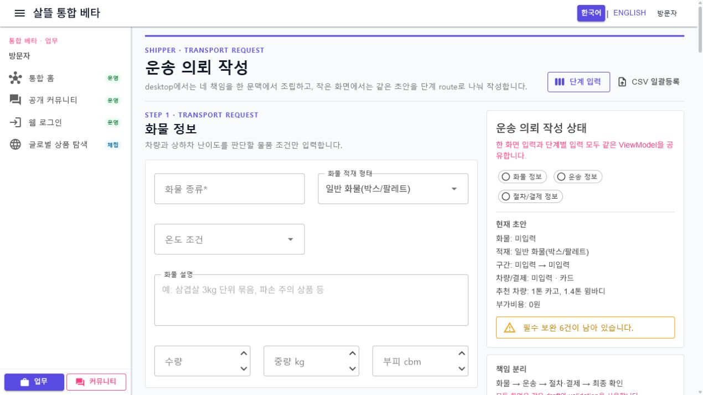
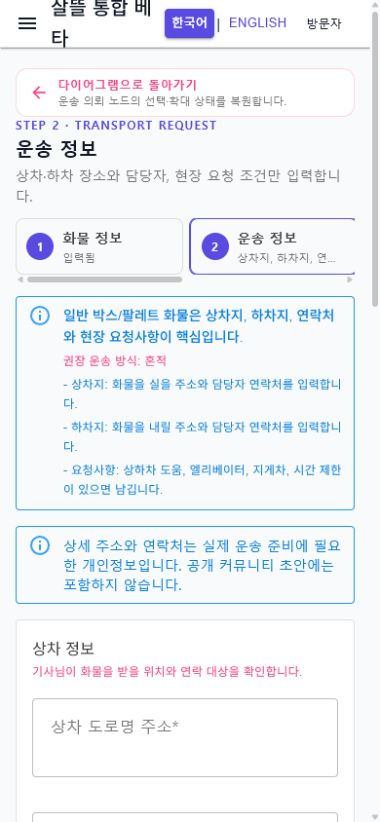

# 운송 의뢰 작성 Route·공용 Screen 단일책임 분리

날짜: 2026-07-22

## 변경 결과

- Web의 606줄 한 화면 route와 354줄 단계 mode multiplexer, 모바일의 997줄 복합 Panel을 공통 `화물`, `운송`, `절차·결제`, `최종 확인` Screen으로 대체했다.
- Web `/shipper/request`는 네 Screen을 adaptive layout으로 조립하고, `/cargo`, `/transport`, `/procedure`, `/review` route는 책임 Screen 하나만 조립한다.
- `SsalddelApp`의 `/shipper/request`는 화물 단계로 호환 이동한다. 네 단계 route는 같은 공용 Screen과 scoped draft를 사용하며 작은 화면에서는 단계 navigation만 표시한다.
- `운송의뢰작성ViewModel`을 `Ssalddel.Ui.Common`으로 옮겨 Web과 앱이 같은 draft round-trip, 필수 validation, 차량 추천과 요금·재알선 경고를 사용한다.
- 공용 `ShipperRequestNavigationContext`가 커뮤니티 화물 글과 다이어그램 원장·node·복귀 위치를 모든 단계 URL에 보존한다. 외부 또는 손상된 query는 전달하지 않는다.
- Web의 자동저장·기능 플래그·커뮤니티 글 가져오기·서버 등록은 `ShipperRequestAuthoringPageViewModel`, 앱의 transport adapter 호출은 앱 전용 PageViewModel이 조율한다. Route Page는 API 호출과 업무 `try/catch`를 소유하지 않는다.
- 의뢰 등록은 명시적 최종 버튼에서만 요청한다. 추천·자동 배차·계약·결제는 등록만으로 확정하지 않으며, Web metadata 확인 실패 때는 등록을 안전하게 보류한다.

## Route 책임

| Route | 책임 |
| --- | --- |
| `/shipper/request` | Web adaptive 최종 조립, 앱에서는 화물 단계 호환 이동 |
| `/shipper/request/cargo` | 화물 조건 입력 |
| `/shipper/request/transport` | 상차·하차와 연락 대상 입력 |
| `/shipper/request/procedure` | 차량·운임·부가비용·알선 경계 검토 |
| `/shipper/request/review` | 공통 validation, 실행 경계, 명시적 저장·등록 |
| `/shipper/request/summary` | 기존 최종 요약 링크의 같은 의미 alias |
| `/shipper/request/bulk` | 단건 작성과 분리된 CSV 일괄등록 |

## 대표 화면

캡처에는 실제 주소, 연락처, 결제 식별자와 계좌 정보를 입력하지 않았다.

## 실제 흐름 확인

1. desktop `/shipper/request`에서 네 책임 Screen과 sticky 초안 요약이 함께 조립되고 CSV·단계 입력 링크가 정확한 route를 가리킴을 확인했다.
2. 390×844 `/shipper/request/cargo`를 다이어그램 `운송 의뢰` node·120% 확대 복귀 문맥으로 열었다.
3. 화물 종류와 수량을 입력하고 `운송 정보`로 이동한 뒤 1단계가 `입력됨`으로 유지되어 같은 scoped draft를 사용하는지 확인했다.
4. 단계 navigation의 모든 URL이 source·원장·node·복귀 deep link를 보존하고 공용 복귀 bar가 정확한 다이어그램 URL을 가리킴을 확인했다.
5. 절차 화면의 일곱 차량 카드와 최종 확인 화면을 열어 가로 overflow가 없고 등록 기능 조회 실패가 sample 성공으로 숨겨지지 않고 안전한 보류 상태로 표시됨을 확인했다.

로컬 검증에서는 API server를 함께 실행하지 않았다. 따라서 실제 운송 의뢰 등록은 실행하지 않았고, Web 화면은 metadata 조회 실패를 명시한 뒤 등록 버튼을 비활성화했다.

## 검증

- 전체 `Ssalddel.Tests` 2,430개 통과(운송 의뢰 route 계약·공용 draft·validation·Web/모바일 Screen parity 포함)
- `Ssalddel.WebApp` 빌드: 경고 0, 오류 0
- `SsalddelApp` Windows 빌드: 경고 0, 오류 0
- `SsalddelAdminApp` Windows 빌드: 경고 0, 오류 0
- 실제 Web desktop 1270×720과 mobile 390×844에서 adaptive 조립과 네 단계 route를 확인
- desktop 1270px와 mobile 390px에서 horizontal overflow 없음
- mobile 단계 Screen의 보이는 버튼·링크·입력 조작 영역 44px 미만 0개
- 브라우저 console warning·error 0개

## 다음 단계

`P1-2` 운송 요청 상세의 Web·모바일 monolith를 같은 request ID와 서버 원본을 사용하는 요약, 진행 이력, 결제, 증빙 Screen으로 분리한다.
