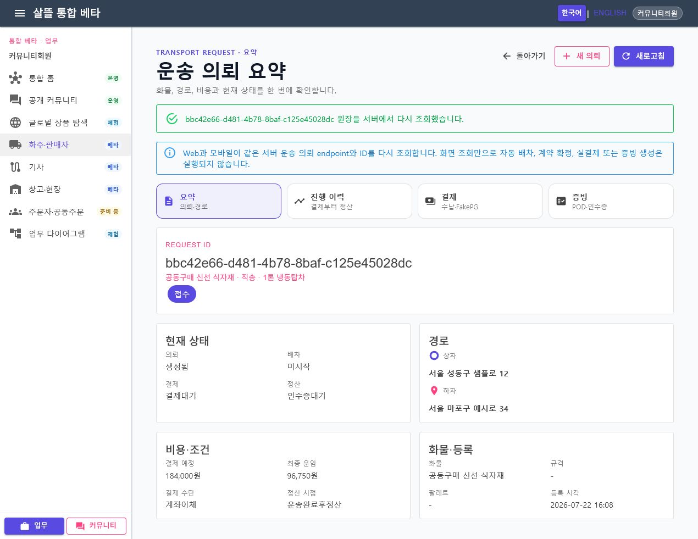

# 운송 의뢰 상세 Route·공용 Screen 단일책임 분리

날짜: 2026-07-22

## 변경 결과

- Web의 828줄 상세 화면과 모바일의 988줄 상세 화면을 `요약`, `진행 이력`, `결제`, `증빙` 공용 Screen으로 대체했다.
- `ShipperRequestDetailPageRoutes`가 stable request ID route와 안전한 local `from`, `created` 문맥을 Web·모바일에 동일하게 제공한다. 기존 `/shipper/request/detail?id=...` 링크는 같은 요약 의미로 호환한다.
- `ShipperRequestDetailPresentation`이 서버·adapter 응답을 현재 상태, 진행 단계, 수납 조건과 증빙 연결 상태로 한 번만 분류한다.
- Web PageViewModel은 인증, `DomesticTransportWorkflow` 기능 플래그와 기존 서버 원장 endpoint 재조회만 맡는다. 모바일 PageViewModel은 기존 transport adapter, 원장 observer와 FakePG 개발 영수증을 조율한다.
- FakePG는 모바일의 명시적인 payment route에서만 열 수 있다. Web payment route는 수납 조건을 읽기 전용으로 표시하고, summary·timeline·proofs 조회는 결제 Command를 실행하지 않는다.
- 증빙 Screen은 상차·하차/POD·인수증·세무 증빙의 연결 상태만 표시한다. 사진·서명 원본 생성, 검수 완료와 세무 증빙 발급을 조회 화면에서 확정하지 않는다.
- 작은 화면의 header flex item을 stretch해 제목·설명과 동작 영역이 한 글자 단위로 축소되지 않도록 보완했다.

## Route 책임

| Route | 책임 |
| --- | --- |
| `/shipper/request/{RequestId}` | 의뢰·경로·비용과 현재 상태 요약 |
| `/shipper/request/{RequestId}/timeline` | 결제부터 정산까지 원장 단계 확인 |
| `/shipper/request/{RequestId}/payment` | 수납 조건 확인과 허용된 개발 환경의 명시적 FakePG 실행 |
| `/shipper/request/{RequestId}/proofs` | 상차·하차/POD·인수증·세무 증빙 연결 상태 확인 |
| `/shipper/request/detail?id=...` | stable-ID 요약 route로 이어지는 legacy 조회 alias |

## 대표 화면

캡처는 로컬 sample 계정과 비식별 주소·화물 데이터로 생성했다. 실제 연락처, 계좌, 결제 식별자와 증빙 원본은 포함하지 않았다.

## 실제 흐름 확인

1. 로컬 API에 비식별 운송 의뢰를 저장하고 Web에서 같은 request ID를 직접 열어 서버 원장을 다시 조회했다.
2. 요약에서 화물, 경로, 결제 예정액과 현재 상태가 표시되며 조회만으로 배차·계약·결제·증빙 생성이 실행되지 않음을 확인했다.
3. 같은 ID의 `/timeline`, `/payment`, `/proofs`를 각각 열어 진행 이력, 읽기 전용 수납 조건과 증빙 연결 상태가 독립 Screen으로 표시됨을 확인했다.
4. 390×844 viewport에서 네 route navigation이 2열로 배치되고 가로 overflow가 없으며 네 링크 높이가 58px임을 확인했다.
5. desktop 1270px에서 네 route navigation과 요약 카드가 가로 overflow 없이 표시되고, 브라우저 warning·error가 없음을 확인했다.

## 검증

- 전체 `Ssalddel.Tests` 2,456개 통과(운송 의뢰 상세 대상 테스트 32개 포함)
- `Ssalddel.WebApp` 빌드: 경고 0, 오류 0
- `SsalddelApp` Windows 빌드: 경고 0, 오류 0
- `SsalddelAdminApp` Windows 빌드: 경고 0, 오류 0
- 실제 Web desktop 1270×720과 mobile 390×844에서 네 route 확인
- desktop·mobile horizontal overflow 없음, mobile route 링크 높이 58px
- 브라우저 console warning·error 0개

## 다음 단계

`P1-3` 입고 요청의 목록, 신규 신청, 상세와 입고 완료 Command를 stable inbound ID 기반 Route Page와 공용 Screen으로 분리한다.
