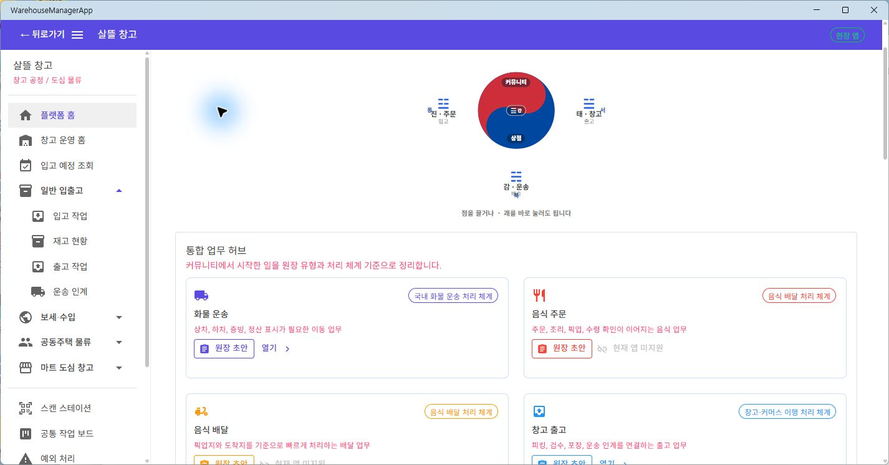
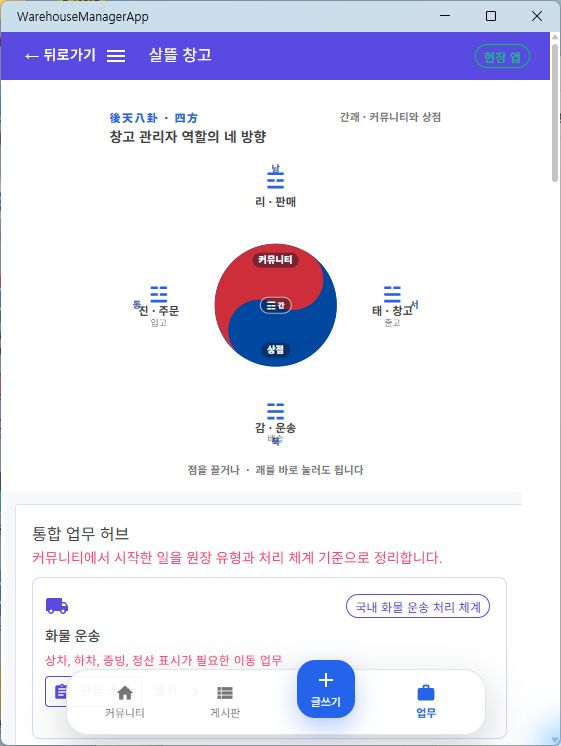
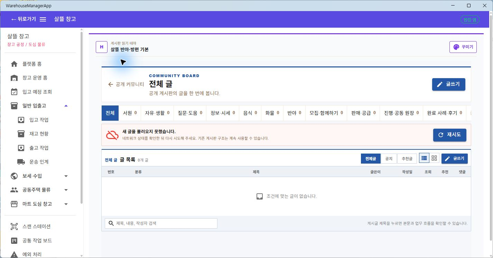
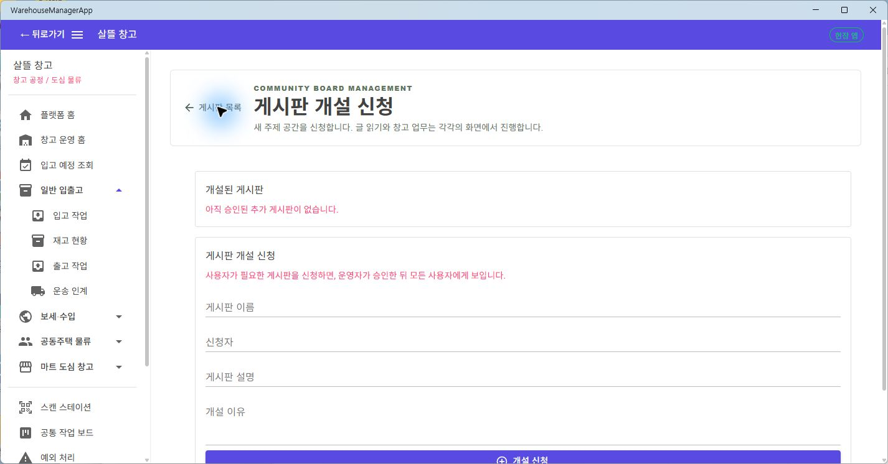

# Warehouse 플랫폼 Home과 커뮤니티 Route 단일책임 분리

## 판단

플랫폼 Home의 공통 구현은 `Ssalddel.Ui.Common`에 둔다. WarehouseManagerApp은 공통 `CommunityWorkspaceScreen`을 조립하고, 창고 앱이 제공하는 이동 대상만 navigation catalog로 주입한다.

Home은 다음 책임만 가진다.

- 창고 관리자 관점의 사방괘 이동
- 통합 업무 허브와 빠른 진입점 표시
- 커뮤니티·게시판·글쓰기·업무 화면으로의 이동

글 목록, 게시판 개설 신청, 글쓰기, 글 상세, 추천 글, 원장 초안과 다이어그램은 각각 독립 Route Page가 공통 Screen 하나를 조립한다. 따라서 게시판 목록 아래에 개설 신청 양식이 이어지는 복합 화면을 만들지 않는다.

## Route와 공통 Screen

| Route | 사용자 목표 | `Ssalddel.Ui.Common` Screen |
| --- | --- | --- |
| `/` | 플랫폼 업무 허브 탐색 | `CommunityWorkspaceScreen` |
| `/community` | 공개 커뮤니티 읽기 | `PlatformCommunityHome`의 feed 전용 surface |
| `/community/boards` | 게시판 글 목록 조회 | `CommunityBoardListScreen` |
| `/community/boards/manage` | 게시판 개설 신청 | `CommunityBoardManagementScreen` |
| `/community/workspace` | 업무·원장 공간 탐색 | `CommunityWorkspaceScreen` |
| `/community/ledgers/new` | 공동 원장 초안 작성 | `CommunityLedgerDraftScreen` |
| `/community/write` | 게시글 작성 | `CommunityPostComposeScreen` |
| `/community/posts/{id}` | 영속 게시글 상세 확인 | `CommunityPostDetailScreen` |
| `/community/posts/recommended` | 추천 글 목록 확인 | `CommunityRecommendedPostListScreen` |
| `/community/posts/recommended/detail` | 추천 글 상세 확인 | `CommunityRecommendedPostDetailScreen` |
| `/diagram` | 원장 다이어그램 작업 | `CommunityDiagramWorkbenchScreen` |

## 실제 화면 확인

### Desktop 플랫폼 Home

### 561px 모바일 폭 플랫폼 Home

### 게시판 목록

서버를 별도로 실행하지 않은 검증이라 API 재시도 상태가 표시되지만, 목록의 골격과 전용 Route는 유지된다. 개설 신청 양식은 이 화면에 포함되지 않는다.

### 게시판 개설 신청

## 검증

- `WarehouseManagerApp` Windows target build: 경고 0, 오류 0
- `Ssalddel.WebApp` build: 경고 0, 오류 0
- `SsalddelApp` Windows target build: 경고 0, 오류 0
- 공통 Home·workspace·Warehouse Route 조립 test: 57개 통과
- 전체 `Ssalddel.Tests`: 2,765개 중 2,763개 통과. 현재 작업 트리의 별도 `CommunityPostComposerViewModelTests`, `CommunityPostListPageViewModelTests` 각 1개 실패
- 실제 MAUI Windows desktop과 561px 폭 렌더링
- 게시판 목록과 개설 신청 간 실제 navigation
