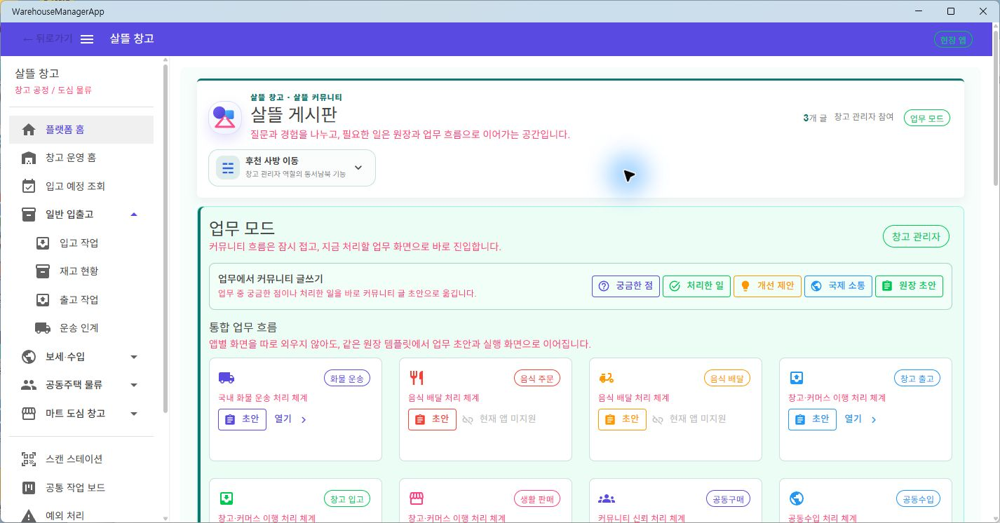

# Workspace 앱별 Navigation Capability

## 결과

`PlatformHomeWorkspaceProfile`에서 화주·음식·기사·창고·커뮤니티 URL을 제거했다. 공용 workspace catalog는 제목, 설명, 원장 template과 표시 정보만 소유하고, 실제 진입 route는 Web·메인·창고·기사·주문 host의 `IPlatformHomeWorkspaceNavigationResolver`가 결정한다.

전문 앱이 제공하지 않는 업무는 다른 앱의 URL을 추측해서 열지 않는다. 해당 card는 원장 `초안` 기능은 유지하되 화면 진입을 `현재 앱 미지원`으로 비활성 표시한다. 공용 UI는 resolver가 반환한 주소도 local route로 정규화해 외부 주소나 잘못된 복귀 문맥을 navigation에 사용하지 않는다.

## Host별 진입 범위

| Host | 지원 workspace | 미지원 예시 |
| --- | --- | --- |
| Web | 화물 운송, 음식 배달, 창고 입·출고, 생활 판매·요청, 공동구매·같이 수입 | Web에 `/food` Route Page가 없는 음식 주문 |
| 메인 앱 | 화물 운송, 창고 입·출고, 생활 판매·요청, 공동구매·같이 수입 | 음식 주문·배달 |
| 창고 앱 | 운송 초안, 창고 입·출고, 생활 판매, 같이 수입 입고 | 음식 주문·배달, 공동구매 |
| 기사 앱 | 음식 배달 workspace | 그 밖의 workspace |
| 주문 앱 | 화물, 음식 주문, 마트, 공동구매·같이 수입 | 음식 배달, 창고 입·출고 |

resolver는 진입 가능성만 표현한다. 목적지 Screen의 로그인, 기능 flag, 원장 참여와 서버 권한 검증은 그대로 유지되며 추천·자동 배차·결제·정산·통관 같은 운영 효과를 새로 켜지 않는다.

## 실제 화면 확인

창고 MAUI Windows 앱의 업무 모드에서 화물 운송과 창고 출고는 `열기`를 제공하고, 음식 주문과 음식 배달은 비활성 `현재 앱 미지원`으로 표시되는 것을 확인했다. 화면 폭을 줄인 Android·iOS 실기기 확인은 배포 대상이 정해질 때 별도로 수행한다.

## 검증

- workspace navigation 대상 테스트: 14개 통과
- `Ssalddel.Tests`: 2,648개 통과, 실패·건너뜀 없음
- `Ssalddel.WebApp` build: warning·error 없음
- `SsalddelApp`, `WarehouseManagerApp`, `FDriverApp`, `OrdererApp` Windows build: warning·error 없음
- 첫 `SsalddelApp -r win-x64` 검증은 설치되지 않은 Mono runtime package 10.0.9를 강제로 요구해 restore가 실패했으며, 프로젝트의 정상 Windows build 명령으로 다시 실행해 통과했다.
- root 작업 경로는 다른 실행 중 프로세스가 `bin`을 점유하고 있어, 이번 staged 변경만 반영한 임시 worktree에서 전체 test와 소비 앱 build를 검증했다.

이번 변경은 navigation 조립과 비활성 표현만 바꾸며 Command나 영속 원장 상태를 변경하지 않는다.
