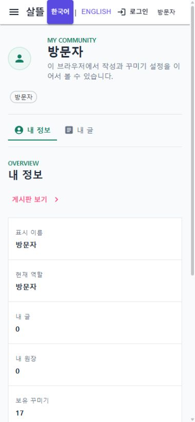

# 커뮤니티 내비게이션 최소 노출

## 결과

커뮤니티 경로의 공용 내비게이션에는 `공개 커뮤니티`, `내 정보`, `내 글`만 표시한다. 개인 화면 안의 보조 내비게이션도 `내 정보`와 `내 글`만 표시한다.

`참여 중`, `역할 지원`, `내 원장`, `알림`, `꾸미기`, `사용 설정`, 미국 공동구매 항목의 route와 화면 구현은 삭제하지 않았다. 전체 카탈로그와 개인 section 정의에 그대로 보존하고, 별도의 공개 목록에서만 제외했다.

## 실제 화면

390px 화면에서 개인 보조 메뉴는 두 항목만 유지된다.

## 검증

- `WebNavigationCatalog.VisibleCommunityNavigationItems`가 요청한 세 route만 반환하는지 확인했다.
- `CommunityPersonalRouteContext.VisibleNavigationSections`가 `내 정보`와 `내 글`만 반환하는지 확인했다.
- 숨긴 항목이 전체 카탈로그와 section 정의에는 남아 있는지 회귀 테스트로 확인했다.
- `Ssalddel.WebApp`을 실제 실행해 데스크톱 좌측 메뉴와 390px 개인 보조 메뉴를 확인했다.
