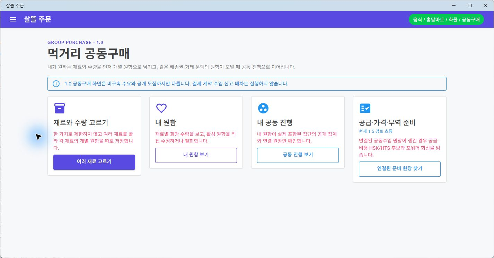

# 주문자 중심 1.0→1.5 공동구매 흐름

## 변경 요약

- 사용자가 한 재료에 제한되지 않고 여러 재료와 수량을 고르되, 재료별 비구속 개별 원함 원장을 독립적으로 저장하도록 구성했습니다.
- 자동집단은 개별 원함 원장을 원본으로 읽는 재처리 가능한 투영으로 바꾸고, 원함 `Revision`을 확인한 수정·철회와 닫힌 원함 재활성화 차단을 적용했습니다.
- 주문자 App에 내 원함, 원함 상세·수정, 내 공동 진행과 집단 상세를 각각 독립 Route로 추가했습니다.
- 연결된 공동수입 원장이 있을 때만 공급자·비용·품목분류·포워더 인계·정보 제공 근거를 주문자 최소 읽기 계약으로 보여 줍니다.
- `/orders`는 개별주문 원장 목록, `/orders/{OrderLedgerId}`는 정확한 원장 상세, `/orders/food`는 기존 음식 주문 이력으로 책임을 분리했습니다.

## 실제 화면

실제 Windows `OrdererApp`에서 새 내비게이션과 공동구매 개요의 네 책임—재료와 수량, 내 원함, 내 공동 진행, 1.5 공급·가격·무역 준비—이 분리되어 보이는 것을 확인했습니다. 캡처에는 실제 사용자 개인정보나 주문 식별자가 포함되지 않습니다.

## 실행 경계

- 개별 원함은 주문·결제·계약이 아니며 수입 신고, 포워더 자동 선정, 외부 자동 전송과 운송 지시를 실행하지 않습니다.
- LCL/FCL은 원함 등록 시 고정하지 않고, 집계 정보를 전달받은 포워더나 물류대행업체의 후속 검토·회신 대상으로 남깁니다.
- 공동 진행 화면은 본인 원함이 포함된 집단의 공개 집계만 보여 주며 다른 참여자의 식별정보는 노출하지 않습니다.

## 검증

- `dotnet build Ssalddel.v1.5.slnx --configuration Release --no-restore -m:1 -nodeReuse:false`
- `dotnet test Ssalddel.Tests/Ssalddel.Tests.csproj --configuration Release --no-build --no-restore` — 2,988개 통과
- 주문자 원함 투영·Revision 철회·Route 조립 집중 테스트 통과
- `git diff --check` 통과
