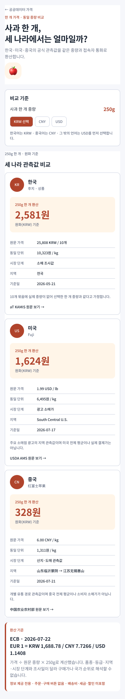

# 사과 한 개 동일 중량·현지 통화 가격 비교

## 변경

- 통합 MAUI 커뮤니티의 공공데이터 영역에 `/information/apple-price-comparison` 정보 화면을 추가했다.
- 기본 사과 한 개를 250g으로 두고 100~500g 범위에서 같은 중량으로 한국·미국·중국 관측값을 다시 계산한다.
- 한국어 문화권은 KRW, 중국어 문화권은 CNY, 그 밖의 문화권은 USD를 기본 표시 통화로 선택하며 사용자가 화면에서 직접 바꿀 수 있다.
- 원문 가격, kg 환산 가격, 시장 단계, 지역, 기준일과 관측 한계를 함께 표시한다.
- 환율은 ECB 2026-07-22 기준값을 사용하고, 서로 다른 조사일·품종·등급·시장 단계의 관측값이므로 구매가나 국가 순위로 해석하지 않도록 경계를 표시한다.
- 주문·구매·배송 버튼 없이 정보 제공 전용으로 구성했다.

## Figma·MAUI 호환 기준

- Figma 화면 `01.04 · 사과 한 개 가격 비교`(`2182:64`)와 재사용 컴포넌트 `Information/Apple Price Country Card`(`2181:64`)를 만들었다.
- Figma의 국가 카드 필드와 MAUI 공용 Razor 컴포넌트의 필드를 국가, 품종, 한 개 환산가, 원문 가격, kg 가격, 시장 단계, 지역, 기준일, 한계, 출처 순서로 맞췄다.
- 사과 강조색과 연한 배경색은 Figma variable과 CSS custom property에 각각 같은 역할명으로 분리했다.
- 모바일에서는 국가 카드를 세로로 쌓고, 넓은 화면에서는 3열로 배치하는 동일한 정보 구조를 유지한다.

## 실제 화면

Windows MAUI 대상은 빌드에 성공했지만 현재 저장소의 앱 시작 과정에서 `-1073741189`로 종료되어 이번 변경의 실제 앱 창 캡처는 만들지 못했다. 아래 이미지는 같은 필드·순서·토큰으로 구성한 실제 Figma 렌더다.

## 검증

- `AppleUnitPriceComparisonViewModelTests` 10건 통과
- 한국어·중국어·영어 문화권별 기본 통화 선택 확인
- 세 국가에 동일 중량 적용, 통화 전환 시 교차환산, 입력 중량 범위 제한 확인
- `Ssalddel.Ui.Common`, `SsalddelApp`, `Ssalddel.Tests` 영향 빌드 확인
- Figma 최종 화면에서 `Noto Sans KR`, 명명된 node, semantic color variable binding 확인
