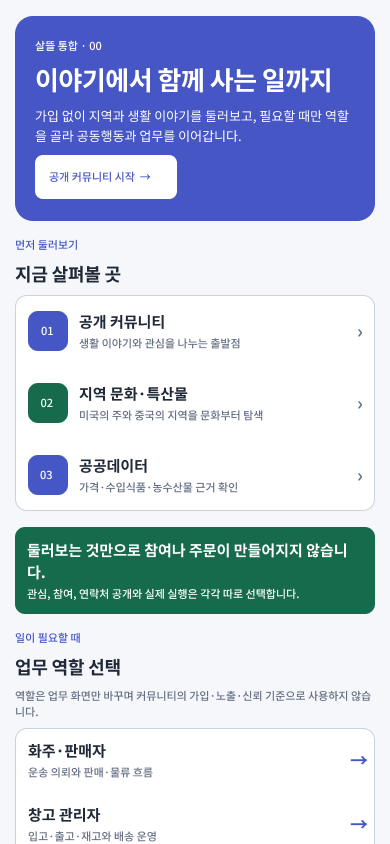
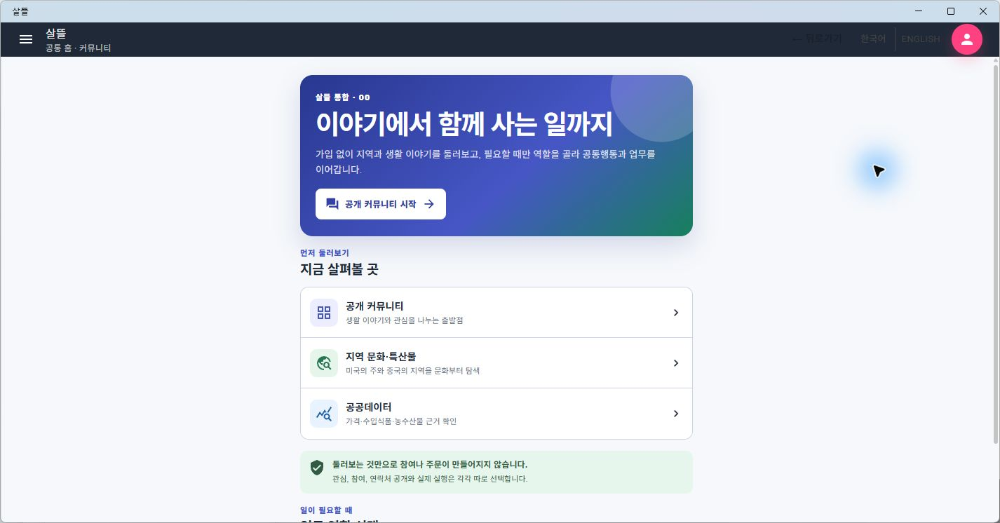

# MAUI 공통 홈 레거시 정리

## 변경

- 통합 MAUI 앱의 공통 홈에서 레거시 `PlatformCommunityHome` 조합과 `HongdalApp` 표기를 제거했다.
- 공통 홈을 `공개 커뮤니티`, `지역 문화·특산물`, `공공데이터` 순서의 살뜰 `0.0` 진입 화면으로 다시 구성했다.
- 열람만으로 참여·주문이 생성되지 않는 동의 경계를 표시하고 화주·창고 관리자 업무 역할은 별도 선택으로 분리했다.
- 기본 .NET 보라색 앱 아이콘과 splash를 살뜰의 indigo·mint 표식으로 교체했다.
- 무시된 과거 빌드 산출물 `HongdalApp.exe`를 삭제했다. 현재 실행 산출물과 Windows 창 제목은 각각 `SsalddelApp.exe`, `살뜰`이다.
- Figma `00 Overview`에 기존 화면을 보존한 채 교체안 `00.01 · 살뜰 공통 홈`을 추가하고 MAUI 화면과 같은 정보 구조를 유지했다.

## 실제 화면

### Figma

[편집 가능한 화면 열기](https://www.figma.com/design/0KhuQLc1MleUBIQnARC21Z/ssalddle?node-id=2177-64)

### Windows MAUI

## 호환성 확인

- Figma와 MAUI 모두 hero, 세 가지 공개 목적지, 참여 동의 경계, 선택형 업무 역할의 순서를 사용한다.
- Figma는 390×844 기준이며 MAUI는 같은 구조를 중앙 560px 열로 확장하고 세로 scroll을 유지한다.
- `CommonHomeLegacyRemovalTests`로 레거시 공통 홈 의존 제거, 현재 route, 앱 이름, 브랜드 자산을 확인했다.
- `net10.0-windows10.0.19041.0` Release build 후 실제 앱에서 `공통 홈` 역할을 선택해 렌더링을 확인했다.
