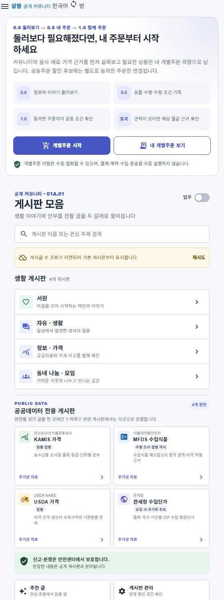

# 커뮤니티App·주문자App 개별주문 흐름 정렬

## 결과

- `SsalddelApp`의 시작 경로를 `/community`로 고정해 정보 공개형 커뮤니티가 첫 인상이 되도록 했다. 기존 `/` 역할·업무 선택과 화주·창고 화면은 보존했다.
- 커뮤니티 홈에 `0.0 둘러보기 → 0.5 내 개별주문 → 1.0 함께 주문` 여정을 추가했다. 공개 음식·재료 근거에서 시작해 본인의 상품·수량·수령 조건을 남기고, 별도로 동의한 주문만 공동 할인 후보에 연결한다고 명시했다.
- `/community/orders/new`를 개별주문 시작 canonical route로, `/community/orders`를 본인 원장 조회·철회 route로 추가했다. 기존 `/community/group-purchase/demand`는 호환 route로 유지한다.
- 두 App은 새 복제 저장소를 만들지 않고 기존 `GroupPurchaseDemandWorkflow`와 본인 원함 원장을 함께 사용한다. 커뮤니티에서는 가볍게 조회·철회하고, 주문자App에서는 수량 수정과 공동주문 진행 상세를 이어서 관리한다.
- 저장 전 `공동주문 후보 참여 동의`를 명시적으로 받는다. 미리보기는 동의 전에도 가능하지만 저장은 동의 뒤에만 가능하며, 결제·계약·수입·운송은 자동 실행하지 않는다.
- 주문자App의 홈·drawer·하단 navigation 용어를 `개별주문 → 공동주문` 흐름으로 정렬했다.

## 실제 렌더

현재 `SsalddelApp` Razor component와 scoped CSS를 문서용 host에서 직접 렌더했다. 새 여정 카드와 기존 게시판 모음이 한 커뮤니티 흐름 안에서 이어진다.

Windows MAUI 실행 파일은 이 환경에서 `Microsoft.UI.Xaml.dll` 초기화 단계에 종료되어 창 캡처는 만들지 못했다. Windows target build와 현재 소스 기반 Razor 렌더로 구성·CSS 계약을 확인했으며, 실행 환경 문제를 화면 성공으로 기록하지 않았다.

## Figma와의 관계

기존 Figma 01의 밝은 커뮤니티 Shell과 Figma 02의 보라색 주문자 Shell은 유지했다. 이번 변경은 두 디자인 사이에 없던 `0.0 → 0.5 → 1.0` 업무 인계 카드와 `내 주문` navigation을 추가한 것이다. 이 작업에는 수정할 Figma file/node가 지정되지 않아 Figma 원본은 변경하지 않았고, 차이를 이 기록과 실제 PNG에 남겼다.

## 검증

- 관련 route·화면 조립·ViewModel·Page capability test 231개 통과
- `SsalddelApp` Windows target build: 경고 0개, 오류 0개
- `OrdererApp` Windows target build: 경고 0개, 오류 0개
- 문서용 SsalddelApp source host build: 경고 0개, 오류 0개
- `SsalddelApp` 실제 Razor component 430px PNG 렌더 확인

## 남은 경계

현재 저장 API는 0.5 개별 원함을 기존 1.0 자동집단화 workflow 안에서 처리한다. UI는 별도 동의를 강제하지만, 개별주문만 저장하고 공동후보 동의를 나중에 추가·철회하는 독립 상태 전이는 `docs/Versions/v0.5/checklist.md`의 후속 release gate다.
