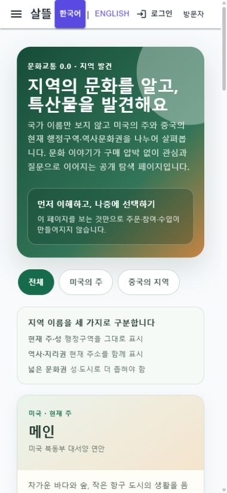

# 0.0 커뮤니티 지역 문화·특산물 탐색

## 변경

- `/community/regions`를 문화교통 `0.0`의 공개 읽기 전용 화면으로 추가했다.
- 미국은 주 단위, 중국은 현재 성·역사·지리권·넓은 문화권을 구분해 표시한다.
- 지역마다 문화 이해 질문, 대표 특산물 탐색 항목, 산지·원산지 확인 경계를 함께 보여 준다.
- `요동`은 현재 행정구역이 아니며 `장강 이남`은 성·도시로 더 좁혀야 한다는 한계를 화면에 표시한다.
- 지역 이야기와 `정보·시세` 근거 검색으로 이어지지만 주문·참여·수입은 자동 생성하지 않는다.
- Web 커뮤니티 공용 navigation과 MAUI 커뮤니티 drawer에서 같은 route로 진입한다.

## 실제 화면

### Desktop

### Mobile 390px

## 검증

- `RegionalCultureSpecialtyCatalogTests`
- `RegionalCultureSpecialtyPageCompositionTests`
- `PageCapabilityCatalogTests`
- `WebNavigationCatalogTests`
- 실제 WebApp desktop·390px 렌더
- 미국/중국 필터 중 중국 선택 시 `산둥성`, `요동 지역`, `장강 이남`만 표시되는 동작
