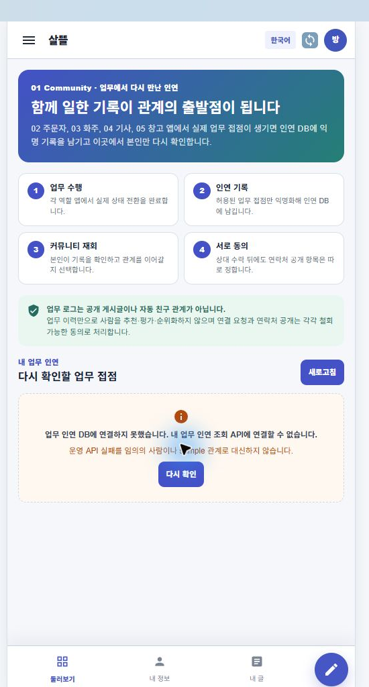

# 업무 앱 로그에서 친구 요청으로 이어지는 장

## 결과

- `02~05` 업무 앱이 일을 처리하고 `01 Community`가 업무에서 만난 접점을 다시 확인하는 장을 맡도록 책임을 분리했다.
- 커뮤니티 전용 Route `/community/relationships`를 추가하고 공통 홈, drawer와 개인 공간에서 진입할 수 있게 연결했다.
- 기존 `GET /api/v1/work-relationship-snapshots/me`를 재사용해 로그인 사용자가 업무 당사자인 익명 기록만 조회한다.
- 기록 작성자뿐 아니라 같은 업무의 상대도 동일 snapshot을 자기 관점에서 확인한다.
- `ConnectionRequestEligible` 기록에서만 친구 요청을 보낼 수 있으며 client에는 상대의 실제 사용자 ID를 전달하지 않는다.
- 연결 요청이 수락되더라도 연락처 공개 항목은 기존 동의 흐름에서 별도로 선택한다.
- 업무 로그는 공개 글, 자동 친구 관계, 사람 추천·평가·순위 신호로 사용하지 않는다.

기준 정책과 현재 기록 범위는 [Work Relationship Snapshots](../work-relationship-snapshots.md)에 정리했다.

## 화면

업무 수행, 익명 친구 후보 기록, 친구 요청, 친구 수락의 네 단계를 먼저 설명하고 그 아래에서 본인의 업무 접점을 조회한다. 로컬 API가 없는 실제 Windows MAUI 실행에서는 sample 관계로 대체하지 않고 연결 오류와 재시도를 표시한다.

## 확인

- 업무 관계 친구 요청 Route·익명 표시·client 계약·ViewModel 테스트 통과
- snapshot 소유권, 연결 가능 privacy, 양쪽 당사자 관점 조회와 친구 요청 생성 테스트 통과
- `SsalddelApp` Windows MAUI 빌드: 경고 0개, 오류 0개
- 실제 Windows MAUI 앱에서 공통 홈 진입, 네 단계 설명, 개인정보 경계와 API 오류·재시도 상태 확인
- 현재 자동 기록 예시는 기사 배차 수락이며, 주문자·창고의 나머지 상태 전이는 후처리 snapshot 대상으로 순차 확장해야 한다.
