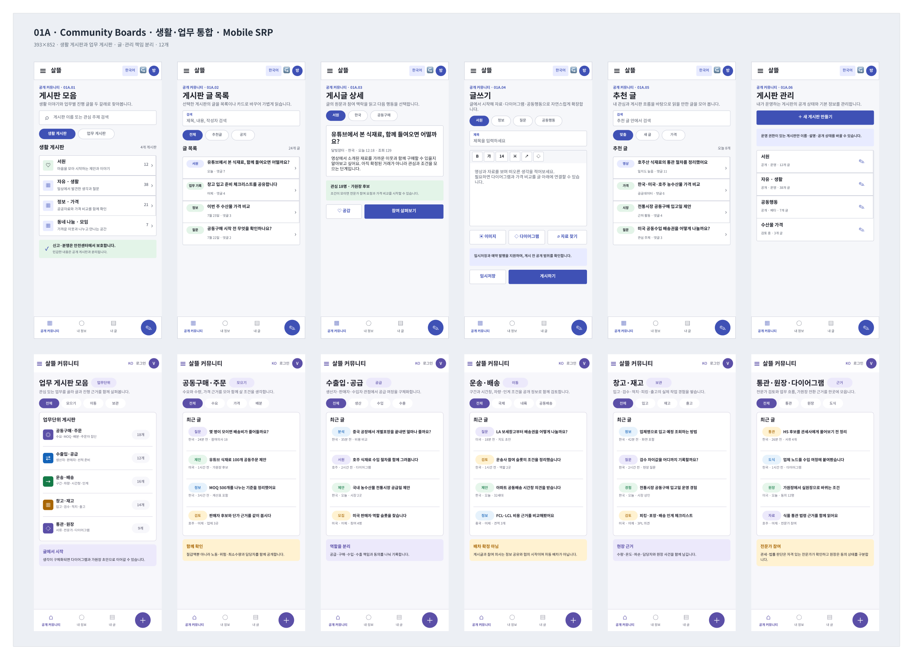

# Figma Community 생활·업무 게시판 통합

## 결과

[살뜰 Figma 파일](https://www.figma.com/design/0KhuQLc1MleUBIQnARC21Z/ssalddle?node-id=0-1)의 `01 Community`에서 생활 게시판 화면과 별도 `01D` 업무단위 게시판 화면을 하나의 `01A · Community Boards` section으로 통합했다.

게시판 모음은 다음 두 부류만 노출한다.

- `생활 게시판`: 서원, 자유·생활, 정보·가격, 동네 나눔·모임
- `업무 게시판`: 공동구매·주문, 수출입·공급, 운송·배송, 창고·재고, 통관·원장·다이어그램

## 화면 배치

통합 section의 위 행에는 생활 게시판에서 글을 읽고 쓰고 관리하는 6개 화면을 배치했다. 아래 행에는 업무 게시판 모음과 업무별 게시판 6개 화면을 배치했다.

기존 `01D.01~01D.06` 화면은 내용을 다시 만들지 않고 `01A.07~01A.12`로 이동했다. 별도 `01D` section만 제거했으며 `02 Orderer`부터 `05 Warehouse`와 나머지 Community section은 변경하지 않았다.

## 확인

- 통합 section에 `393x852` 화면 12개가 있는지 확인했다.
- 위 행 6개와 아래 행 6개가 겹치지 않고 section 안에 들어가는지 확인했다.
- 게시판 모음에서 `생활 게시판`과 `업무 게시판`만 보이는지 확인했다.
- 별도 `01D` section이 남아 있지 않은지 확인했다.
- Figma 구조 검사 결과 `issueCount: 0`을 확인했다.
- 이 기록은 Figma 설계 변경에 대한 시각 기록이며 애플리케이션 코드 변경은 포함하지 않는다.
