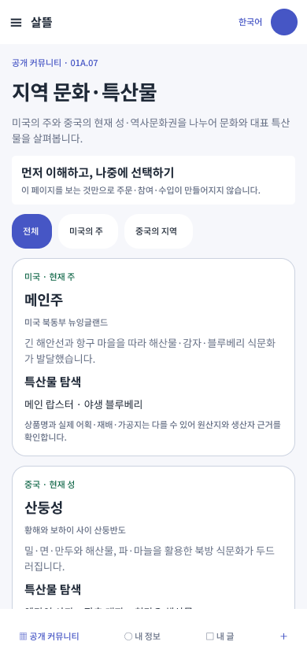
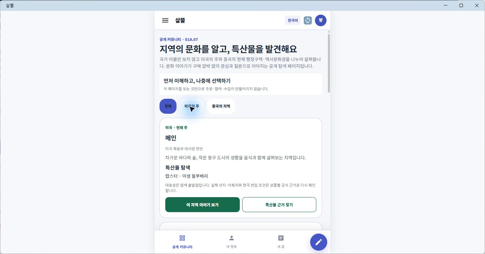

# Figma-MAUI 커뮤니티 지역 문화 화면 동기화

## 결과

- [살뜰 Figma 파일](https://www.figma.com/design/0KhuQLc1MleUBIQnARC21Z/ssalddle?node-id=2175-64)의 `01 Community`에 `01A.07 · 지역 문화·특산물` 390×844 화면을 추가했다.
- Community 전용 색상·간격·반경 변수 22개와 `Noto Sans KR` text style 5개를 만들고 Web·Android·iOS code syntax를 연결했다.
- `Regional Culture Card` component에 국가·지역 유형, 지역명, 위치, 문화 설명, 특산물, 근거 경계 text property를 두었다.
- .NET MAUI `/community/regions`가 `CommunityMobileLayout`을 사용하고 Figma 01에 맞춘 compact card 표현을 선택하도록 변경했다.
- [Figma-MAUI 화면 호환성 정책](../Architecture/FigmaMauiCompatibilityPolicy.md)을 기준 문서로 추가하고 공통 UI 지침에서 참조한다.

## Figma

국가 필터는 최소 44px이고, 화면의 fill은 모두 Community 변수에 연결했다. 메인주·산둥성·요동 지역은 같은 component instance로 구성한다.

## Windows MAUI

실제 Windows MAUI 앱에서 업무 홈 → 공개 커뮤니티 → drawer → 지역 문화·특산물로 이동했다. AppBar, 국가 필터, compact card와 고정 bottom navigation이 모바일 캔버스 안에서 렌더되는 것을 확인했다.

## 대응표

| 책임 | Figma | MAUI |
| --- | --- | --- |
| 화면 | `2175:64` · `01A.07 · 지역 문화·특산물` | `/community/regions` |
| 셸 | Community AppBar·Bottom Navigation | `CommunityMobileLayout` |
| 반복 카드 | `2174:69` · `Regional Culture Card` | `RegionalCultureSpecialtyBrowse` |
| 데이터 | component text property | `RegionalCultureSpecialtyCatalog` |

## 검증

- Figma: 390×844, `Noto Sans KR`, 하드코딩 fill 0곳, 필터 touch target 44px
- 대상 test: 7개 통과
- `SsalddelApp` Windows build: 오류 0개
- 실제 Windows MAUI 이동과 대표 화면 확인
