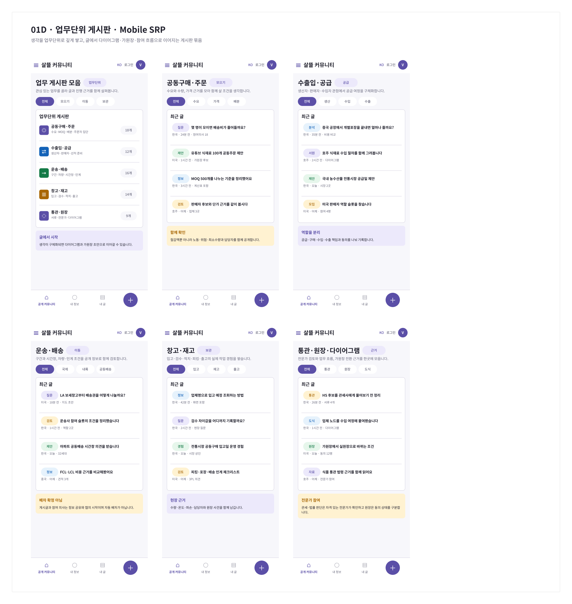
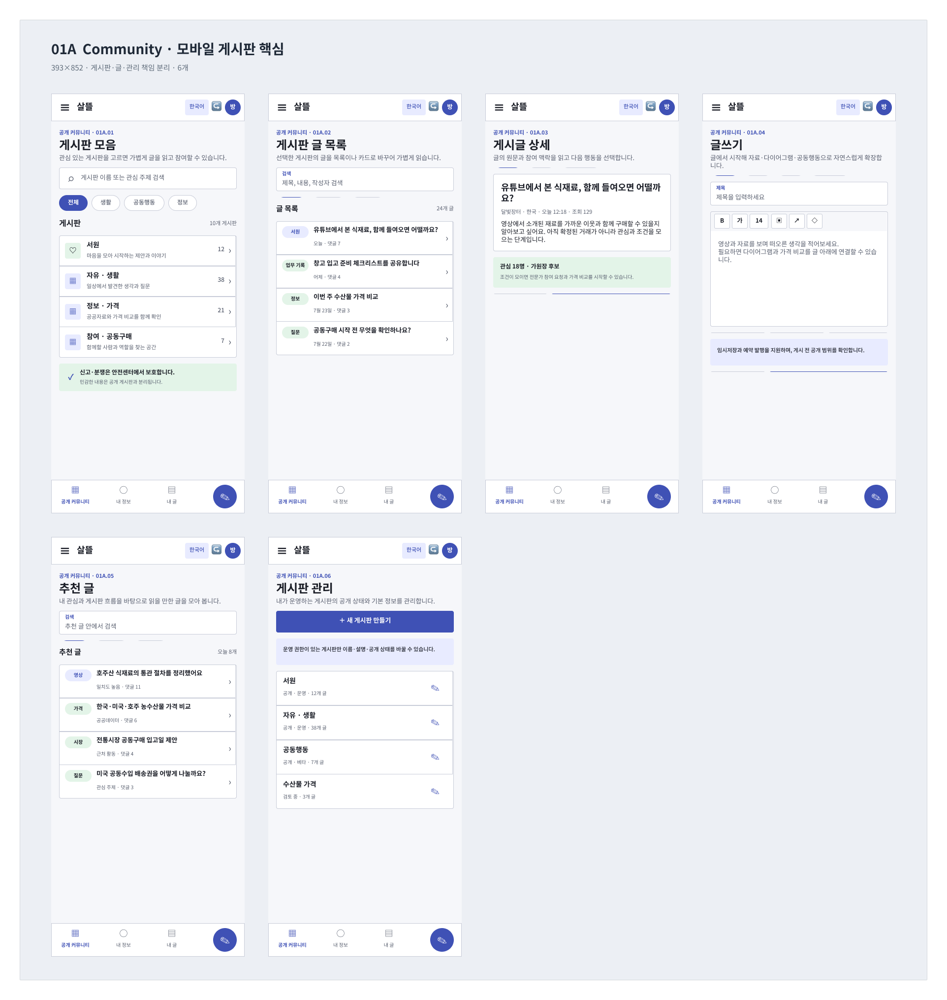
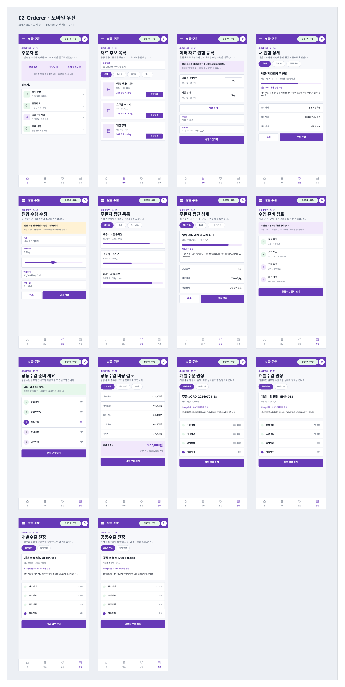
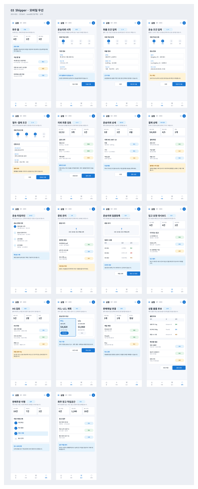
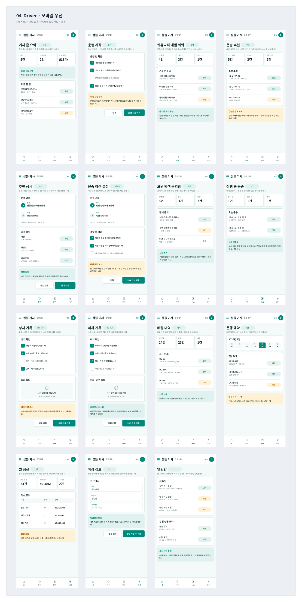
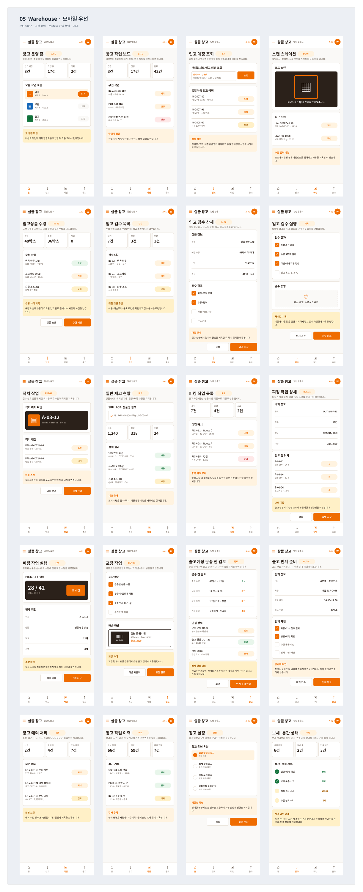

# Figma 01~05 역할 레이어와 업무단위 게시판

## 결과

[살뜰 Figma 파일](https://www.figma.com/design/0KhuQLc1MleUBIQnARC21Z/ssalddle?node-id=0-1)에서 한 페이지에 섞여 있던 역할 화면을 다음 페이지로 분리했다.

| Figma 페이지 | 화면 책임 |
| --- | --- |
| `01 Community` | 공개 게시판, 글쓰기, 공동행동 진입과 업무단위 게시판 |
| `02 Orderer` | 주문, 재료 탐색, 수요와 공동수입 준비 |
| `03 Shipper` | 화물 의뢰, 운송 준비와 이행 확인 |
| `04 Driver` | 기사 작업, 인수·운송·인계 |
| `05 Warehouse` | 입고, 검수, 적재, 재고와 출고 |

`00 Overview`에는 통합 방향과 검토 기준만 남기고, 역할별 화면은 각 페이지가 소유하도록 정리했다. 구현되지 않은 화면은 설계 상태로 유지했으며 실제 기능이 제공되는 것처럼 표시하지 않았다.

## 업무단위 게시판

커뮤니티에서 생각을 업무별로 깊게 살핀 뒤 글, 다이어그램, 가원장과 참여 흐름으로 이어 갈 수 있도록 6개 모바일 화면을 추가했다.

- 업무 게시판 모음
- 공동구매·주문
- 수출입·공급
- 운송·배송
- 창고·재고
- 통관·원장·다이어그램

## 역할별 화면

### 01 Community

### 02 Orderer

### 03 Shipper

### 04 Driver

### 05 Warehouse

## 확인

- `02 Orderer`부터 `05 Warehouse`까지 모바일 화면 67개가 각 역할 페이지의 직접 하위 section에 배치됐는지 확인했다.
- `01D · Community Business Unit Boards · Mobile SRP`의 6개 화면과 `업무단위` 진입 필터를 확인했다.
- 대상 화면의 `393x852` 프레임, AppBar·본문·하단 내비게이션 구성과 한글 폰트 적용을 확인했다.
- 잘림, 겹침, 비어 있는 화면과 문서 설명 문구의 앱 화면 노출 여부를 점검했다.
- 이 기록은 Figma 설계 변경에 대한 시각 기록이며 애플리케이션 코드 변경은 포함하지 않는다.
