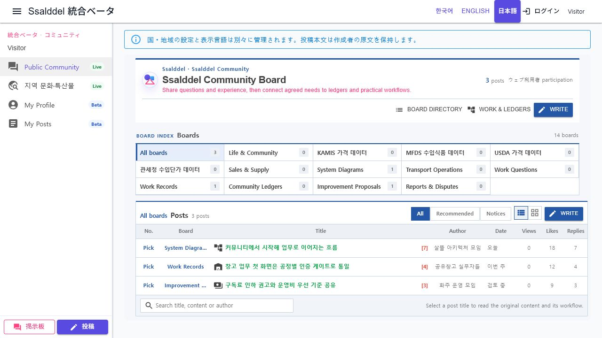

# 다국어 커뮤니티 기반과 일본어 표시

## 변경

- 표시 언어의 코드, 중립 코드, URL 구간, 원어 이름을 하나의 카탈로그에서 관리한다.
- 기존 `ko-KR`, `en-US`에 `ja-JP`를 추가하고 브라우저 언어와 `JP` 국가 신호를 일본어 추천에 연결한다.
- `/ja/community`를 정식 공개 커뮤니티 경로로 인식하고 언어 선택기를 카탈로그 기반으로 렌더링한다.
- 게시글 원문 언어 감지와 Azure Translator 대상에 일본어를 추가한다.
- 참여 시작, 역할 참여와 가원장 요청은 한국어 고정값 대신 현재 표시 언어를 전달한다.
- 일본어 번역이 아직 없는 공용 게시판 문구는 한국어로 잘못 보이지 않도록 영어를 대체 언어로 사용한다.
- 일본의 주문·계약·결제·운송 실행 기능은 추가하거나 활성화하지 않는다.

## 실제 화면

### Desktop

일본어 셸과 안내 문구, `/ja/community` 경로, 선택된 `日本語` 버튼을 확인했다. 게시판의 사용자 생성 이름과 게시글 원문은 작성 언어를 유지하고, 아직 일본어 번역이 없는 공용 문구는 영어로 표시된다.

## 검증

- `DisplayLanguageCodesTests`
- `WebLocalePolicyTests`
- `PublicLocaleRecommendationUseCaseTests`
- `CommunityPostTranslationServiceTests`
- `PlatformCommunityPostListPresentationTests`
- `PlatformCommunityHomePageViewModelTests`
- 관련 테스트 67개 통과
- `Ssalddel.WebApp`, `Ssalddel.Ui.Common` 빌드
- 인앱 브라우저에서 `/ja/community` 실제 렌더와 `lang="ja-JP"` 확인
