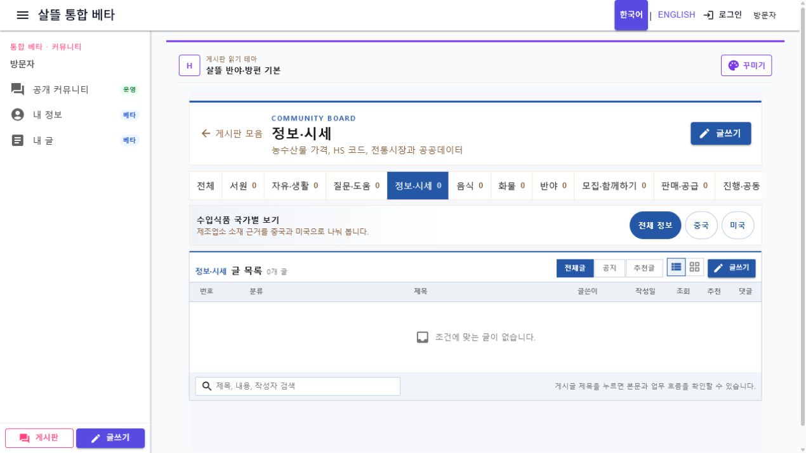
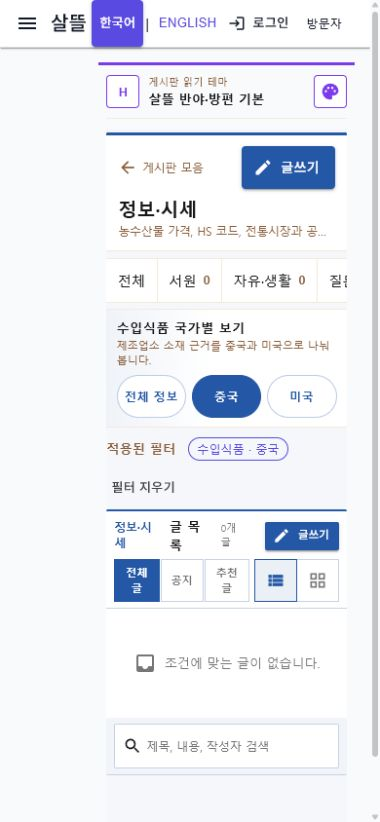

# 정보·시세 수입식품 중국·미국 분류

## 변경

- Web·모바일 공용 `정보·시세` 게시판에 `전체 정보`, `중국`, `미국` 전환을 추가했다.
- 중국과 미국 자동 게시글이 사용하는 업무 태그를 공통 계약 카탈로그로 고정해 게시와 조회가 같은 값을 사용하도록 했다.
- 국가를 선택하면 기존 게시글 조회 API의 `workflowTag` 정확 일치 필터를 사용하므로 검색 결과와 페이지 수가 함께 좁혀진다.
- 선택 상태를 URL에 남기고 목록 검색·공지·추천글·목록형·카드형 상태를 유지한다.
- 적용된 필터에는 내부 태그 전문 대신 `수입식품 · 중국`, `수입식품 · 미국`으로 표시한다.
- 국가 필터는 `정보·시세` 게시판에서만 노출하며 다른 게시판 분류와 사용자 작성 기능은 바꾸지 않았다.

## 화면

데스크톱에서는 게시판 탭 아래에 국가 전환을 한 줄로 배치했다.

390px 모바일에서는 세 항목을 같은 폭으로 배치하고 44px 터치 높이와 가로 넘침 없음을 확인했다. 아래 화면은 중국 필터 선택 상태다.

로컬 API의 기존 개발 데이터는 중국·미국 자동 게시글이 아직 없어 목록이 0건으로 표시된다. 국가 선택 URL, 활성 상태, 적용 필터 표시와 반응형 배치를 실제 렌더링으로 확인했다.
