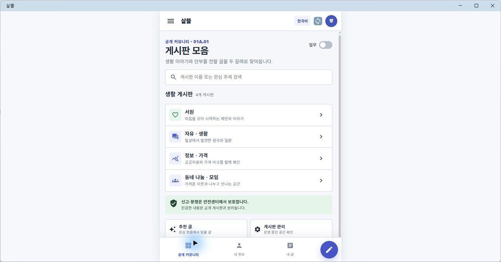
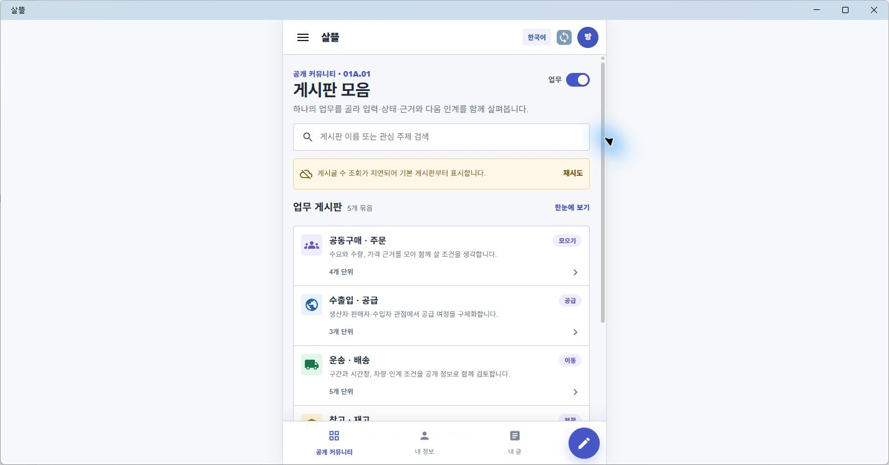

# MAUI Community 01 Figma 근접 구현
## 결과

- 통합 `.NET MAUI` 앱의 공개 커뮤니티 진입점을 Figma `01A · Community Boards`에 가까운 모바일 화면으로 교체했다.
- 밝은 AppBar, 가운데 모바일 캔버스, `업무` OFF/ON 스위치, 검색, 카드형 게시판 목록, 하단 내비게이션과 글쓰기 FAB를 공통 모바일 Shell로 구성했다.
- `01A.01` 게시판 모음과 `01A.02` 글 목록, `01A.03` 상세, `01A.04` 글쓰기, `01A.05` 추천 글, `01A.06` 게시판 관리에 같은 Shell과 화면 책임 표기를 적용했다.
- 업무 모드는 `01A.08` 공동구매·주문, `01A.09` 수출입·공급, `01A.10` 운송·배송, `01A.11` 창고·재고, `01A.12` 원장·근거로 이어진다. 새 업무 상태를 만들지 않고 기존 16개 업무 게시판 Key와 route를 재사용했다.
- 기존 통합 홈의 `게시판 보기`와 `/community/boards/directory`도 새 MAUI 게시판 모음으로 연결했다.
- 게시글 수 API를 사용할 수 없을 때는 성공한 것처럼 샘플 수치를 표시하지 않고, 지연 안내와 정적 게시판 카탈로그만 보여 준다.

현재 연결된 Figma 파일에는 `00 · 통합 메인 · 운영`과 참고용 주문자 화면만 저장되어 있어, 같은 날 보존한 [Figma Community 생활·업무 게시판 통합](2026-07-24-figma-community-board-consolidation.md) 및 [업무 모드 토글](2026-07-24-figma-community-mode-toggle.md)의 실제 PNG를 구현 기준으로 사용했다.

## 화면

Windows MAUI 창을 넓게 실행해도 Figma 모바일 프레임에 가까운 폭으로 가운데 정렬된다. 아래는 업무 OFF 상태의 생활 게시판이다.

업무 ON 상태에서는 기존 업무 게시판을 다섯 탐색 묶음으로 보여 준다. 캡처 시 로컬 API가 실행 중이지 않아 게시글 수 지연 안내도 실제 상태 그대로 표시된다.

## 확인

- `SsalddelApp` Windows 대상 빌드: 경고 0개, 오류 0개
- Community 모바일 표현 및 기존 MAUI Community 조합 대상 테스트 통과
- 실제 Windows MAUI 앱에서 통합 홈 → 게시판 모음 → 업무 모드 → 공동구매·주문 → 게시판 글 목록 이동 확인
- 생활/업무 대표 화면을 실제 MAUI 렌더 PNG로 보존
