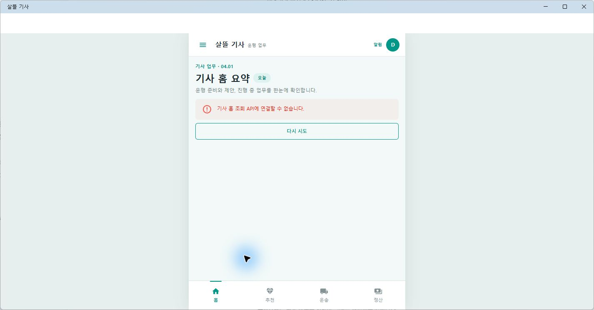
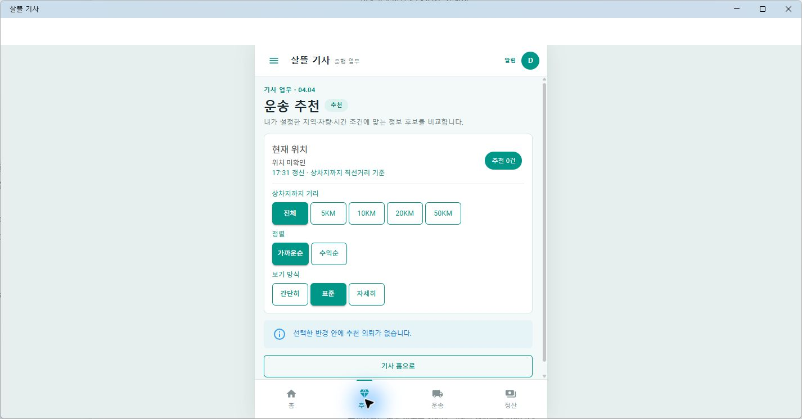
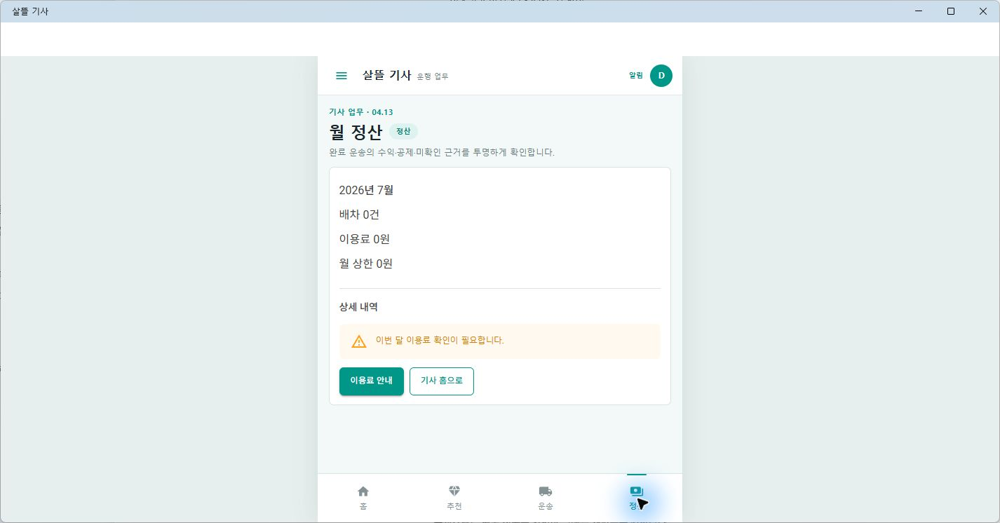

# MAUI Driver 04 Figma 근접 구현

## 결과

- 별도 `.NET MAUI` 앱 `DriverApp`의 기본 시작 화면을 Figma `04 Driver`에 가까운 기사 전용 모바일 Shell로 전환했다.
- 흰색 AppBar, 청록색 기사 업무 강조색, 가운데 모바일 캔버스와 `홈·추천·운송·정산` 하단 내비게이션을 구성했다.
- `04.01` 기사 홈부터 `04.15` 알림함까지 기존 Route와 업무 화면을 화면 번호·제목·설명으로 식별할 수 있게 연결했다.
- 기존 네이티브 운행 지도는 제거하지 않고 drawer에서 열 수 있게 보존했으며, 네이티브 지도 하단 `목록`으로 기사 업무 화면에 다시 복귀하도록 연결했다.
- 기존 API·권한·원장 흐름을 그대로 사용한다. 로컬 API가 없을 때 임의 sample data로 성공처럼 보이지 않고 조회 오류와 빈 상태를 명시한다.

현재 연결된 Figma 파일에는 `00 Overview`와 참고용 기사 카드만 남아 있고 `04 Driver` 전체 페이지는 확인되지 않았다. 따라서 같은 날 보존한 [Figma 01~05 역할 레이어](2026-07-24-figma-role-layer-milestone.md)의 실제 `driver-layer.png`와 연결된 카드의 테두리·타이포그래피를 구현 기준으로 사용했다.

## 화면

기사 홈은 실제 API 연결 상태와 오늘의 업무 진입점을 모바일 화면에서 바로 확인한다.

운송 추천은 거리·정렬·보기 조건을 청록색 compact control로 정돈하고 추천이 없을 때의 상태를 명확히 표시한다.

월 정산은 운행 수익·공제·미확인 근거를 한 화면에서 검토하고 기사 홈으로 돌아갈 수 있게 구성한다.

## 확인

- `DriverApp` Windows 대상 빌드: 오류 0개
- `04.01~04.15` Route·화면 표식, 기사 Shell, 기본 시작 화면과 네이티브 지도 보존 대상 테스트 33개 통과
- 실제 Windows MAUI 앱에서 홈·추천·운송·정산 하단 내비게이션, drawer, 네이티브 지도 진입과 업무 화면 복귀 확인
- 실제 MAUI 렌더 PNG 3개 보존
- 기존 Xamarin.AndroidX 버전 제약 불일치 `NU1608` 경고 9개는 남아 있다.
