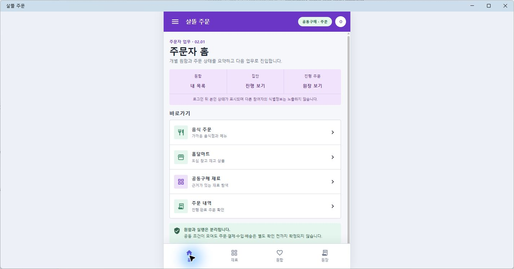
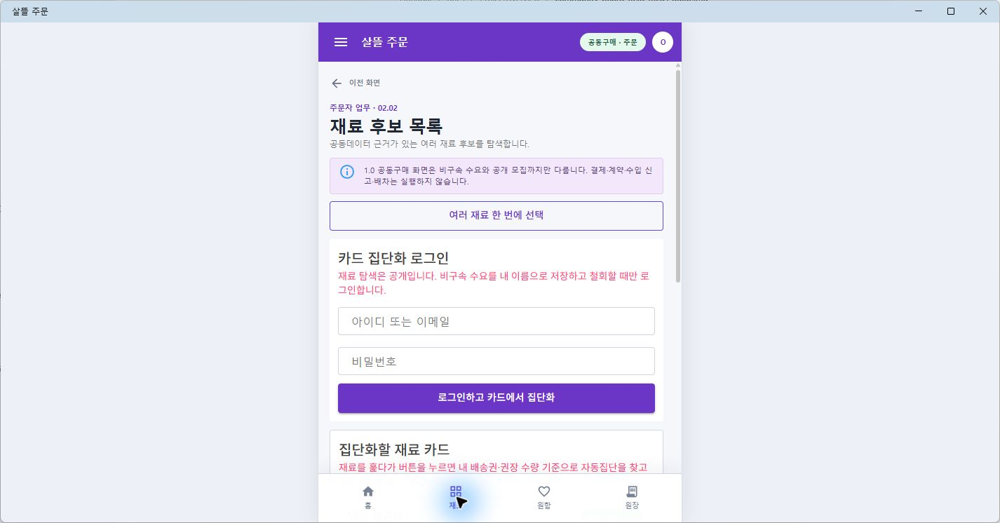
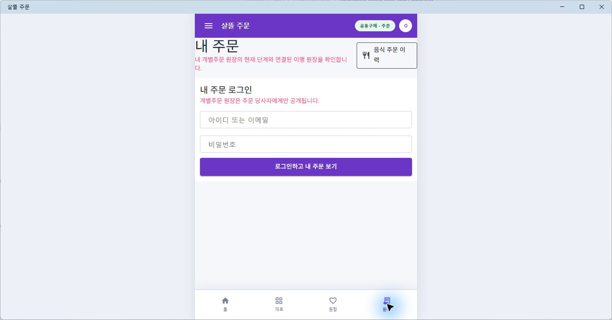

# MAUI Orderer 02 Figma 근접 구현

## 결과

- 별도 `.NET MAUI` 주문자 앱 `OrdererApp`을 Figma `02 Orderer`에 가까운 밝은 모바일 화면으로 전환했다.
- 보라색 AppBar, 주문자 범위 배지, 가운데 모바일 캔버스, 카드형 본문과 `홈·재료·원함·원장` 하단 내비게이션을 공통 Shell로 구성했다.
- `02.01` 주문자 홈부터 `02.10` 같이 수입 비용 검토까지 기존 공동구매 route와 조회·등록 흐름을 그대로 사용하고, 화면 책임 코드와 설명을 Figma 순서에 맞췄다.
- `02.11` 개별주문 원장, `02.12` 개별수입 원장, `02.13` 개별수출 원장, `02.14` 공동수출 원장은 기존 공용 원장 Screen을 모바일 Route frame 안에 배치했다.
- 로그인, 서버 권한, 원장 상태 전이는 바꾸지 않았다. 익명 상태에서는 공개 탐색과 로그인 안내를 표시하며 원함·결제·계약·수입·운송 실행 경계도 유지한다.

현재 연결된 Figma 파일에는 `00 Overview`와 참고용 주문자 카드만 남아 있고 `02 Orderer` 페이지는 확인되지 않았다. 따라서 같은 날 보존한 [Figma 01~05 역할 레이어](2026-07-24-figma-role-layer-milestone.md)의 실제 `orderer-layer.png`와 연결된 주문자 카드의 색상·타이포그래피를 구현 기준으로 사용했다.

## 화면

주문자 홈은 개별 원함·집단·진행 주문을 과장된 샘플 수치 없이 요약하고 기존 음식, 마트, 공동구매 재료와 주문 내역 route로 연결한다.

재료 후보 화면은 Figma의 `02.02` 책임과 비구속 경계를 표시하면서 기존 공개 재료 카드·여러 재료 원함 흐름을 유지한다.

원장 탭은 기존 주문자 로그인과 개별주문 원장 조회 계약을 그대로 사용한다.

## 확인

- `OrdererApp` Windows 대상 빌드: 경고 0개, 오류 0개
- `02.01~02.14` 페이지 책임과 모바일 Shell 조합 대상 테스트 34개 통과
- 실제 Windows MAUI 앱에서 홈 → 재료 → 원함 → 원장 하단 내비게이션 이동 확인
- 홈·재료·원장 대표 화면을 실제 MAUI 렌더 PNG로 보존
