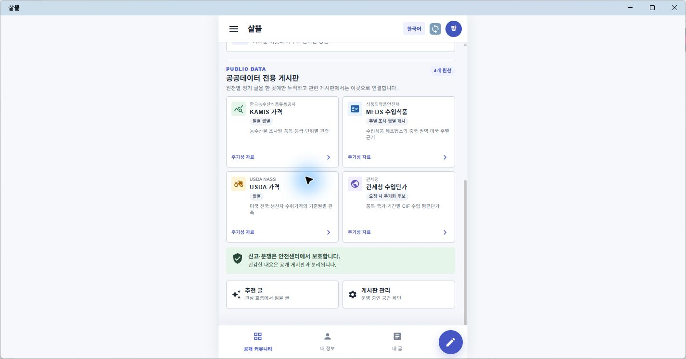

# MAUI 공공데이터 전용 게시판

## 결과

통합 MAUI 커뮤니티 앱의 게시판 모음에 공공데이터 전용 영역을 추가했다. Web과 별도 데이터를 만들지 않고 다음 네 canonical 게시판 key와 서버 글을 함께 사용한다.

- KAMIS 가격 데이터: 한국농수산식품유통공사, 일별·월별 농수산물 가격 관측
- MFDS 수입식품 데이터: 식품의약품안전처, 중국 권역·미국 주별 제조업소 근거를 주별 조사·월별 게시
- USDA 가격 데이터: USDA NASS, 미국 생산자 수취가격 월별 관측
- 관세청 수입단가 데이터: 품목·국가·기간별 CIF 평균단가, 현재 요청 시 조회하며 주기화 후보로 표시

각 카드는 해당 `boardKey`와 `주기성` 목록 필터를 포함한 공용 게시판 route로 이동한다. 따라서 원천 자료는 전용 게시판에 한 번만 누적하고, 관련 게시판은 대표 안내와 링크로 연결하는 기존 중복 방지 원칙을 유지한다.

## MAUI 화면

- 커뮤니티 drawer에 `공공데이터 게시판` 바로가기를 추가했다.
- 생활 게시판 모음 아래에 원천 4개를 2열 카드로 표시하고 좁은 화면에서는 1열로 바꾼다.
- 원천명, 갱신 주기, 자료 범위, 현재 글 수 또는 `주기성 자료` 상태를 함께 보여 준다.
- 검색어는 게시판명뿐 아니라 제공기관, 자료 설명, 갱신 주기에도 적용된다.
- 현재 통합 MAUI의 기존 게시판 인덱스도 같은 `CommunityPeriodicDataBoardCatalog`를 사용하도록 연결했다.

## 검증

- Windows MAUI 앱에서 drawer의 `공공데이터 게시판`을 열어 네 카드와 전용 영역 제목을 직접 확인했다.
- `CommunityMobileBoardPresentationTests`에서 네 stable key, `주기성` route, drawer link, 기존 게시판 인덱스의 공용 catalog 사용을 확인했다.
- Windows 대상 MAUI build에서 경고와 오류가 없음을 확인했다.
