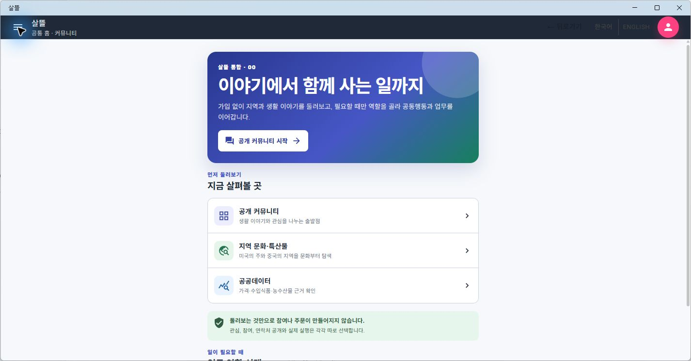
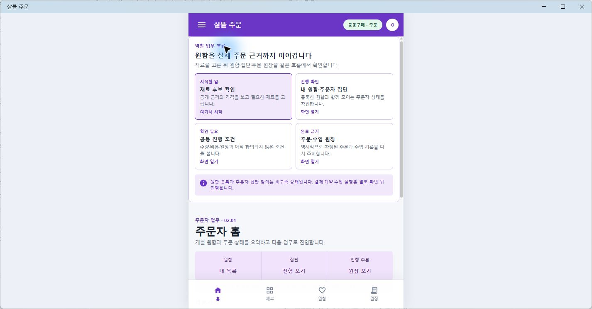
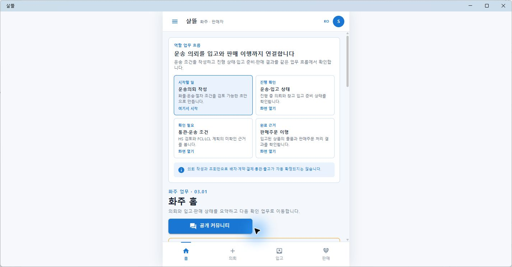
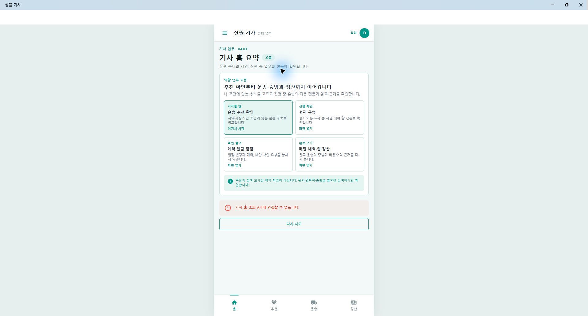
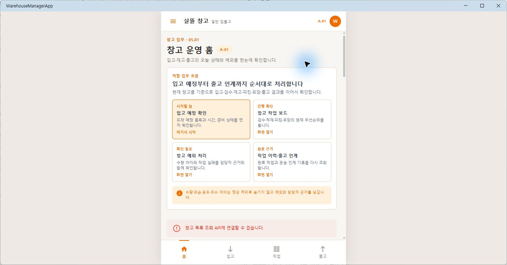

# MAUI 01 탐색형·02~05 목적형 역할 홈

## 결과

- 기존의 밝고 간결한 카드·테두리·역할별 강조색은 유지했다.
- `01 Community`는 가입이나 실행을 먼저 요구하지 않고 생활 이야기, 지역 문화·특산물, 공공데이터를 둘러보는 탐색 홈으로 정리했다.
- `02 Orderer`, `03 Shipper`, `04 Driver`, `05 Warehouse`는 각 홈 상단에 `시작할 일 → 진행 확인 → 확인 필요 → 완료 근거`를 배치했다.
- 네 단계는 설명용 카드에 머물지 않고 각 앱이 이미 제공하는 실제 Route로 이동한다.
- 통합 앱에서 화주·창고 역할을 고르면 공통 홈에 머물지 않고 각각의 목적형 업무 홈으로 바로 이동한다.
- 탐색, 추천, 의사 표시와 실제 주문·배차·계약·출고 확정의 경계 문구를 역할별로 유지했다.

연결된 Figma 파일의 역할 카드가 보여 주는 얇은 테두리, 간결한 타이포그래피와 역할별 구분을 기준으로 삼았고, 기존 MAUI Shell과 실제 업무 Route에 맞게 확장했다.

## 화면

01은 정보를 편하게 둘러보고, 관심·참여·연락처 공개·실행을 각각 따로 선택한다.

02는 재료 후보에서 주문·수입 원장까지 주문자의 다음 목적을 먼저 보여 준다.

03은 운송의뢰, 운송·입고 상태, 통관 조건과 판매주문 이행을 한 흐름으로 연결한다.

04는 추천 확인, 현재 운송, 예약·알림과 배달 내역·정산을 구분한다.

05는 입고 예정, 작업 보드, 예외 처리와 출고 인계 기록을 순서대로 보여 준다.

## 확인

- 목적형 공용 컴포넌트, 실제 Route, 앱별 강조색과 기본 시작 화면 대상 테스트 13개 통과
- `OrdererApp`, `SsalddelApp`, `DriverApp`, `WarehouseManagerApp` Windows MAUI 빌드 확인
- 실제 Windows MAUI 앱 5개 화면 렌더와 Route 문구 확인
- 로컬 API가 없는 기사·창고 화면은 sample 성공 상태로 숨기지 않고 기존 오류 안내를 그대로 표시
- `DriverApp`의 기존 Xamarin.AndroidX 패키지 버전 제약 `NU1608` 경고 9개는 남아 있다.
