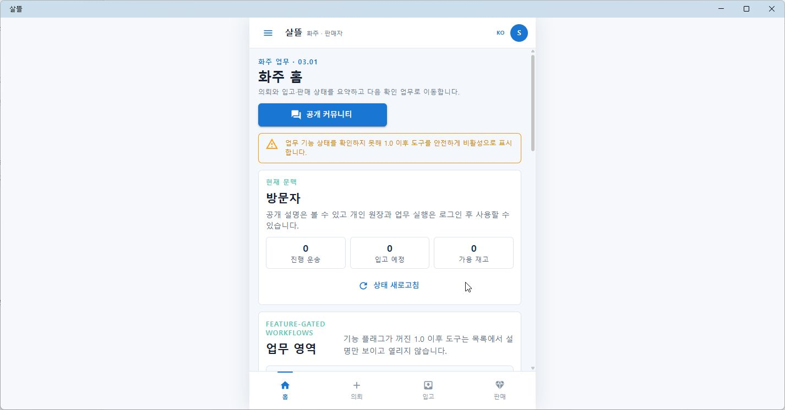
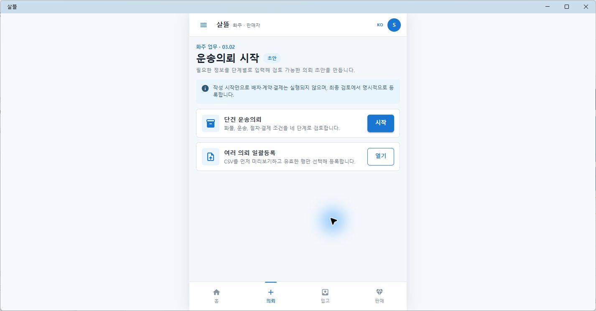
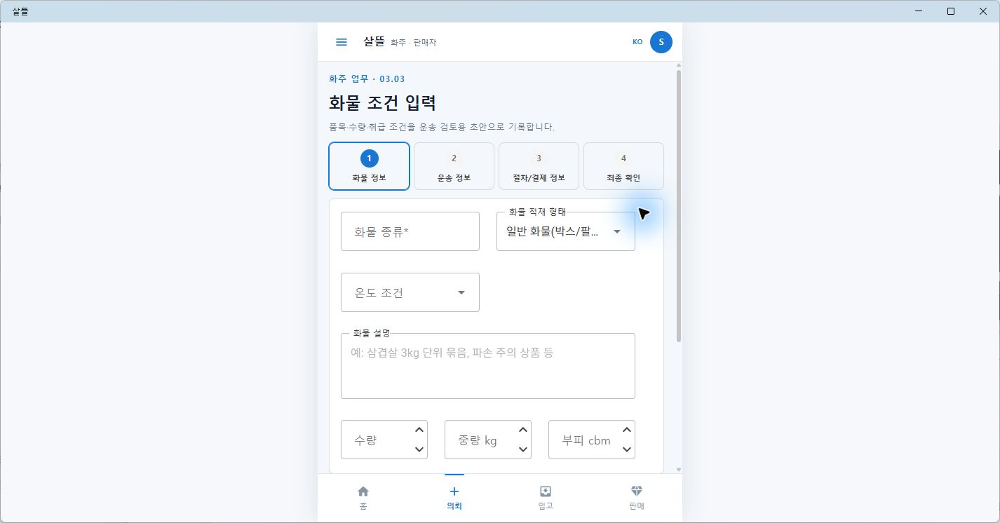
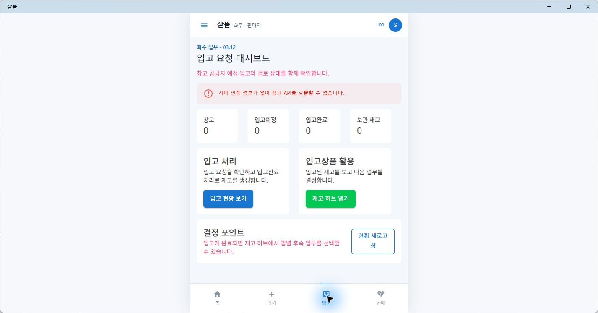
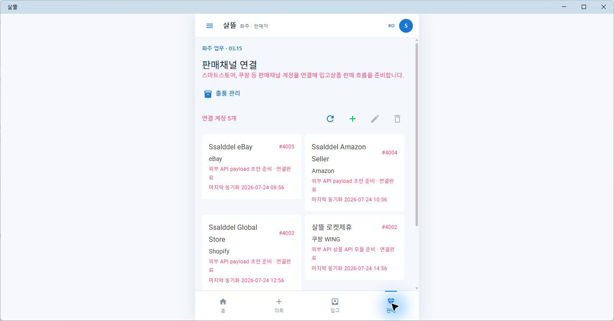

# MAUI Shipper 03 Figma 근접 구현

## 결과

- 통합 `.NET MAUI` 앱 `SsalddelApp`의 화주 영역을 Figma `03 Shipper`에 가까운 밝은 모바일 화면으로 전환했다.
- 흰색 AppBar, 화주·판매자 역할 표시, 가운데 모바일 캔버스와 `홈·의뢰·입고·판매` 하단 내비게이션을 전용 `ShipperMobileLayout`으로 구성했다.
- `03.01` 화주 홈, `03.02~03.11` 운송의뢰 작성·상세·증빙·일괄등록, `03.12~03.14` 입고·HS·FCL/LCL, `03.15~03.17` 판매채널·상품·주문 이행, `03.18` 창고 작업공간을 기존 Route와 공용 Screen 위에 배치했다.
- 운송의뢰 작성은 시작 화면과 단건 4단계 입력을 분리하고, 등록 전에는 배차·계약·결제가 실행되지 않는 기존 경계를 유지했다.
- 홈과 업무 화면은 기존 API·권한·기능 플래그를 그대로 사용한다. 로컬 API나 인증이 없을 때 임의 sample data로 성공처럼 보이지 않고 오류와 비활성 상태를 명시한다.

현재 연결된 Figma 파일에는 `00 Overview`와 참고용 화주·판매자 카드만 남아 있고 `03 Shipper` 전체 페이지는 확인되지 않았다. 따라서 같은 날 보존한 [Figma 01~05 역할 레이어](2026-07-24-figma-role-layer-milestone.md)의 실제 `shipper-layer.png`와 연결된 카드의 파란색·테두리·타이포그래피를 구현 기준으로 사용했다.

## 화면

화주 홈은 실제 조회 결과와 기능 플래그 경계를 모바일 카드 밀도로 요약한다.

운송의뢰 시작 화면은 단건 작성과 CSV 일괄등록을 분리하고, 작성만으로 후속 실행이 일어나지 않음을 먼저 알린다.

화물 조건 화면은 기존 공용 draft와 validation을 유지하면서 네 입력 단계를 좁은 화면에서 한 번에 식별할 수 있게 정돈했다.

입고 대시보드는 실데이터 조회와 인증 오류를 그대로 표시하고, 입고 처리와 입고상품 후속 업무를 구분한다.

판매채널 화면은 데스크톱 표 대신 기존 반응형 카드 표현을 강제해 520px 모바일 Shell에서도 계정 상태를 읽을 수 있게 했다.

## 확인

- `SsalddelApp` Windows 대상 빌드: 경고 0개, 오류 0개
- `03.01~03.18` 화면 책임, 전용 Shell, 기존 운송의뢰 조합 대상 테스트 55개 통과
- 실제 Windows MAUI 앱에서 홈·의뢰 시작·화물 조건·입고·판매 하단 내비게이션과 대표 화면 확인
- 실제 MAUI 렌더 PNG 5개 보존
