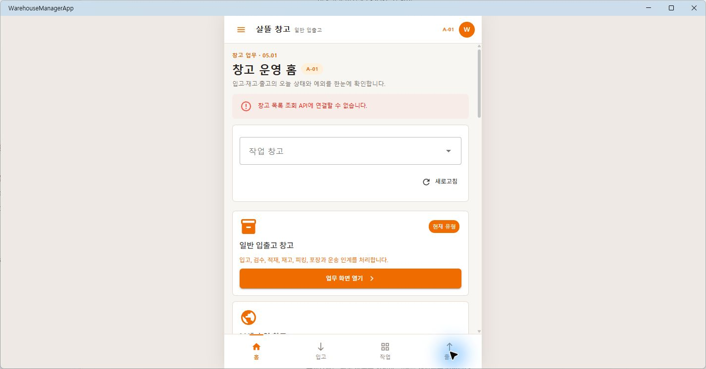
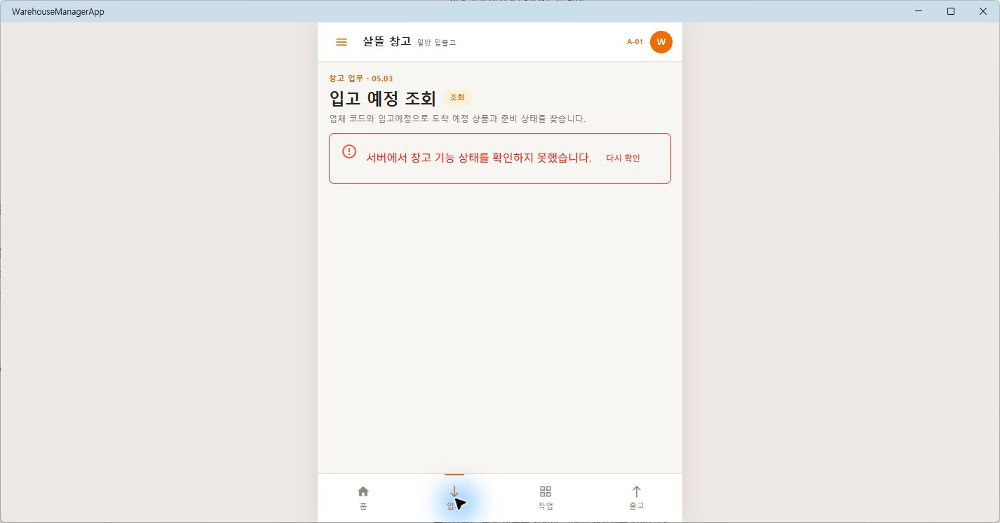
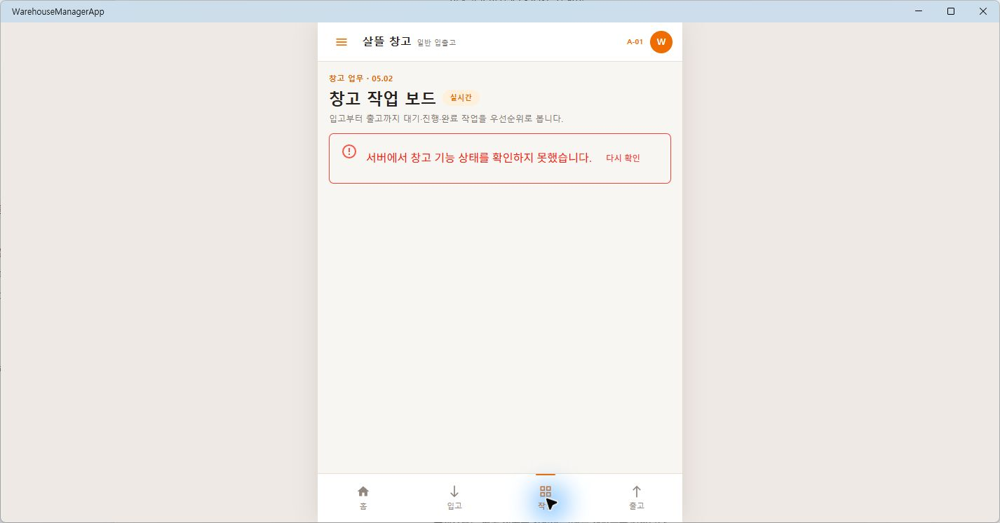
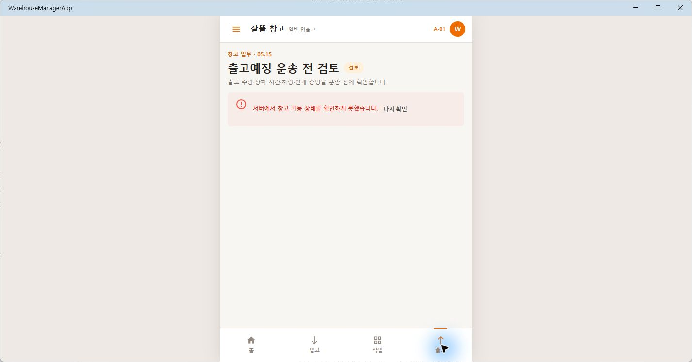
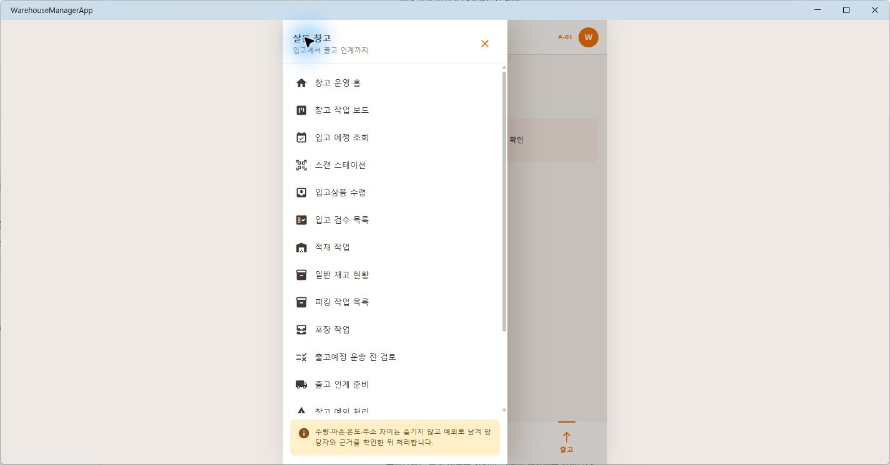

# MAUI Warehouse 05 Figma 근접 구현

## 결과

- 별도 `.NET MAUI` 앱 `WarehouseManagerApp`의 기본 시작 화면을 Figma `05 Warehouse`에 가까운 창고 관리자 모바일 Shell로 전환했다.
- 흰색 AppBar, 주황색 창고 업무 강조색, 가운데 모바일 캔버스와 `홈·입고·작업·출고` 하단 내비게이션을 구성했다.
- `05.01` 창고 운영 홈부터 `05.20` 보세·통관 상태까지 기존 Route와 ViewModel 업무 화면을 화면 번호·제목·설명으로 식별할 수 있게 연결했다.
- MAUI `BlazorWebView`의 `StartPath`를 실제 창고 운영 홈 `/warehouse`로 지정하고, 기존 `/` 주소도 같은 화면으로 호환 이동한다.
- 기존 API·권한·원장 흐름을 그대로 사용한다. 로컬 API가 없을 때 임의 sample data로 성공처럼 보이지 않고 조회 오류와 기능 상태를 명시한다.

현재 연결된 Figma 파일에는 `00 Overview`와 참고용 창고 관리자 카드만 남아 있고 `05 Warehouse` 전체 페이지는 확인되지 않았다. 따라서 같은 날 보존한 [Figma 01~05 역할 레이어](2026-07-24-figma-role-layer-milestone.md)의 실제 `warehouse-layer.png`와 연결된 카드의 테두리·타이포그래피를 구현 기준으로 사용했다.

## 화면

창고 운영 홈은 실제 창고 조회 상태와 운영 유형별 업무 진입점을 모바일 카드로 표시한다.

입고 예정 조회는 서버 기능 상태와 재시도 경계를 숨기지 않고 표시한다.

작업 보드는 선택한 원장과 권한을 확인하기 전 임의 작업을 만들지 않는다.

출고예정 검토는 운송 인계 전에 수량·상차 시간·차량·증빙을 확인하는 기존 경계를 유지한다.

drawer에서는 20개 화면의 주요 진입점과 예외 기록 원칙을 한 곳에서 확인한다.

## 확인

- `WarehouseManagerApp` Windows 대상 빌드: 경고 0개, 오류 0개
- `05.01~05.20` Route·화면 표식, 창고 Shell, 기본 시작 화면과 기존 ViewModel/API 경계 대상 테스트 43개 통과
- 실제 Windows MAUI 앱에서 홈·입고·작업·출고 하단 내비게이션과 drawer 확인
- 실제 MAUI 렌더 PNG 5개 보존
