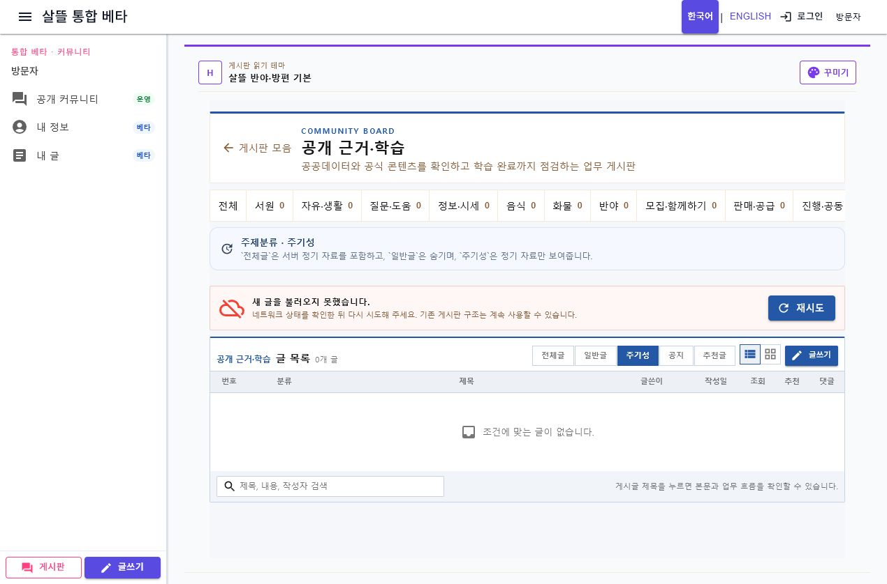
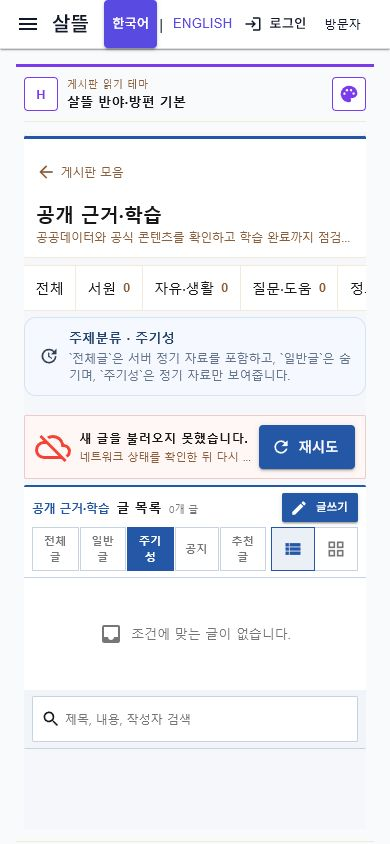

# 업무 게시판 주기성 주제분류

## 변경

- 16개 업무단위 게시판의 글 목록에 `전체글`, `일반글`, `주기성` 선택을 추가했다.
- `전체글`은 서버 정기 자료를 포함하고, `일반글`은 정기 자료를 숨기며, `주기성`은 정기 자료만 표시한다.
- `system:community-editorial:{sourceKey}:{periodKey}` 식별자를 가진 정기 편집 글만 `주기성`으로 분류했다.
- 원장 Event 시스템 글과 사용자 예약 글은 주기성에 포함하지 않는다.
- 게시글 응답에 `IsPeriodic`, `TopicClassificationCode`, `TopicClassificationName`을 추가하고 목록 제목 옆에 `주기성` 배지를 표시한다.
- API의 `periodicVisibility=all|exclude|only` 필터를 페이지 계산 전에 적용해 페이지 수와 실제 목록이 어긋나지 않게 했다.
- 선택 상태는 기존 `filter` URL 문맥으로 복원하며 필터 변경 시 1페이지부터 다시 조회한다.
- 일반 게시판에는 주기성 선택을 노출하지 않고 주기성 deep link도 `전체글`로 보정한다.

## 화면

업무 게시판의 `주기성` 선택 상태를 데스크톱에서 확인했다.

390px 모바일에서도 다섯 개 필터와 안내가 가로 넘침 없이 표시된다.

