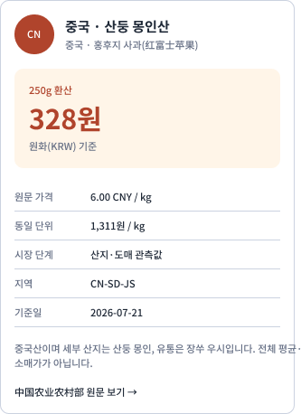

# 중국 농축산물 지역 산지 표기

## 결과

- 중국 농산물의 국가 원산지를 숨기지 않고 `중국 · 세부 산지` 형식으로 표시한다.
- 현재 사과 관측값은 `중국 · 산둥 몽인산`으로 표시하고, 장쑤 우시는 생산지가 아니라 관측 유통지임을 제한 설명에서 구분한다.
- 품종명은 한국어를 먼저 쓴 `홍후지 사과(红富士苹果)`로 표시한다.
- 국가 전체 평균이나 소비자 소매가가 아닌 개별 산지·도매 관측값이라는 경계를 유지한다.

## 표기 정책

- 권장: `중국 · 산둥산`, `중국 · 강남(장강 이남)산`
- 금지: 국가를 생략한 `강남산` 단독 표기, 생산지와 유통지를 합친 산지 표기
- 필요 시 행정구역과 문화권을 병기하되 실제 원산지 근거가 있을 때만 `산`을 붙인다.
- `강남`은 문화권 설명으로 유용하지만, 원산지 증빙에는 성·시·현 등 확인 가능한 현재 지명을 함께 둔다.

이 방식은 부정적인 국가 선입견을 완화할 수 있도록 지역의 문화와 생산 배경을 더 잘 드러내면서도 소비자가 원산지를 오인하지 않게 하는 투명성 원칙이다.

## Figma·MAUI 호환

- MAUI 지역가격 ViewModel과 Figma 표·가로 카드의 국가, 생산지, 품종, 데이터 제한 문구를 같은 의미로 맞췄다.
- Figma table node: `2182:64`
- Figma horizontal-card node: `2192:64`
- 모바일 카드 제목은 잘림을 피하기 위해 `중국 · 산둥 몽인산`으로 표시하고 장쑤 유통 관측은 본문에 둔다.

## 확인

- 중국 관측값의 표시명이 `중국 · 산둥`으로 시작하는지 테스트한다.
- 원산지 투명성 제한 문구가 유지되는지 테스트한다.
- Figma 카드의 국가·세부 산지·중문 품종 병기와 텍스트 잘림을 실제 PNG로 확인했다.
