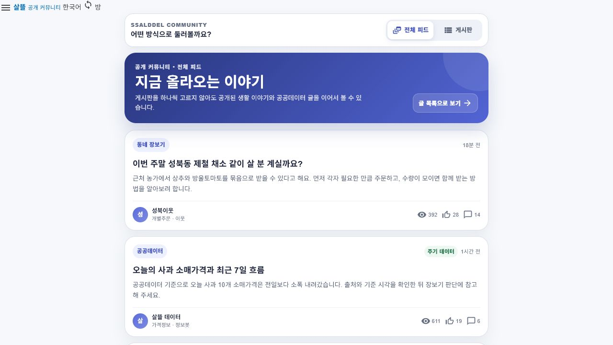

# 커뮤니티 전체 피드 카드 탐색

## 결과

- 기존 `/community` 게시판 탐색을 유지하면서 `/community?view=feed` 전체 피드를 두 번째 탐색 방식으로 추가했다.
- 전체 피드는 특정 게시판을 먼저 고르지 않아도 공개 커뮤니티 글을 서버 반환 순서대로 카드로 이어서 보여 준다.
- 첫 page 12개를 불러오고 화면 하단 관찰 지점에 도달하면 다음 page를 붙인다. 관찰 기능이 동작하지 않는 환경에서도 `다음 글 더 보기`로 계속 탐색할 수 있다.
- 다음 page 조회가 실패해도 이미 읽던 카드는 보존하며, 게시글 ID 중복만 제거한다.
- 게시판 chip, 주기 데이터 표시, 판매·공급 정보, 작성자·업무 tag, 조회·추천·댓글 수와 원래 게시글 상세 진입 경로를 카드에 유지했다.
- 보호 속성이나 성사 가능성으로 글을 재정렬하지 않고 공개 API의 순서를 그대로 사용한다.

## Figma·MAUI 대응

| 설계 | 구현 |
| --- | --- |
| [Figma `01A.13 · 전체 피드 카드`](https://www.figma.com/design/0KhuQLc1MleUBIQnARC21Z/ssalddle?node-id=2194-197) | `SsalddelApp` `/community?view=feed` |
| 탐색 방식 `전체 피드 / 게시판` | `CommunityHomePage.razor` |
| 세로 공개 글 카드와 이어보기 | `Community전체FeedScreen.razor`, `Community전체FeedViewModel.cs` |
| 공개 글 조회 | 기존 `CommunityPlatformClient.GetBoardPostsAsync`와 `PlatformCommunityPostListResponse` |
| 자동 이어보기 | `CommunityFeedScrollSentinel.razor`, `community-feed-scroll.js` |

Figma 화면은 기존 `01A.02`의 393×852 모바일 Shell과 `Noto Sans KR` 규칙을 재사용하고, 하나의 목록 테두리 안에 행을 모으는 대신 4개의 독립 카드로 분리했다.

## 화면

분리된 검증 worktree의 실제 Blazor Hybrid source capture host에서 공개 글 sample 응답을 사용해 `/community?view=feed`를 렌더링했다. 운영 API 실패를 sample로 숨기는 동작은 제품 코드에 넣지 않았다.

## 확인

- `eng/validate-changes.ps1 -Level Fast`: 영향 solution build와 targeted test 통과
- `eng/validate-changes.ps1 -Level Task`: 영향 solution build와 targeted test 통과
- `Community전체FeedViewModelTests`: 서버 순서 유지, page 추가, ID 중복 제거, 오류 시 기존 카드 보존 확인
- `CommunityPageRoutesTests`: 전체 피드와 게시판 탐색 URL 확인
- 실제 렌더에서 전체 피드 카드 4개와 공개 글 종료 상태 확인
- `게시판` 선택 시 기존 개별주문 안내와 게시판 모음으로 전환되는 것 확인
- Figma 최종 화면에서 카드 4개, placeholder 0개, `Noto Sans KR` 단일 글꼴 확인
