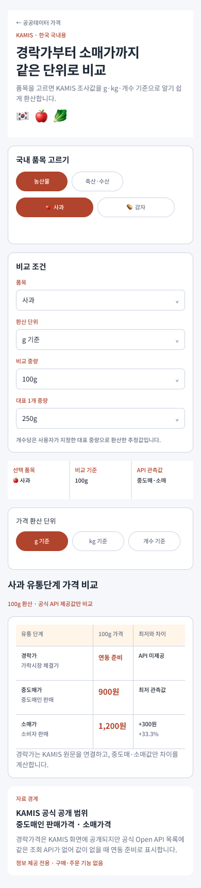

# KAMIS 국내 유통단계 가격 비교

## 결과

- 통합 커뮤니티 앱의 공공데이터 정보 영역에 `/information/kamis-domestic-price-comparison` 직접 Route를 추가했다.
- 품목별 KAMIS 관측값을 `g`, `kg`, `개수` 기준으로 바꾸어 같은 단위에서 비교한다.
- `g` 기준은 1~10,000g을 선택할 수 있고, 개수 기준은 사용자가 입력한 대표 1개 중량으로 환산한다.
- 세로 카드 반복 대신 가로 스크롤이 가능한 표에 경락가·중도매가·소매가를 한 번에 배치했다.
- 가장 낮은 제공값을 기준으로 금액 차이와 비율을 함께 표시한다.

## 데이터 경계

- KAMIS Open API의 `p_product_cls_code`는 소매 `01`, 도매 `02`를 제공하므로 현재 자동 비교값은 중도매가와 소매가다.
- 경락가는 KAMIS 가락시장 경락가격 화면의 공식 원문으로 연결하지만 같은 Open API 목록에는 대응 조회 API가 없어 값을 추정하거나 합성하지 않고 `연동 준비`로 표시한다.
- 개수 가격은 공공데이터의 공식 개수 단위가 아니라 사용자가 지정한 대표 중량을 이용한 추정 환산값이다.
- 유통단계 간 차이는 매입 원가, 운송, 선별, 손실, 마진을 분리한 수치가 아니므로 유통 마진으로 단정하지 않는다.
- 화면에는 출처, 기준일, 원 단위, 관측 단계와 제한을 함께 표시한다.

공식 근거:

- [KAMIS Open API 목록](https://www.kamis.or.kr/customer/reference/openapi_list.do)
- [KAMIS Open API 도매·소매 코드 상세](https://www.kamis.or.kr/customer/reference/openapi_list.do?action=detail&boardno=1)
- [KAMIS 가락시장 경락가격](https://www.kamis.or.kr/customer/price/market/period.do)
- [KAMIS 중도매인 판매가격](https://www.kamis.or.kr/customer/price/wholesale/period.do)
- [KAMIS 소매가격](https://www.kamis.or.kr/customer/price/agricultureRetail/catalogue.do)

## Figma·MAUI 호환

- Figma `00 Overview`에 `01.05 · KAMIS 국내 유통단계 가격 비교` 화면을 추가했다.
- Figma node: `2198:176`, mobile width `390`, `Noto Sans KR`.
- Figma의 정보 순서와 MAUI 공통 Razor 화면의 섹션 순서를 품목 선택 → 비교 조건 → 단위 선택 → 유통단계 표 → 데이터 경계로 맞췄다.
- Figma 가격 숫자는 레이아웃 검증용 예시이며 앱은 KAMIS API 응답을 사용한다.

## 확인

- 농수산 가격 ViewModel의 100g·kg·대표 개수 환산과 최저값 대비 차이 테스트
- 신규 공개 읽기 전용 Route의 page capability 테스트
- Figma 전체 모바일 화면의 표 폭, 단위 탭, 경락가 미제공 상태와 데이터 경계 문구 확인

