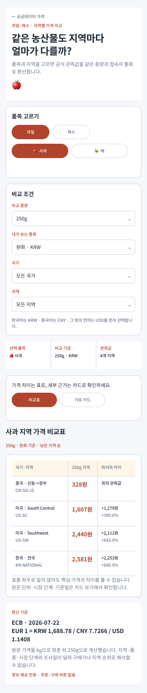
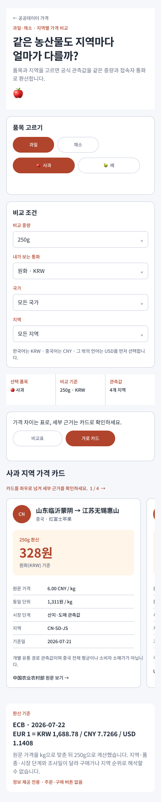

# 과일·채소 국가·지역별 가격 비교

## 변경

- 기존 사과 3개국 비교 화면을 과일·채소 품목별 지역 관측값 비교 화면으로 확장했다.
- 과일은 사과·배, 채소는 토마토·양파를 초기 품목 카탈로그로 제공한다.
- `과일·채소 → 품목 → 국가 → 지역` 순서로 범위를 좁히고, 선택 품목에 실제로 연결된 관측값만 보여 준다.
- 비교 중량은 100~1,000g 사이에서 바꿀 수 있으며 모든 관측값을 kg과 선택 중량으로 환산한다.
- 한국어는 KRW, 중국어는 CNY, 그 밖의 언어는 USD를 기본 표시 통화로 선택하는 기존 정책을 유지한다.
- 기본 보기는 낮은 가격 순 비교표로 바꾸고, 각 지역 가격을 최저 관측값과의 금액·비율 차이로 함께 표시한다.
- 세부 출처와 시장 단계는 `가로 카드` 보기에서 좌우로 넘겨 확인하며, 모바일에서는 다음 카드 일부를 노출해 수평 탐색을 안내한다.
- 새 canonical route는 `/information/produce-price-comparison`이며 기존 `/information/apple-price-comparison`도 호환 route로 유지한다.

## 자료 경계

- 사과는 기존 aT KAMIS 전국값, 중국 농업농촌부 산지·도매 경로값과 USDA AMS의 미국 지역값을 함께 보여 준다.
- 배·토마토·양파는 USDA AMS 2026-07-24 지역 광고 소매가를 초기 지역 비교 자료로 연결했다.
- 서로 다른 국가·지역의 품종, 등급, 시장 단계, 조사일이 일치하지 않을 수 있으므로 지역 순위나 구매가로 해석하지 않도록 화면에 표시한다.
- 운영 API 오류를 sample 값으로 숨기는 fallback이 아니라, 출처·기준일이 고정된 초기 공개 관측 카탈로그다.

## Figma·MAUI 호환

- Figma 기본 화면 `01.04 · 과일·채소 지역별 가격 비교`(`2182:64`)를 MAUI와 같은 비교표 상태로 갱신했다.
- Figma 카드 화면 `01.04B · 과일·채소 지역 가격 가로 카드`(`2192:64`)를 별도 상태로 만들고 카드 컴포넌트 인스턴스 4개를 수평 viewport에 배치했다.
- 재사용 컴포넌트 이름을 `Information/Produce Regional Price Card`(`2181:64`)로 바꾸고 제목 필드를 `Region Name`, 상세 행을 `Region Code` 의미로 전환했다.
- 기존 apple 색상 variable은 `produce` 역할명으로 바꿔 CSS의 `--produce-*` 토큰과 대응시켰다.
- Figma와 MAUI 모두 같은 필터·통화·환산 가격을 사용하며 `비교표`와 `가로 카드` 상태를 대응시킨다.
- 기본 Figma 화면 높이는 세로 카드형 3,187px에서 비교표형 1,837px로 줄었다.

## 실제 화면

### 기본 비교표

### 가로 카드

## 검증

- `ProduceRegionalPriceComparisonViewModelTests` 15건 통과
- 과일·채소 분류 전환, 품목 변경 시 기본 중량과 지역 필터 초기화 확인
- 국가·지역 필터, 동일 중량·현지 통화 환산, 입력 중량 제한 확인
- 기본 비교표 상태와 가로 카드 전환, 최저 관측값 대비 금액·비율 계산 확인
- Figma 기본 화면 1개와 카드 화면 1개에서 이름 없는 node 0개, `Noto Sans KR` 단일 글꼴, 카드 화면의 재사용 instance 4개를 확인
- 두 Figma 화면의 잘림과 다음 카드 노출을 실제 PNG로 확인
