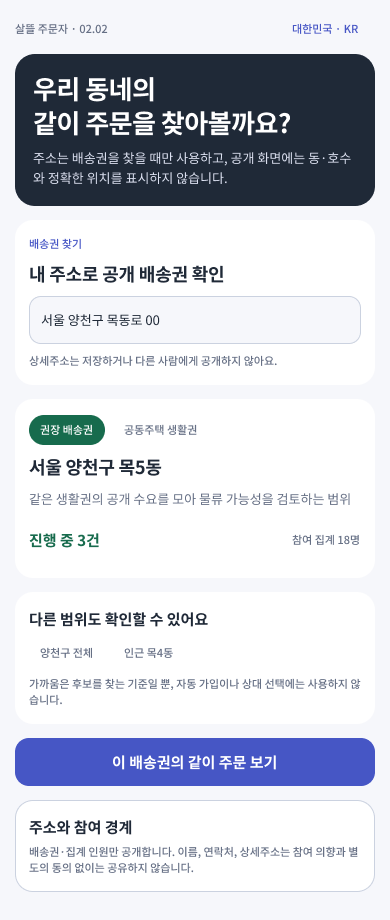
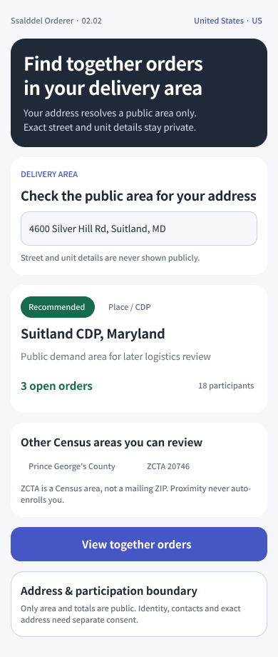
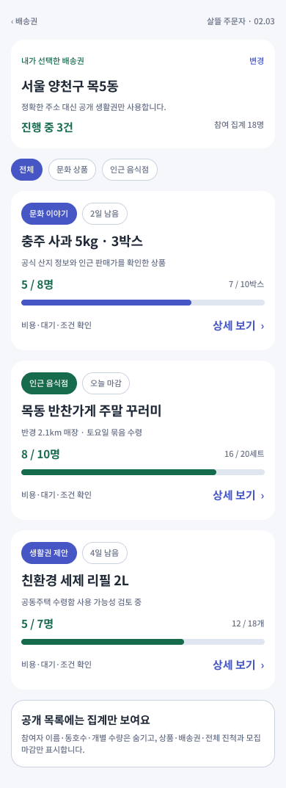
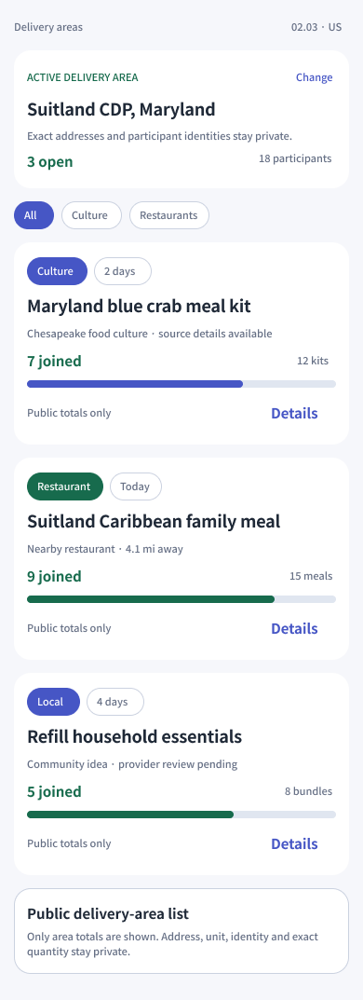
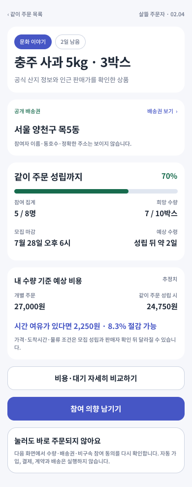
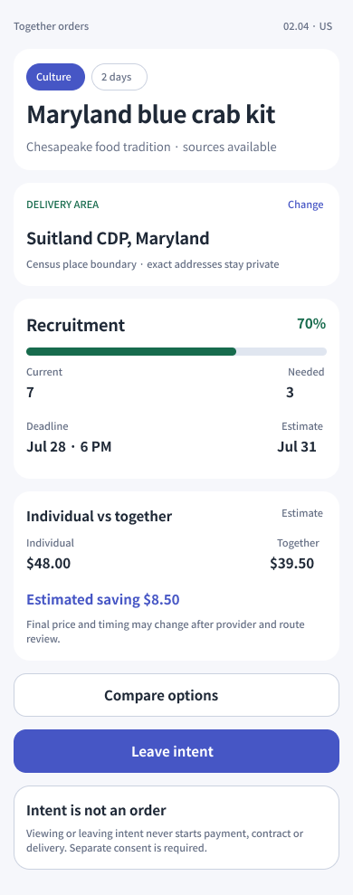

# 배송권에서 같이 주문 참여 결정까지

## 확인 결과

- 서버에는 주소를 상세주소가 없는 행정구역 배송권으로 바꾸는
  `POST /api/v1/orderer/public-data/group-purchase/delivery-scopes/resolve`와
  `deliveryScopeKey`로 공개 같이 주문을 찾는
  `GET /api/v1/orderer/group-purchase-auto-groups`가 이미 있었다.
- 기존 공개 목록 응답은 참여자 식별자, 주소, 개별 수량, 결제 금액과 내부 원장 ID를
  제외하고 있어 배송권 탐색에 사용할 수 있었다.
- 공개 상세 조회 API와 배송권 탐색 전용 페이지 route가 없어
  `배송권 확인 → 같이 주문 목록 → 상세 → 참여 판단` 흐름은 완결되지 않은 상태였다.

## 완성한 화면 흐름

### 02.02 내 배송권 확인

- 주소로 공개 배송권 후보를 확인하되 상세주소는 저장·공개하지 않는다고 입력부에 표시한다.
- 권장 배송권과 인접 후보를 사용자가 직접 선택한다.
- 가까움은 자동 가입이나 상대 선택 근거가 아니라 공개 수요·물류 검토 후보임을 안내한다.
- 화면 상단에 현재 운영시장인 `대한민국 · KR` 또는 `United States · US`를 표시한다.

미국 운영시장에서는 한국 행정구역을 재사용하지 않고 Census의 Place/CDP를 권장 범위로,
County와 ZCTA를 다른 탐색 범위로 표시한다. ZCTA가 우편 ZIP과 동일한 개념이 아니라는
경계도 화면에 남긴다.

### 02.03 배송권의 같이 주문

- 선택한 배송권의 진행 중인 같이 주문을 문화 상품, 인근 음식점, 생활권 제안으로 함께 탐색한다.
- 상품, 전체 참여 집계, 목표 수량, 모집 마감과 전체 진척만 표시한다.
- 이름, 동·호수, 개별 희망 수량은 목록에 표시하지 않는다.

미국 변형은 `Suitland CDP, Maryland` 배송권 안에서 문화 상품과 4.1마일 이내
인근 음식점의 같이 주문을 보여 주며, 한국 주소나 한국 행정구역을 섞지 않는다.

### 02.04 같이 주문 상세

- 상품 근거, 공개 배송권, 모집 진척, 마감, 예상 수령과 비용 비교 미리보기를 확인한다.
- `비용·대기 자세히 비교하기`와 `참여 의향 남기기`를 별도 행동으로 둔다.
- 상세 보기나 버튼 진입만으로 자동 참여, 결제, 계약 또는 배송을 실행하지 않는다.

미국 상세도 같은 Census 배송권을 유지하고 달러 가격, 현지 날짜와 미국 상품 예시를
사용한다. 보기와 참여 의향은 주문·결제와 계속 분리한다.

## Figma

- 파일: `0KhuQLc1MleUBIQnARC21Z`
- Section: `2233:176` — `02 · 주문자 · 배송권에서 같이 주문 결정 · 1.0`
- Screen: `2238:176` — `02.02 · 내 배송권 확인 · KR`
- Screen: `2242:176` — `02.02-US · My delivery area · US`
- Screen: `2239:176` — `02.03 · 배송권의 같이 주문`
- Screen: `2244:176` — `02.03-US · Together orders in this area · US`
- Screen: `2240:176` — `02.04 · 같이 주문 상세`
- Screen: `2244:247` — `02.04-US · Together order detail · US`
- 기존 `02.01`의 보라색 주문자 계열, 초록색 지역 강조, 흰 카드와 `Noto Sans KR`를 재사용했다.

## 서버와 페이지 계약

- 운영시장 분리
  - 서버 시작 시 `OperatingMarket:MarketCode`가 `KR`이면
    `KoreaDeliveryScopeService`, `US`이면 `UnitedStatesDeliveryScopeService`만 등록한다.
  - `GET /api/v1/operations/market-profile`로 화면이 현재 배포의
    `MarketCode`, 국가, 통화, 주소·지도 제공자와 단위를 확인할 수 있다.
  - 한국 서비스는 미국 요청을, 미국 서비스는 한국 요청을 주소 조회 전에 거부한다.
  - 한국은 시·군·구/읍·면·동, 미국은 State/County/Place·CDP/ZCTA 계약을 사용한다.
- 공개 상세 API
  - `GET /api/v1/orderer/group-purchase-auto-groups/{autoGroupId}`
  - 다른 참여자의 식별자·주소·개별 수량·결제·내부 원장을 제외한 집계만 반환한다.
  - 배송권 보기와 기존 주문 방식 비교 stable route를 함께 반환한다.
- stable page route
  - `/group-purchase/delivery-scopes`
  - `/group-purchase/delivery-scopes/{DeliveryScopeKey}`
  - `/group-purchase/together-orders/{AutoGroupId}`
- 참여 판단
  - 모집 중인 집단만 참여 가능으로 표시한다.
  - 참여는 비구속 수요이며 자동 참여 금지와 별도 동의 필요를 응답에 명시한다.

## 경계

- 배송권 공개 화면에는 정확한 주소와 동·호수를 넣지 않는다.
- 지리적 가까움은 공개 수요 집계와 물류 효율 후보에만 사용한다.
- 상세 보기, 비용 비교와 비구속 참여 의향은 서로 분리한다.
- `GroupPurchaseDemandWorkflow`가 꺼진 기본 `0.0` 배포에서는 이 `1.0` 흐름을 노출하지 않는다.
- 이번 작업에서는 MAUI 주문자 앱을 수정하거나 실행하지 않았다.

## 검증

- 자동집단 상세, 공개정보 보호, page route·capability와 기존 소비자 대상 테스트 통과
- `eng/validate-changes.ps1 -Level Task -Paths ...`로 관련 solution build, targeted test와 `git diff --check` 확인
- Figma 한국·미국 배송권 확인·목록·상세 화면의 390px PNG와 `Noto Sans KR` 적용을 확인
