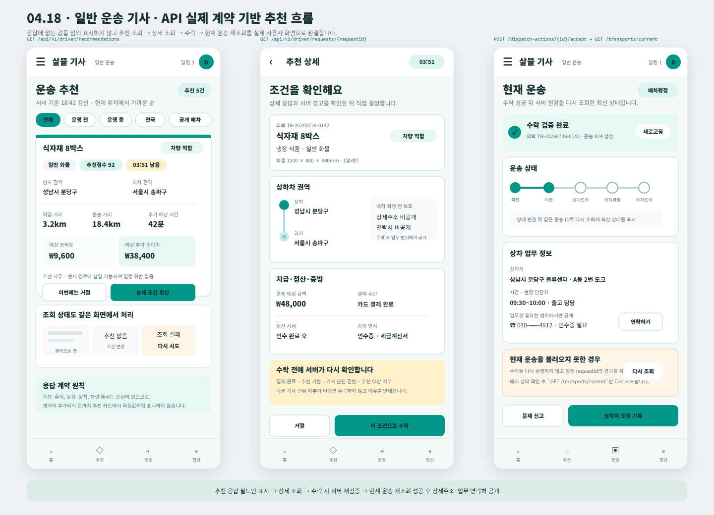

# Driver API 실제 계약 기반 추천 흐름

## 결과

- Figma `04 Driver`에 추적표가 아닌 실제 사용자 화면 `04.18 · Driver · API-Ready Recommendation Flow`를 추가했다.
- 추천 목록은 현재 `기사배차추천항목응답`에서 제공하는 거리, 예상 비용, 예상 추가 순이익, 추천점수, 추천 기한, 차량 적합 여부만 사용한다.
- 독차·혼적, 당상·당착, 차량 톤수처럼 현재 추천 응답에 없는 값은 계약이 추가되기 전까지 확정값으로 표시하지 않도록 정리했다.
- 추천 상세는 `기사운송의뢰상세응답`의 결제·정산·증빙·화물 크기·차량 적합 정보를 사용하고, 배차 확정 전에는 상세주소와 연락처를 숨긴다.
- 기사 수락은 서버가 권한·추천 기한·결제 완료·다른 기사 선점을 다시 검증한다는 점을 화면에 안내한다.
- 수락 성공 뒤에는 같은 의뢰의 배차 결과를 확인하고 `GET /api/v1/driver/transports/current`를 다시 조회한 뒤 현재 운송 화면으로 넘어간다.
- 현재 운송 조회가 실패하면 수락을 반복하지 않고 배차 상태를 확인한 뒤 현재 운송 조회만 재시도하도록 구성했다.

## 화면

## 확인

- Figma `04 Driver`에 [`04.18 · Driver · API-Ready Recommendation Flow`](https://www.figma.com/design/0KhuQLc1MleUBIQnARC21Z/ssalddle?node-id=2273-176) 프레임으로 배치했다.
- 프레임 위치 `X 70 / Y 6400`, 크기 `1440 × 1040`을 확인했다.
- SVG 원본과 PNG 시각 산출물을 함께 보존한다.
- `Helvetica Neue` 제품 글꼴 계열과 기존 `04 Driver`의 청록색 모바일 화면 규격을 유지한다.
- 이번 변경은 Figma와 변경 기록만 포함하며 `DriverApp`, `FDriverApp`, 서버 코드는 수정하지 않는다.
