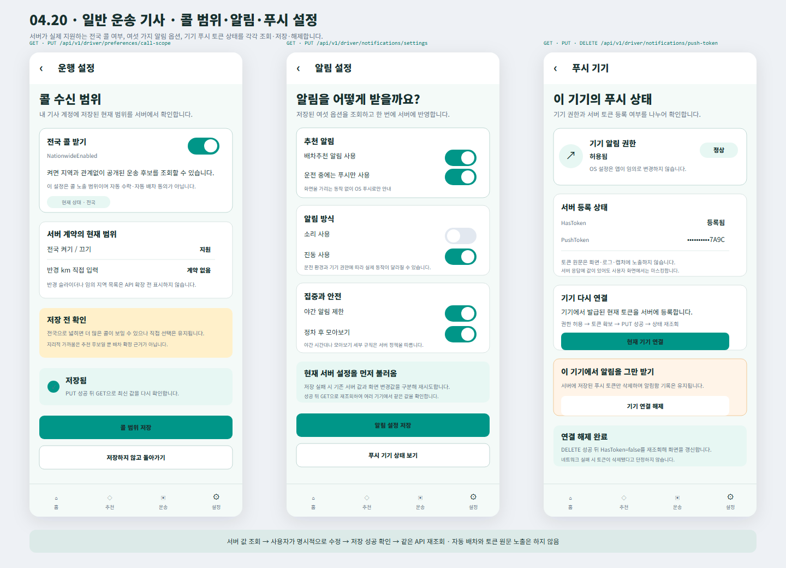

# Driver 콜 범위·알림·푸시 설정

## 결과

- Figma `04 Driver`에 실제 사용자 화면 `04.20 · Driver · Call Notification Push Settings`를 추가했다.
- 콜 범위는 현재 서버 계약이 제공하는 `NationwideEnabled` 한 가지 값만 조회·수정한다.
- 서버 계약에 없는 반경 km 슬라이더나 임의 지역 목록은 넣지 않고, 전국 설정도 자동 수락이나 자동 배차 동의가 아님을 표시했다.
- 알림 설정은 배차추천 알림, 운전 중 푸시만 사용, 소리, 진동, 야간 제한, 정차 후 모아보기의 여섯 옵션을 실제 계약과 동일하게 구성했다.
- 푸시 화면은 기기 OS 권한과 서버 토큰 등록 상태를 분리하고, 토큰 원문은 마스킹한다.
- 기기 연결은 토큰 `PUT`, 연결 해제는 `DELETE` 뒤 같은 상태를 다시 조회하도록 연결했다.
- 각 설정은 서버 값을 먼저 조회하고, 사용자 명시 수정과 저장 성공 뒤 같은 API를 다시 조회해 여러 기기에서 같은 상태를 보도록 구성했다.

## 화면

## 확인

- Figma `04 Driver`에 [`04.20 · Driver · Call Notification Push Settings`](https://www.figma.com/design/0KhuQLc1MleUBIQnARC21Z/ssalddle?node-id=2275-172) 프레임으로 배치했다.
- 프레임 위치 `X 70 / Y 8800`, 크기 `1440 × 1040`을 확인했다.
- SVG 원본과 PNG 시각 산출물을 함께 보존한다.
- `Helvetica Neue` 제품 글꼴 계열과 기존 `04 Driver`의 청록색 모바일 화면 규격을 유지한다.
- 이번 변경은 Figma와 변경 기록만 포함하며 `DriverApp`, `FDriverApp`, 서버 코드는 수정하지 않는다.
