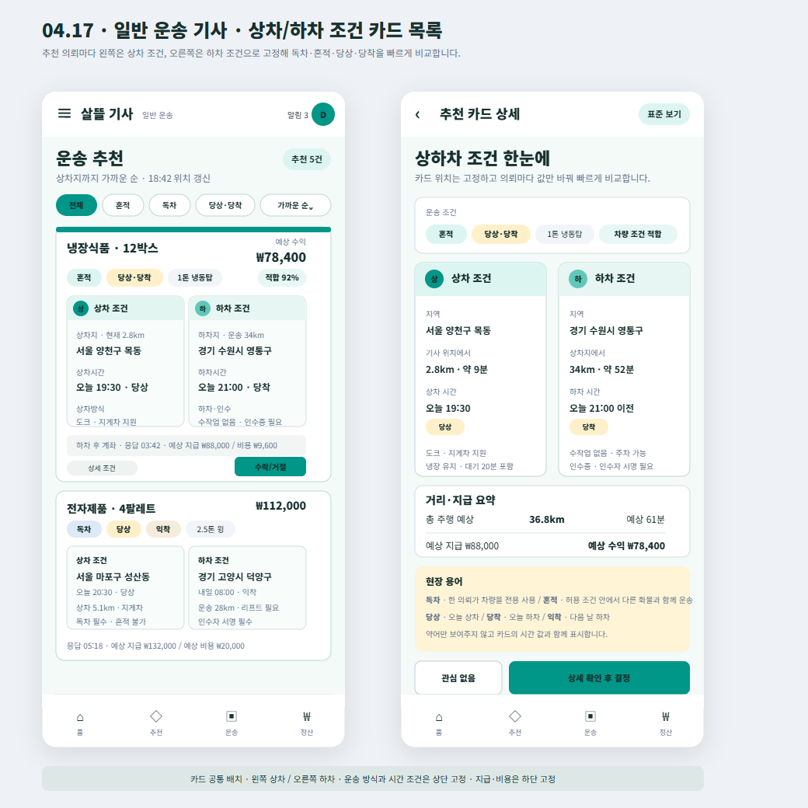

# 일반 운송 기사 상차·하차 조건 카드

## 결과

- Figma `04 Driver`의 일반 운송 추천 목록에 카드형 상하차 조건 화면을 추가했다.
- 각 추천카드의 왼쪽은 `상차 조건`, 오른쪽은 `하차 조건`으로 고정해 여러 운송 의뢰를 같은 시선 흐름으로 비교할 수 있게 했다.
- 카드 상단에는 `독차/혼적`, `당상/당착/익착`, 차량 톤수·형태와 차량 적합도를 배치했다.
- 카드 하단에는 예상 지급, 예상 비용·수익, 응답 기한과 상세·수락 진입을 배치했다.

## 코드와 맞춘 조건

- `DriverRequestItem.운송방식`: `독차`, `혼적`
- `DriverRequestItem.시간조건표시`: `당상·당착`, `당상`, `당착`, `일반`
- 상차 영역: 상차지, 현재 위치에서 상차지까지 거리, 상차 시간, 차량·상차 방식
- 하차 영역: 하차지, 운송 거리, 하차 시간, 인수증·인수자 서명 조건
- 기존 `DriverRoutePaymentSummary`의 2열 상차·하차 구조를 모바일 카드 목록에서 더 명확하게 보이도록 시각화

## 화면

## 확인

- Figma `04 Driver`에 [`04.17 · Driver · Freight Condition Cards`](https://www.figma.com/design/0KhuQLc1MleUBIQnARC21Z/ssalddle?node-id=2271-176) 프레임으로 배치
- 프레임 위치 `X 70 / Y 5200`, 크기 `1040 × 1040` 확인
- SVG와 PNG 시각 산출물 보존
- 이번 변경은 Figma와 변경 기록만 포함하며 `DriverApp`, `FDriverApp`, 서버 코드는 수정하지 않음
