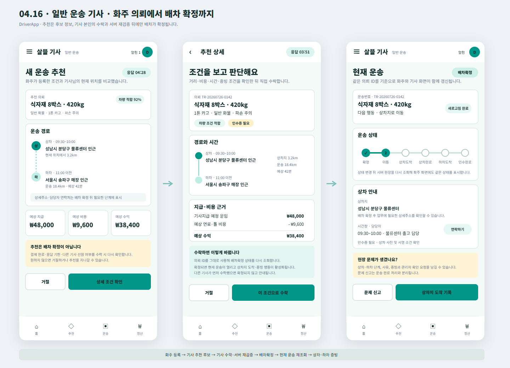

# 일반 운송 기사 화주 의뢰 인계 화면

## 결과

- 음식 배달용 `FDriverApp`이 아니라 일반 용달·화물 운송을 수행하는 `DriverApp` 관점의 Figma 화면을 추가했다.
- 화주의 운송 의뢰가 기사에게 곧바로 확정 배차로 보이지 않도록 `새 운송 추천 → 상세 조건 확인과 직접 수락 → 배차확정 뒤 현재 운송`을 세 화면으로 분리했다.
- 기존 `04 Driver`의 흰색 AppBar, 청록색 강조색, `홈·추천·운송·정산` 하단 내비게이션과 390px 모바일 규격을 유지했다.

## 서버 흐름 반영

- 추천 화면은 `api/v1/driver/recommendations`의 화물 종류, 상하차 지역, 거리, 차량 적합 여부, 추천 기한, 예상 비용과 수익을 사용한다.
- 기사 수락은 `api/v1/driver/dispatch-actions/{requestId}/accept`에서 결제 완료, 추천 기한, 기사 본인 권한, 공개 배차 또는 추천 대상 여부, 다른 기사 선점을 다시 검증한다.
- 수락 성공 뒤 배차 상태는 `배차확정`이 되고 같은 의뢰 ID의 운송 진행 건이 생성·보정된다.
- 현재 운송은 `api/v1/driver/transports/current`를 다시 조회하고 `상차지 도착 → 상차 완료 → 하차지 도착 → 인수 완료`로 진행한다.
- 상세주소, 정밀 위치와 담당자 연락처는 추천 후보 단계가 아니라 배차 확정 뒤 업무상 필요한 범위에서 표시하도록 구분했다.

## 화면

## 확인

- Figma `04 Driver`에 [`04.16 · Driver · Freight Request Handoff`](https://www.figma.com/design/0KhuQLc1MleUBIQnARC21Z/ssalddle?node-id=2270-176) 프레임으로 배치
- 프레임 위치 `X 70 / Y 4000`, 크기 `1440 × 1040` 확인
- SVG와 PNG 시각 산출물 보존
- 이번 변경은 Figma와 변경 기록만 포함하며 `DriverApp`, `FDriverApp`, 서버 코드는 수정하지 않음
